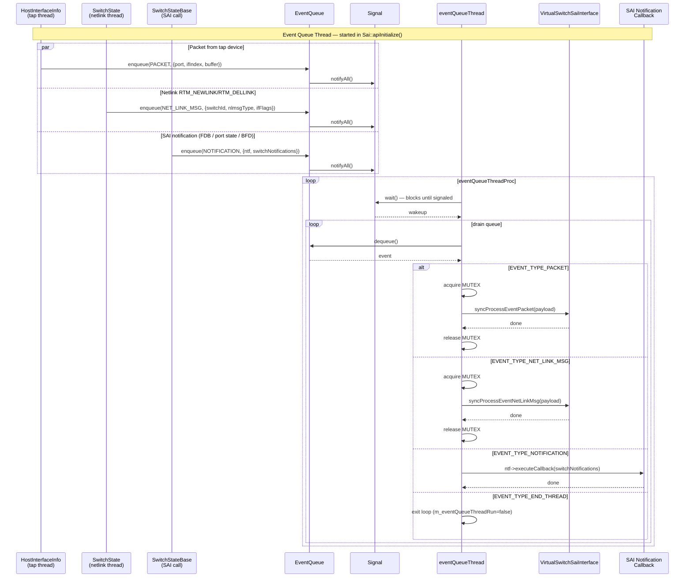

# SONiC VPP SAI implementation

## `sai_vs.cpp` — The Auto-Generated SAI Entry Point

`sai_vs.cpp` is the **public C interface** of `libsaivs.so` — the shared library that syncd-vs links against to talk to the VPP SAI implementation. It is auto-generated at build time by `stub.pl` from the SAI header files and **must never be edited by hand**.
* **`sai_vs.cpp` directs all SAI API calls to `saivs::Sai`**

### How It Is Generated

```makefile
# From vslib/Makefile.am
BUILT_SOURCES = sai_vs.cpp

sai_vs.cpp: ../stub.pl $(top_srcdir)/SAI/meta/saimetadata.c
    ../stub.pl -d ../SAI/ -c Sai -n saivs -f sai_vs.cpp -s stub
```

---


* a single global `saivs::Sai` instance

```cpp
/* DO NOT MODIFY, FILE AUTO GENERATED */

static std::shared_ptr<sairedis::SaiInterface> stub =
    std::make_shared<saivs::Sai>();
```

* Role in the Overall Architecture

```
syncd process
  │
  ├─ links libsaivs.so             ← contains saivs/sai_vs.cpp (compiled)
  │
  ├─ sai_api_initialize()            ← sai_vs.cpp → stub->apiInitialize()
  │      └─ saivs::Sai::apiInitialize()
  │              └─ creates VirtualSwitchSaiInterface
  │                      └─ SwitchStateBase constructor
  │                              └─ init_vpp_client()  ← connects to VPP socket
  │
  ├─ sai_api_query(SAI_API_ROUTE, &route_api)
  │      └─ returns &stub_route       ← pointer to static struct in sai_vs.cpp
  │
  └─ route_api->create_route_entry(...)
         └─ stub_create_route_entry()
                └─ stub->create(SAI_OBJECT_TYPE_ROUTE_ENTRY, ...)
                       └─ saivs::Sai::create()
                              └─ VirtualSwitchSaiInterface::create()
                                     └─ SwitchStateBaseRoute::createRouteEntry()
                                            └─ vppxlate: ip_route_add_del() → VPP Binary API
```


### apiInitialize
the VPP syncd profile:
```
root@vlab-vpp-02:/# cat /usr/share/sonic/hwsku/sai_vpp.profile
SAI_VS_SWITCH_TYPE=SAI_VS_SWITCH_TYPE_VPP
SAI_VS_HOSTIF_USE_TAP_DEVICE=true
SAI_VS_INTERFACE_LANE_MAP_FILE=/usr/share/sonic/hwsku/lanemap.ini
SAI_VS_CORE_PORT_INDEX_MAP_FILE=/usr/share/sonic/hwsku/coreportindexmap.ini
SAI_VS_INTERFACE_FABRIC_LANE_MAP_FILE=/usr/share/sonic/hwsku/fabriclanemap.ini
```

#### init context

```
ContextConfigContainer
  └─ m_map: map<uint32_t, shared_ptr<ContextConfig>>
       │
       └─ ContextConfig  (guid, name, dbAsic)
            ├─ m_guid:   uint32_t          (e.g. 0)
            ├─ m_name:   string            (e.g. "VirtualSwitch")
            ├─ m_dbAsic: string            (e.g. "ASIC_DB")
            └─ m_scc:    shared_ptr<SwitchConfigContainer>
                              │
                              └─ SwitchConfigContainer
                                   ├─ m_indexToConfig:  map<uint32_t, shared_ptr<SwitchConfig>>
                                   └─ m_hwinfoToConfig: map<string,   shared_ptr<SwitchConfig>>
                                              │
                                              └─ SwitchConfig  (one per virtual ASIC)
                                                   ├─ m_switchIndex:    uint32_t
                                                   ├─ m_hardwareInfo:   string
                                                   ├─ m_saiSwitchType:  sai_switch_type_t
                                                   ├─ m_switchType:     sai_vpp_switch_type_t
                                                   ├─ m_bootType:       sai_vpp_boot_type_t
                                                   ├─ m_useTapDevice:   bool
                                                   ├─ m_laneMap:        shared_ptr<LaneMap>
                                                   ├─ m_eventQueue:     shared_ptr<EventQueue>
                                                   └─ m_resourceLimiter: shared_ptr<ResourceLimiter>
```

* context basics:
  * Context = one syncd instance = one ASIC_DB. Each context has a GUID, a name, and an ASIC_DB name.
  * Multi-context is for multi-ASIC SONiC (chassis with multiple line cards). All syncd instances load the full context_config.json but each activates only its own context via SAI_VS_GLOBAL_CONTEXT.
  * Multiple switches per context is designed for VOQ/fabric scenarios (NPU + fabric ASIC in one syncd), but is not implemented — VirtualSwitchSaiInterface.cpp throws "multiple switches not supported, FIXME".
  * Normal single-ASIC SONiC (including SONiC-VPP): no config file is set, getDefault() returns one context (guid=0, "ASIC_DB") with one switch (index=0).


#### init VirtualSwitchSaiInterface
* **`saivs::Sai` is the top-level entry-point called by `syncd`, wraps SAI API calls behind a `saimeta::Meta` and delegates the actual work to `VirtualSwitchSaiInterface`.**


#### Start event queue thread

The event queue thread (`eventQueueThreadProc`) serializes async events from multiple producer threads onto a single consumer thread. It blocks on `Signal::wait()` and drains the `EventQueue` on each wakeup.

Three event types are produced:

| Event | Producer | Handler | SAI Mutex |
|---|---|---|---|
| `EVENT_TYPE_PACKET` | `HostInterfaceInfo` tap thread — raw bytes from tap fd | `syncProcessEventPacket()` → `VirtualSwitchSaiInterface` | yes |
| `EVENT_TYPE_NET_LINK_MSG` | `SwitchState` netlink thread — RTM_NEWLINK/RTM_DELLINK | `syncProcessEventNetLinkMsg()` → `VirtualSwitchSaiInterface` | yes |
| `EVENT_TYPE_NOTIFICATION` | `SwitchStateBase` — FDB event, port state change, BFD state change | `asyncProcessEventNotification()` → registered SAI callback | **no** (avoids deadlock when callback re-enters SAI API) |
| `EVENT_TYPE_END_THREAD` | `stopEventQueueThread()` | exits the loop | — |




### switch creation

* Switch creation happens in two stages:
  * `saivs::Sai::apiInitialize()` reads the profile and populates `SwitchConfig`
  * `create(SAI_OBJECT_TYPE_SWITCH)` allocates the OID
  * instantiates the switch-state class
  * builds all default SAI objects.

#### Stage 1 — `saivs::Sai::apiInitialize()`: profile → SwitchConfig

`saivs::Sai::apiInitialize()` reads keys from the profile file (`sai.profile`) via `profile_get_value()` and populates each `SwitchConfig`:

* inspect switch config with GDB
```
(gdb) thread 5
[Switching to thread 5 (Thread 0x7fc7b7fff6c0 (LWP 88))]
#0  0x00007fc7be8aaf26 in epoll_wait () from /lib/x86_64-linux-gnu/libc.so.6
(gdb) bt
#0  0x00007fc7be8aaf26 in epoll_wait () from /lib/x86_64-linux-gnu/libc.so.6
#1  0x00007fc7bef960b8 in swss::Select::poll_descriptors (this=this@entry=0x7fc7b7ffe270, c=c@entry=0x7fc7b7ffe238, timeout=timeout@entry=4294967295, interrupt_on_signal=interrupt_on_signal@entry=false) at common/select.cpp:100
#2  0x00007fc7bef962c6 in swss::Select::select (this=this@entry=0x7fc7b7ffe270, c=c@entry=0x7fc7b7ffe238, timeout=timeout@entry=-1, interrupt_on_signal=interrupt_on_signal@entry=false) at common/select.cpp:183
#3  0x00007fc7bed36e1f in saivs::Sai::unittestChannelThreadProc (this=0x55ca42126f50) at ./vslib/SaiUnittests.cpp:320
#4  0x00007fc7bea784a3 in ?? () from /lib/x86_64-linux-gnu/libstdc++.so.6
#5  0x00007fc7be82b1f5 in ?? () from /lib/x86_64-linux-gnu/libc.so.6
#6  0x00007fc7be8ab8dc in ?? () from /lib/x86_64-linux-gnu/libc.so.6
(gdb) up
#1  0x00007fc7bef960b8 in swss::Select::poll_descriptors (this=this@entry=0x7fc7b7ffe270, c=c@entry=0x7fc7b7ffe238, timeout=timeout@entry=4294967295, interrupt_on_signal=interrupt_on_signal@entry=false) at common/select.cpp:100
100     common/select.cpp: No such file or directory.
(gdb) up
#2  0x00007fc7bef962c6 in swss::Select::select (this=this@entry=0x7fc7b7ffe270, c=c@entry=0x7fc7b7ffe238, timeout=timeout@entry=-1, interrupt_on_signal=interrupt_on_signal@entry=false) at common/select.cpp:183
183     in common/select.cpp
(gdb) up
#3  0x00007fc7bed36e1f in saivs::Sai::unittestChannelThreadProc (this=0x55ca42126f50) at ./vslib/SaiUnittests.cpp:320
320     ./vslib/SaiUnittests.cpp: No such file or directory.
(gdb) p this
$1 = (saivs::Sai * const) 0x5593ef342f50
(gdb) p this->m_contextMap
$2 = std::map with 1 element = {[0] = std::shared_ptr<saivs::Context> (use count 1, weak count 0) = {get() = 0x5593ef359c20}}
(gdb) p ((saivs::Context *) 0x5593ef359c20)->m_contextConfig->m_scc->m_indexToConfig
(gdb) p *((saivs::SwitchConfig *) 0x5593ef3551d0)
$8 = {_vptr.SwitchConfig = 0x7f57857c9b00 <vtable for saivs::SwitchConfig+16>, m_saiSwitchType = SAI_SWITCH_TYPE_NPU,
  m_switchType = saivs::SAI_VS_SWITCH_TYPE_VPP, m_bootType = saivs::SAI_VS_BOOT_TYPE_COLD, m_switchIndex = 0, m_hardwareInfo = "",
  m_useTapDevice = true, m_bfdOffload = true, m_useConfiguredSpeedAsOperSpeed = false,
  m_laneMap = std::shared_ptr<saivs::LaneMap> (use count 2, weak count 0) = {get() = 0x5593ef356b40},
  m_fabricLaneMap = std::shared_ptr<saivs::LaneMap> (use count 2, weak count 0) = {get() = 0x5593ef35d850},
  m_eventQueue = std::shared_ptr<saivs::EventQueue> (use count 2, weak count 0) = {get() = 0x5593ef35f360},
  m_resourceLimiter = std::shared_ptr<saivs::ResourceLimiter> (empty) = {get() = 0x0},
  m_corePortIndexMap = std::shared_ptr<saivs::CorePortIndexMap> (use count 2, weak count 0) = {get() = 0x5593ef357c40}}
```


| Profile key | VPP value | `SwitchConfig` field |
|---|---|---|
| `SAI_VS_SWITCH_TYPE` | `SAI_VS_SWITCH_TYPE_VPP` | `m_switchType` → selects `SwitchVpp` subclass |
| `SAI_VS_SAI_SWITCH_TYPE` | *(not set)* → `SAI_SWITCH_TYPE_NPU` | `m_saiSwitchType` |
| `SAI_VS_HOSTIF_USE_TAP_DEVICE` | `true` | `m_useTapDevice` |
| `SAI_VS_INTERFACE_LANE_MAP_FILE` | path to `lanemap.ini` | `m_laneMap` |
| `SAI_KEY_BOOT_TYPE` | `cold` / `warm` | `m_bootType` |

Then `VirtualSwitchSaiInterface` and `saimeta::Meta` are created.

```cpp
    m_vsSai = std::make_shared<VirtualSwitchSaiInterface>(contextConfig);
    m_meta = std::make_shared<saimeta::Meta>(m_vsSai);
    m_vsSai->setMeta(m_meta);
```

#### Stage 2 — `create(SAI_OBJECT_TYPE_SWITCH)`: OID allocation → default objects

```
Sai::create(SAI_OBJECT_TYPE_SWITCH, &oid, 0, attrs)
  └─ m_meta->create(...)                              ← attribute validation
       └─ VirtualSwitchSaiInterface::create(SWITCH, &oid, ...)
            ├─ allocateNewSwitchObjectId(hwinfo)      ← OID encodes switch index (0..15)
            └─ init_switch(switchId, config, warmBootState)
                 ├─ new SwitchVpp(...)               ← selected by m_switchType = SAI_VS_SWITCH_TYPE_VPP
                 │    └─ SwitchStateBase cold ctor
                 │         └─ SwitchState ctor
                 │              ├─ pre-fills m_objectHash for EVERY SAI object type
                 │              ├─ creates SWITCH entry in m_objectHash
                 │              └─ registers netlink callback (m_useTapDevice=true)
                 └─ ss->initialize_default_objects()
                      ├─ set_switch_mac_address()
                      ├─ create_cpu_port()             ← SAI_PORT_TYPE_CPU
                      ├─ create_default_vlan()         ← VLAN 1
                      ├─ create_default_virtual_router()
                      ├─ create_default_stp_instance()
                      ├─ create_default_1q_bridge()    ← SAI_BRIDGE_TYPE_1Q
                      ├─ create_default_trap_group()
                      ├─ create_ports()                ← 1 port OID per lane group (lanemap.ini)
                      ├─ set_port_list()               ← SAI_SWITCH_ATTR_PORT_LIST
                      ├─ create_bridge_ports()         ← 1 BP per port + 1Q_ROUTER BP
                      ├─ create_vlan_members()         ← all ports untagged in VLAN 1
                      ├─ create_ingress_priority_groups() ← 8 PG / port
                      ├─ create_qos_queues()           ← BCM56850: 20 Q/port + 32 CPU Q
                      ├─ create_scheduler_groups()
                      ├─ set_switch_default_attributes() ← FDB/port-state callbacks, aging
                      └─ set_static_crm_values()
```

* NOTES:
  * object hash is the entire in-memory SAI object store for one switch
    * when syncd calls CRUD operations, the object hash will be updated

##### SwitchState class hierarchy

```
SwitchState                          (vslib/SwitchState.h)
│   Pure data store for one virtual switch.
│   ─────────────────────────────────────────────────────
│   typedef map<string, shared_ptr<SaiAttrWrap>>    AttrHash;
│   typedef map<sai_object_type_t,
│               map<string, AttrHash>>              ObjectHash;   ← entire in-memory SAI object DB
│
│   Members
│   ├─ m_objectHash          ObjectHash              ← all SAI objects (type → oid_str → attr_str → value)
│   ├─ m_switch_id           sai_object_id_t
│   ├─ m_switchConfig        shared_ptr<SwitchConfig>
│   ├─ m_meta                weak_ptr<saimeta::Meta>
│   ├─ m_ifname_to_port_id_map    map<string, sai_object_id_t>
│   ├─ m_port_id_to_tapname       map<sai_object_id_t, string>
│   └─ m_linkCallbackIndex   uint64_t                ← netlink RTM_NEWLINK/DELLINK callback
│
│   Virtual methods
│   └─ getStatsExt()         ← reads /sys or VPP counters
│
└── SwitchStateBase          (vslib/SwitchStateBase.h)
    │   Platform-neutral SAI CRUD + default-object initialisation.
    │   All create_* methods are virtual so VPP can override them.
    │   ─────────────────────────────────────────────────────────
    │   Members
    │   ├─ m_realObjectIdManager   shared_ptr<RealObjectIdManager>
    │   ├─ m_macsecManager         MACsecManager
    │   ├─ m_fdbInfoSet            set<FdbInfo>       ← FDB aging entries
    │   └─ m_hostifInfoMap         map<string, shared_ptr<HostInterfaceInfo>>
    │
    │   Key virtual methods (all overridable by SwitchVpp)
    │   ├─ initialize_default_objects()
    │   ├─ create_ports() / set_port_list()
    │   ├─ create_default_vlan() / create_vlan_members()
    │   ├─ create_cpu_port()
    │   ├─ create_default_virtual_router()
    │   ├─ create_default_1q_bridge() / create_bridge_ports()
    │   ├─ create_qos_queues() / create_scheduler_groups()
    │   ├─ create_ingress_priority_groups()
    │   ├─ createHostif()           ← TAP + LCP pair creation
    │   └─ startFdbAgingThread()
    │
    └── SwitchVpp            (vslib/vpp/SwitchVpp.h)
            VPP-specific dataplane programming.
            Overrides SwitchStateBase virtuals to call vppxlate (VPP Binary API).
            ─────────────────────────────────────────────────────────────────────
            Extra members
            ├─ m_object_db         SaiObjectDB         ← object dependency tracking
            ├─ m_tunnelManager     TunnelManager        ← VXLAN/IPIP tunnel state
            ├─ m_ipVrfInfoMap      map<string, IpVrfInfo>
            ├─ m_acl               SwitchVppAcl
            └─ m_nexthop           SwitchVppNexthop

            Overrides (representative)
            ├─ create_qos_queues() / create_cpu_qos_queues()
            ├─ create_scheduler_groups() / create_scheduler_group_tree()
            ├─ set_maximum_number_of_childs_per_scheduler_group()
            ├─ refresh_bridge_port_list()
            ├─ create_port_serdes() / create_port_serdes_per_port()
            ├─ warm_update_queues()
            ├─ getStatsExt()        ← reads VPP interface counters
            ├─ queryAttributeCapability()
            └─ getObjectTypeAvailability()
```

* `initialize_default_objects()`
  * `initialize_default_objects()` creates all the default SAI objects that orchagent expects to be already existed when it starts - things like the CPU port, default VLAN, virtual router, 1Q bridge, trap group, port OIDs, bridge ports, QoS queues, scheduler groups, etc.
  * The key point is that on a real ASIC, these objects exist at power-on by virtue of hardware defaults. In the VS SAI there's no hardware, so `initialize_default_objects()` synthesizes them in software at switch-creation time so that orchagent's assumptions hold.


#### Stage 3 - init VPP dataplane

`vpp_dp_initialize()` is called from the `SwitchVpp` constructor (both cold and warm boot). It connects to the VPP process and starts the VPP event polling thread.

```
SwitchVpp ctor
  └─ vpp_dp_initialize()
       ├─ init_vpp_client()
       │    ├─ clib_mem_init() / vlib_main_init()         ← VPP client library bootstrap
       │    ├─ vsc_socket_connect("sonic_vpp_api_client") ← connect to /run/vpp/api.sock
       │    ├─ get_base_msg_id() / vpp_ext_vpe_init()     ← negotiate message IDs with VPP
       │    ├─ api_sw_interface_dump()                    ← build sw_if_index ↔ name table
       │    ├─ vpp_acl_counters_enable_disable(true)
       │    ├─ vpp_lcp_ethertype_enable(0x8809)           ← punt LACP to host
       │    ├─ vpp_lcp_ethertype_enable(0x88cc)           ← punt LLDP to host
       │    ├─ vpp_intf_events_enable_disable(true)       ← subscribe to link up/down events
       │    ├─ vpp_bfd_events_enable_disable(true)        ← subscribe to BFD state events
       │    ├─ vpp_bfd_udp_enable_multihop()
       │    └─ vpp_evq_init()                             ← init VPP async event queue
       └─ start thread: vppProcessEvents()               ← polls VPP events every 2 s
```

`vppProcessEvents` runs in a dedicated thread and polls every 2 seconds with `vpp_sync_for_events()`, then drains the event queue:

| Event type | Handler |
|---|---|
| `VPP_INTF_LINK_STATUS` | `asyncIntfStateUpdate()` → `send_port_oper_status_notification()` → SAI port state callback |
| `VPP_BFD_STATE_CHANGE` | `asyncBfdStateUpdate()` → `send_bfd_state_change_notification()` → SAI BFD callback |

Note: `init_vpp_client()` is also called lazily by individual vppxlate functions (e.g. `createRouteEntry`, `createRif`) — the `if (vpp_client_init) return 0;` guard at the top makes it idempotent.

### port creation

Port creation happens in **two phases**: first `SAI_OBJECT_TYPE_PORT` allocates the OID and registers internal QoS objects; then `SAI_OBJECT_TYPE_HOSTIF` creates the Linux TAP device and VPP LCP pair.

#### Phase 1 — `createPort`

```
Sai::create(SAI_OBJECT_TYPE_PORT, &oid, switch_id, attrs)
  └─ m_meta->create(...)                                     ← attribute validation
       └─ VirtualSwitchSaiInterface::create(...)
            ├─ m_realObjectIdManager->allocateNewObjectId()  ← assign 64-bit OID
            └─ ss->create(SAI_OBJECT_TYPE_PORT, ...)
                 └─ SwitchStateBase::createPort(oid, attrs)
                      ├─ UpdatePort(oid, attrs)              ← apply any attrs that touch VPP:
                      │    ├─ SAI_PORT_ATTR_ADMIN_STATE → SW_INTERFACE_SET_FLAGS (VPP API)
                      │    └─ SAI_PORT_ATTR_MTU         → HW_INTERFACE_SET_MTU  (VPP API)
                      ├─ create_internal(...)                ← persist attrs in m_objectHash[PORT][oid]
                      └─ create_port_dependencies(oid)
                           ├─ set ADMIN_STATE = false
                           ├─ create_ingress_priority_groups_per_port()
                           ├─ create_qos_queues_per_port()
                           ├─ create_scheduler_groups_per_port()
                           └─ create_port_serdes_per_port()
```

> VPP hardware interfaces (`GigabitEthernet0/0/0`) are **pre-existing** in VPP (created by VPP drivers at startup). `createPort` never creates a VPP interface; it only configures one.

#### Phase 2 — `createHostif` (TAP + LCP pair)

```
Sai::create(SAI_OBJECT_TYPE_HOSTIF, attrs={TYPE=NETDEV, OBJ_ID=port_oid, NAME="Ethernet0"})
  └─ SwitchStateBase::createHostif(oid, attrs)
       └─ vpp_create_hostif_tap_interface(attrs)
            ├─ open /dev/net/tun → create TAP "Ethernet0"
            ├─ tap_to_hwif_name("Ethernet0") → "GigabitEthernet0/0/0"  (sonic_vpp_ifmap.ini)
            ├─ configure_lcp_interface(hwif, "Ethernet0")
            │    └─ VPP API: LCP_ITF_PAIR_ADD_DEL (hwif ↔ TAP)
            ├─ interface_get_state(hwif)     → VPP API: SW_INTERFACE_DUMP
            ├─ send_port_oper_status_notification(port_oid, UP/DOWN)
            ├─ vpp_set_dev_mac_address("Ethernet0", mac)  → ioctl SIOCSIFHWADDR
            ├─ sw_interface_set_mac(hwif, mac)  → VPP API: SW_INTERFACE_SET_MAC_ADDRESS
            ├─ sw_interface_ip6_enable_disable(hwif, true) → VPP API: SW_INTERFACE_IP6_ENABLE_DISABLE
            ├─ setIfNameToPortId("Ethernet0", port_oid)   ← register name → OID
            └─ setPortIdToTapName(port_oid, "Ethernet0")  ← register OID → name
```

#### Lane map and interface name resolution

Two files bridge SAI lane numbers → VPP interface names:

| File | Purpose |
|---|---|
| `lanemap.ini` (`SAI_VS_INTERFACE_LANE_MAP_FILE`) | Maps lane numbers to interface names: `eth0:1,2,3,4`. Loaded into `LaneMap` at `create_ports()` time. |
| `sonic_vpp_ifmap.ini` | Maps SONiC/tap interface names to VPP hwif names: `Ethernet0 GigabitEthernet0/0/0`. Used at `createHostif` time. |

```
SAI_PORT_ATTR_HW_LANE_LIST: [1,2,3,4]
  └─ LaneMap::getInterfaceFromLaneNumber(1)  →  "Ethernet0"   (lanemap.ini)
       └─ tap_to_hwif_name("Ethernet0")      →  "GigabitEthernet0/0/0"  (sonic_vpp_ifmap.ini)
            └─ used in all VPP API calls
```

#### Key data structures after port + hostif creation

| Structure | Key | Value |
|---|---|---|
| `m_objectHash[PORT]` | port OID (serialized) | attribute map (speed, lane list, MTU …) |
| `m_port_list` | index | port OID — used for `SAI_SWITCH_ATTR_PORT_LIST` |
| `m_port_id_to_tapname` | port OID | `"Ethernet0"` |
| `m_ifname_to_port_id_map` | `"Ethernet0"` | port OID |
| `m_hostif_hwif_map` | `"Ethernet0"` | `"GigabitEthernet0/0/0"` |
| `m_hwif_hostif_map` | `"GigabitEthernet0/0/0"` | `"Ethernet0"` |
| `m_hostif_info_map` | `"Ethernet0"` | `HostInterfaceInfo` (tap fd, packet thread) |


## references
* https://github.com/sonic-net/sonic-sairedis/blob/master/stub.pl

