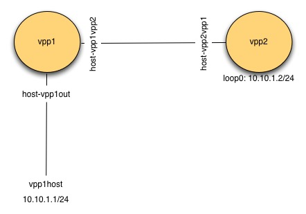

# VPP progressive usages


## visualize VPP packet flow

```
# vppctl show vlib graphviz > vpp_graph.dot
# dot -Tpng vpp_graph.dot -o vpp_graph.png
```

## create host interface
* create veth pair
```
# sudo ip link add name vpp1out type veth peer name vpp1host
# sudo ip link set dev vpp1out up
# sudo ip link set dev vpp1host up
# sudo ip addr add 10.10.1.1/24 dev vpp1host
```

* startup vpp instance from [startup1.conf](./vpp-tutorial/startup1.conf)
```
# sudo /usr/bin/vpp -c startup1.conf
```

* create host interface
```
# sudo vppctl -s /run/vpp/cli-vpp1.sock
vpp# create host-interface name vpp1out
vpp# set int state host-vpp1out up
vpp# set int ip address host-vpp1out 10.10.1.2/24
vpp# show int addr
```

## trace

```
vpp# trace add <NODE COUNT>
vpp# filter trace <include NODE COUNT | exclude NODE COUNT | none>
```

```
vpp# trace add af-packet-input 10
vpp# show trace
------------------- Start of thread 0 vpp_main -------------------
Packet 1

00:56:16:812952: af-packet-input                                        # node: af-packet-input
  af_packet: hw_if_index 1 rx-queue 0 next-index 4
    block 93:
      address 0x72f322683000 version 2 seq_num 414 pkt_num 0
    tpacket3_hdr:
      status 0x20000001 len 98 snaplen 98 mac 92 net 106
      sec 0x699129bb nsec 0x2a83ebc5 vlan 0 vlan_tpid 0
    vnet-hdr:
      flags 0x00 gso_type 0x00 hdr_len 0
      gso_size 0 csum_start 0 csum_offset 0
00:56:16:816277: ethernet-input                                         # node: ethernet-input
  IP4: 3e:b9:cb:70:47:9c -> 02:fe:53:fc:6b:9b
00:56:16:816282: ip4-input                                              # node: ip4-input
  ICMP: 10.10.1.1 -> 10.10.1.2
    tos 0x00, ttl 64, length 84, checksum 0x0afc dscp CS0 ecn NON_ECN
    fragment id 0x1997, flags DONT_FRAGMENT
  ICMP echo_request checksum 0xa637 id 3
00:56:16:816285: ip4-lookup                                             # node: ip4-lookup
  fib 0 dpo-idx 7 flow hash: 0x00000000
  ICMP: 10.10.1.1 -> 10.10.1.2
    tos 0x00, ttl 64, length 84, checksum 0x0afc dscp CS0 ecn NON_ECN
    fragment id 0x1997, flags DONT_FRAGMENT
  ICMP echo_request checksum 0xa637 id 3
00:56:16:816288: ip4-receive                                            # node: ip4-receive
    fib:0 adj:7 flow:0x00000000
  ICMP: 10.10.1.1 -> 10.10.1.2
    tos 0x00, ttl 64, length 84, checksum 0x0afc dscp CS0 ecn NON_ECN
    fragment id 0x1997, flags DONT_FRAGMENT
  ICMP echo_request checksum 0xa637 id 3
00:56:16:816290: ip4-icmp-input                                         # node: ip4-icmp-input
  ICMP: 10.10.1.1 -> 10.10.1.2
    tos 0x00, ttl 64, length 84, checksum 0x0afc dscp CS0 ecn NON_ECN
    fragment id 0x1997, flags DONT_FRAGMENT
  ICMP echo_request checksum 0xa637 id 3
00:56:16:816290: ip4-icmp-echo-request                                  # node: ip4-icmp-echo-request, the handler generates the reponse
  ICMP: 10.10.1.1 -> 10.10.1.2
    tos 0x00, ttl 64, length 84, checksum 0x0afc dscp CS0 ecn NON_ECN
    fragment id 0x1997, flags DONT_FRAGMENT
  ICMP echo_request checksum 0xa637 id 3
00:56:16:816293: ip4-load-balance                                        # node: ip4-load-balance
  fib 0 dpo-idx 2 flow hash: 0x00000000
  ICMP: 10.10.1.2 -> 10.10.1.1
    tos 0x00, ttl 64, length 84, checksum 0x4dfc dscp CS0 ecn NON_ECN
    fragment id 0xd696, flags DONT_FRAGMENT
  ICMP echo_reply checksum 0xae37 id 3
00:56:16:816294: ip4-rewrite                                            # node: ip4-rewrit
  tx_sw_if_index 1 dpo-idx 2 : ipv4 via 10.10.1.1 host-vpp1out: mtu:9000 next:3 flags:[] 3eb9cb70479c02fe53fc6b9b0800 flow hash: 0x00000000
  00000000: 3eb9cb70479c02fe53fc6b9b080045000054d696400040014dfc0a0a01020a0a
  00000020: 01010000ae370003017dbb299169000000003ae20a00000000001011
00:56:16:816295: host-vpp1out-output                                    # node: host-vpp1out-output
  host-vpp1out flags 0x03180005
  IP4: 02:fe:53:fc:6b:9b -> 3e:b9:cb:70:47:9c
  ICMP: 10.10.1.2 -> 10.10.1.1
    tos 0x00, ttl 64, length 84, checksum 0x4dfc dscp CS0 ecn NON_ECN
    fragment id 0xd696, flags DONT_FRAGMENT
  ICMP echo_reply checksum 0xae37 id 3
00:56:16:816298: host-vpp1out-tx                                       # node: host-vpp1out-tx
  af_packet: hw_if_index 1 tx-queue 0
    tpacket3_hdr:
      status 0x1 len 108 snaplen 108 mac 0 net 0
      sec 0x0 nsec 0x0 vlan 0 vlan_tpid 0
    vnet-hdr:
      flags 0x00 gso_type 0x00 hdr_len 0
      gso_size 0 csum_start 0 csum_offset 0
    buffer 0x94c88:
      current data 0, length 98, buffer-pool 0, ref-count 1, trace handle 0x0
      local ip4 l2-hdr-offset 0 l3-hdr-offset 14
    IP4: 02:fe:53:fc:6b:9b -> 3e:b9:cb:70:47:9c
    ICMP: 10.10.1.2 -> 10.10.1.1
      tos 0x00, ttl 64, length 84, checksum 0x4dfc dscp CS0 ecn NON_ECN
      fragment id 0xd696, flags DONT_FRAGMENT
    ICMP echo_reply checksum 0xae37 id 3
```

## ARP table

```
vpp# show ip neighbor
     Age                       IP                    Flags      Ethernet              Interface
     31.1801                10.10.1.1                  D    3e:b9:cb:70:47:9c host-vpp1out
```
* `Age`: the neighbor was last heard from/verified 31s ago.


## memif

* instance1
```
# sudo vppctl -s /run/vpp/cli-vpp1.sock
vpp# create interface memif id 0 master
vpp# set interface state memif0/0 up
vpp# set int ip addr memif0/0 10.10.2.1/24
vpp# show memif
sockets
  id  listener    filename
  0   yes (1)     /run/vpp/memif.sock

interface memif0/0
  remote-name "VPP 25.10-release"
  remote-interface "memif0/0"
  socket-id 0 id 0 mode ethernet
  flags admin-up connected
  listener-fd 13 conn-fd 14
  num-s2m-rings 1 num-m2s-rings 1 buffer-size 0 num-regions 2
  region 0 size 33024 fd 15
  region 1 size 39845888 fd 16
    master-to-slave ring 0:
      region 0 offset 16512 ring-size 1024 int-fd 18
      head 1024 tail 5 flags 0x0001 interrupts 0
    slave-to-master ring 0:
      region 0 offset 0 ring-size 1024 int-fd 17
      head 5 tail 5 flags 0x0001 interrupts 0
```

* instance2
```
# sudo vppctl -s /run/vpp/cli-vpp2.sock
vpp# create interface memif id 0 slave
vpp# set int state memif0/0 up
vpp# set int ip addr memif0/0 10.10.2.2/24
```

## routing table

```
vpp# show ip fib
ipv4-VRF:0, fib_index:0, flow hash:[src dst sport dport proto flowlabel ] epoch:0 flags:none locks:[adjacency:1, default-route:1, ]
0.0.0.0/0
  unicast-ip4-chain
  [@0]: dpo-load-balance: [proto:ip4 index:1 buckets:1 uRPF:0 to:[0:0]]
    [0] [@0]: dpo-drop ip4
0.0.0.0/32
  unicast-ip4-chain
  [@0]: dpo-load-balance: [proto:ip4 index:2 buckets:1 uRPF:1 to:[0:0]]
    [0] [@0]: dpo-drop ip4
10.10.1.0/32
  unicast-ip4-chain
  [@0]: dpo-load-balance: [proto:ip4 index:11 buckets:1 uRPF:10 to:[0:0]]
    [0] [@0]: dpo-drop ip4
10.10.1.1/32                                                                                                        # the IP of other side of veth pair, learnt from ARP
  unicast-ip4-chain                                                                                                 # define the DPO chain
  [@0]: dpo-load-balance: [proto:ip4 index:13 buckets:1 uRPF:13 to:[0:0] via:[1501:126084]]                         # default dpo-load-balance DPO
    [0] [@5]: ipv4 via 10.10.1.1 host-vpp1out: mtu:9000 next:3 flags:[] 3eb9cb70479c02fe53fc6b9b0800                # adjacency DPO
10.10.1.0/24                                                                                                        # the subnet of the local veth port
  unicast-ip4-chain
  [@0]: dpo-load-balance: [proto:ip4 index:10 buckets:1 uRPF:9 to:[0:0]]
    [0] [@4]: ipv4-glean: [src:10.10.1.0/24] host-vpp1out: mtu:9000 next:1 flags:[] ffffffffffff02fe53fc6b9b0806    # address resolution DPO
10.10.1.2/32
  unicast-ip4-chain
  [@0]: dpo-load-balance: [proto:ip4 index:9 buckets:1 uRPF:8 to:[1501:126084]]
    [0] [@12]: dpo-receive: 10.10.1.2 on host-vpp1out
10.10.1.255/32
  unicast-ip4-chain
  [@0]: dpo-load-balance: [proto:ip4 index:12 buckets:1 uRPF:12 to:[0:0]]
    [0] [@0]: dpo-drop ip4
224.0.0.0/4
  unicast-ip4-chain
  [@0]: dpo-load-balance: [proto:ip4 index:4 buckets:1 uRPF:3 to:[0:0]]
    [0] [@0]: dpo-drop ip4
240.0.0.0/4
  unicast-ip4-chain
  [@0]: dpo-load-balance: [proto:ip4 index:3 buckets:1 uRPF:2 to:[0:0]]
    [0] [@0]: dpo-drop ip4
255.255.255.255/32
  unicast-ip4-chain
  [@0]: dpo-load-balance: [proto:ip4 index:5 buckets:1 uRPF:4 to:[0:0]]
    [0] [@0]: dpo-drop ip4
```


* `unicast-ip4-chain`: represents the sequence of operations (DPOs: data plane objects) a packet must traverse to be forwarded for a specific route
* `dpo-load-balance`: the load-balance DPO sits between FIB and the exit interface, it is to select a out bucket for a flow
  * the bucket is selected by "5-tuple"
* `ipv4-glean`: the ARP DPO, whenever a packet hits this DPO, an ARP request is generated
* `ipv4 via 10.10.1.1 host-vpp1out`: the adjacency DPO

### add static route
```
# sudo vppctl -s /run/vpp/cli-vpp2.sock
vpp# ip route add 10.10.1.0/24  via 10.10.2.1
vpp# show ip fib
ipv4-VRF:0, fib_index:0, flow hash:[src dst sport dport proto flowlabel ] epoch:0 flags:none locks:[adjacency:1, recursive-resolution:1, default-route:1, ]
10.10.1.0/24
  unicast-ip4-chain
  [@0]: dpo-load-balance: [proto:ip4 index:14 buckets:1 uRPF:14 to:[0:0]]
    [0] [@13]: dpo-load-balance: [proto:ip4 index:13 buckets:1 uRPF:13 to:[9:864]]
          [0] [@5]: ipv4 via 10.10.2.1 memif0/0: mtu:9000 next:3 flags:[] 02fe5d72cf5902feccde35e00800
10.10.2.1/32
  unicast-ip4-chain
  [@0]: dpo-load-balance: [proto:ip4 index:13 buckets:1 uRPF:13 to:[9:864]]
    [0] [@5]: ipv4 via 10.10.2.1 memif0/0: mtu:9000 next:3 flags:[] 02fe5d72cf5902feccde35e0080
```


## switching



* VPP instance 1
```
vpp# set int l2 bridge host-vpp1vpp2 1
vpp# set int l2 bridge host-vpp1out 1
vpp# show bridge-domain 1 detail
  BD-ID   Index   BSN  Age(min)  Learning  U-Forwrd   UU-Flood   Flooding  ARP-Term  arp-ufwd Learn-co Learn-li   BVI-Intf
    1       1      0     off        on        on       flood        on       off       off        0    16777216     N/A
span-l2-input l2-input-classify l2-input-feat-arc l2-policer-classify l2-input-acl vpath-input-l2 l2-ip-qos-record l2-input-vtr l2-learn l2-rw l2-fwd l2-flood l2-flood l2-output

           Interface           If-idx ISN  SHG  BVI  TxFlood        VLAN-Tag-Rewrite
         host-vpp1vpp2           2     3    0    -      *                 none
         host-vpp1out            1     3    0    -      *                 none
```

* VPP instance 2
```
vpp# create loopback interface
loop0
vpp# set int state loop0 up
vpp# set int ip address loop0 10.10.1.2/24
vpp# set int l2 bridge loop0 1 bvi
vpp# set int l2 bridge host-vpp2vpp1 1
vpp# show bridge-domain 1 detail
  BD-ID   Index   BSN  Age(min)  Learning  U-Forwrd   UU-Flood   Flooding  ARP-Term  arp-ufwd Learn-co Learn-li   BVI-Intf
    1       1      0     off        on        on       flood        on       off       off        0    16777216    loop0
span-l2-input l2-input-classify l2-input-feat-arc l2-policer-classify l2-input-acl vpath-input-l2 l2-ip-qos-record l2-input-vtr l2-learn l2-rw l2-fwd l2-flood l2-flood l2-output

           Interface           If-idx ISN  SHG  BVI  TxFlood        VLAN-Tag-Rewrite
             loop0               2     1    0    *      *                 none
         host-vpp2vpp1           1     1    0    -      *                 none
```

* ping from host to `10.10.1.2` and trace on VPP instance 1

```
vpp# trace add af-packet-input 10
vpp# show trace
------------------- Start of thread 0 vpp_main -------------------
Packet 1

00:14:22:938685: af-packet-input
  af_packet: hw_if_index 1 rx-queue 0 next-index 4
    block 36:
      address 0x7ce1adc0b000 version 2 seq_num 37 pkt_num 0
    tpacket3_hdr:
      status 0x20000001 len 98 snaplen 98 mac 92 net 106
      sec 0x6991a4da nsec 0x28b13ae1 vlan 0 vlan_tpid 0
    vnet-hdr:
      flags 0x00 gso_type 0x00 hdr_len 0
      gso_size 0 csum_start 0 csum_offset 0
00:14:22:946885: ethernet-input
  IP4: 3e:b9:cb:70:47:9c -> de:ad:00:00:00:00
00:14:22:946892: l2-input
  l2-input: sw_if_index 1 dst de:ad:00:00:00:00 src 3e:b9:cb:70:47:9c [l2-learn l2-fwd l2-flood l2-flood ]
00:14:22:946894: l2-learn
  l2-learn: sw_if_index 1 dst de:ad:00:00:00:00 src 3e:b9:cb:70:47:9c bd_index 1
00:14:22:946896: l2-fwd
  l2-fwd:   sw_if_index 1 dst de:ad:00:00:00:00 src 3e:b9:cb:70:47:9c bd_index 1 result [0x30d0000000002, 2] none
00:14:22:946898: l2-output
  l2-output: sw_if_index 2 dst de:ad:00:00:00:00 src 3e:b9:cb:70:47:9c data 08 00 45 00 00 54 df 46 40 00 40 01
00:14:22:946900: host-vpp1vpp2-output
  host-vpp1vpp2 flags 0x00180005
  IP4: 3e:b9:cb:70:47:9c -> de:ad:00:00:00:00
  ICMP: 10.10.1.1 -> 10.10.1.2
    tos 0x00, ttl 64, length 84, checksum 0x454c dscp CS0 ecn NON_ECN
    fragment id 0xdf46, flags DONT_FRAGMENT
  ICMP echo_request checksum 0x1090 id 8
00:14:22:946902: host-vpp1vpp2-tx
  af_packet: hw_if_index 2 tx-queue 0
    tpacket3_hdr:
      status 0x1 len 108 snaplen 108 mac 0 net 0
      sec 0x0 nsec 0x0 vlan 0 vlan_tpid 0
    vnet-hdr:
      flags 0x00 gso_type 0x00 hdr_len 0
      gso_size 0 csum_start 0 csum_offset 0
    buffer 0x950de:
      current data 0, length 98, buffer-pool 0, ref-count 1, trace handle 0x0
      l2-hdr-offset 0 l3-hdr-offset 14
    IP4: 3e:b9:cb:70:47:9c -> de:ad:00:00:00:00
    ICMP: 10.10.1.1 -> 10.10.1.2
      tos 0x00, ttl 64, length 84, checksum 0x454c dscp CS0 ecn NON_ECN
      fragment id 0xdf46, flags DONT_FRAGMENT
    ICMP echo_request checksum 0x1090 id 
```

### FIB

* VPP instance 2 fib
```
10.10.1.1/32                                                                                                        # the resolved neighbor
  unicast-ip4-chain
  [@0]: dpo-load-balance: [proto:ip4 index:13 buckets:1 uRPF:13 to:[0:0] via:[138:11592]]
    [0] [@5]: ipv4 via 10.10.1.1 loop0: mtu:9000 next:3 flags:[] 3eb9cb70479cdead000000000800                       # adjacency DPO
10.10.1.0/24                                                                                                        # the glean bridge subnet
  unicast-ip4-chain
  [@0]: dpo-load-balance: [proto:ip4 index:10 buckets:1 uRPF:9 to:[0:0]]
    [0] [@4]: ipv4-glean: [src:10.10.1.0/24] loop0: mtu:9000 next:1 flags:[] ffffffffffffdead000000000806
10.10.1.2/32                                                                                                        # the local BVI
  unicast-ip4-chain
  [@0]: dpo-load-balance: [proto:ip4 index:9 buckets:1 uRPF:8 to:[138:11592]]
    [0] [@12]: dpo-receive: 10.10.1.2 on loop0                                                                      # dpo-receive means forward to local device
```

