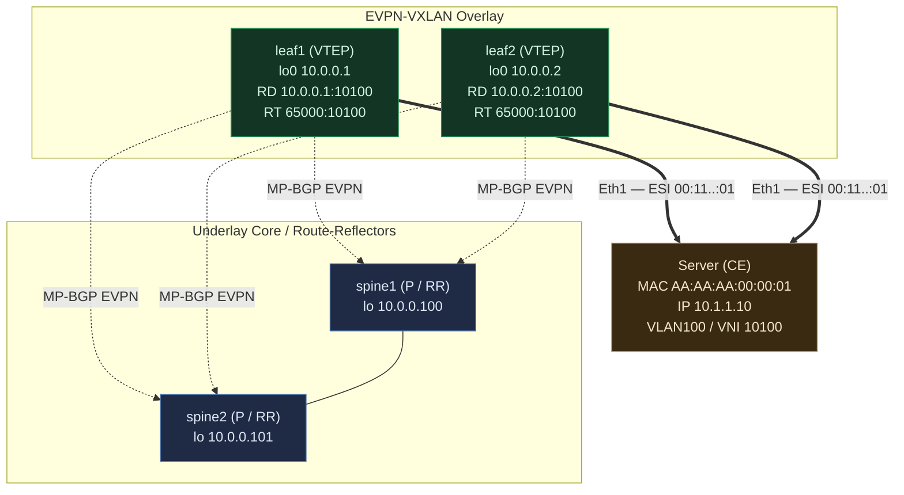

# EVPN All-Active Multihoming — Two Leaves Example

Two leaves dual-attached to one server via an ESI LAG. This is the canonical
active-active case. Config is FRR-style (what SONiC's `bgpd` runs).

## Topology



Edge legend: **thick `==>`** = the ESI LAG (server's single LACP bond, same ESI
on both leaves — the all-active data path); **dashed `-.->`** = MP-BGP EVPN
control-plane sessions to the spine route-reflectors; **plain `---`** =
spine-to-spine underlay.

The server has **one LACP bond** split across leaf1-Eth1 and leaf2-Eth1. Both leaves
forward for it simultaneously = **all-active**. Tenant: VLAN100 ↔ **L2 VNI
10100**; tenant VRF ↔ **L3 VNI 10200**.

## Addressing that matters (and why)

| Purpose | leaf1 | leaf2 | Why |
|---|---|---|---|
| **Loopback0 / Router-ID / VTEP source** | `10.0.0.1/32` | `10.0.0.2/32` | Each leaf's *unique* VTEP tunnel source. Distinct per leaf. |
| **Anycast VTEP loopback** (optional, for AA) | `10.0.0.10/32` | `10.0.0.10/32` | **Shared** — advertised by *both* so remote VTEPs load-share/failover to the pair. |
| **ESI** (on the bond) | `00:11:...:01` | `00:11:...:01` | **Identical** on both leaves — this is what says "same multihomed link." |
| **Anycast gateway IP+MAC** (VLAN100 SVI) | `10.1.1.1` / `00:00:5e:...` | `10.1.1.1` / same MAC | **Shared** — server's default gateway answered by whichever leaf. |
| Underlay p2p to spines | /31s | /31s | eBGP underlay, unique. |

**Discipline:** things that must be *distinct* → loopback0 / VTEP-source / RD.
Things that make the pair act as *one* → ESI, anycast VTEP, anycast gateway, RT.

## BGP config (FRR style — what SONiC's bgpd runs)

**leaf1:**

```
router bgp 65001
 bgp router-id 10.0.0.1
 neighbor 10.0.0.100 remote-as 65100      ! spine1 = RR (or eBGP underlay)
 neighbor 10.0.0.101 remote-as 65100      ! spine2 = RR
 !
 address-family l2vpn evpn
  neighbor 10.0.0.100 activate
  neighbor 10.0.0.101 activate
  advertise-all-vni
 exit-address-family
!
! L2 VNI (bridging)
vni 10100
 rd 10.0.0.1:10100               ! per-leaf unique RD  (leaf2 uses 10.0.0.2:10100)
 route-target import 65000:10100 ! shared RT -> same L2 domain
 route-target export 65000:10100
!
! L3 VNI (tenant VRF routing, symmetric IRB)
vrf Vrf_tenant1
 vni 10200
 rd 10.0.0.1:10200
 route-target import 65000:10200
 route-target export 65000:10200
```

**leaf2 is identical except** `router-id 10.0.0.2`, `rd 10.0.0.2:10100`,
`rd 10.0.0.2:10200`. **RTs are the same on both** (`65000:10100`,
`65000:10200`) — that shared RT is what glues them into one VNI/VRF. **RDs
differ** so their advertisements of the *same* server stay distinct paths
(essential for all-active ECMP).

The **ESI on the bond** (config side, e.g. via SONiC/FRR interface):

```
interface bond0
 evpn mh es-id 00:11:11:11:11:11:11:11:00:01   ! SAME on leaf1 and leaf2
 evpn mh es-df-pref 32767                        ! DF election preference
```

## The EVPN routes that appear

EVPN uses typed NLRI. This all-active setup produces **four/five route types**.

### Type-4 — Ethernet Segment route (who shares this ESI)

Both leaves advertise membership of ESI `00:11...:01`:

```
[4]:[00:11:11:11:11:11:11:11:00:01]:[10.0.0.1]   from leaf1  RT=ES-import(auto from ESI)
[4]:[00:11:11:11:11:11:11:11:00:01]:[10.0.0.2]   from leaf2
```

**Purpose:** the two leaves *discover each other* as attached to the same segment →
they run **DF (Designated Forwarder) election** (for BUM traffic) and enable
**split-horizon** so a frame from the server isn't echoed back to it via the peer.

### Type-1 — Ethernet Auto-Discovery (the all-active enabler)

```
[1]:[ESI 00:11...:01]:[EthTag 0]   from leaf1, ESI-label, "Single-Active=0" (all-active)
[1]:[ESI 00:11...:01]:[EthTag 0]   from leaf2
```

**Purpose — this is the load-balancing route.** A remote VTEP that has a MAC
pointing at this ESI uses the **Type-1 A-D per-ES** routes to know it can send to
*both* leaf1 and leaf2 → **aliasing**: it ECMPs traffic to the MAC across both VTEPs
even if only one leaf actually learned the MAC. Also gives **fast mass-withdraw**:
if leaf1's link fails, one Type-1 withdraw reconverges all MACs on that ESI at once.

### Type-2 — MAC/IP advertisement (the host route)

Say the server's frame was learned on leaf1:

```
RD 10.0.0.1:10100
[2]:[ESI 00:11...:01]:[EthTag 0]:[48]:[AA:AA:AA:00:00:01]:[32]:[10.1.1.10]
    L2VNI 10100, L3VNI 10200
    next-hop 10.0.0.1
    ESI = 00:11...:01
    RT 65000:10100 (L2)  + 65000:10200 (L3, symmetric IRB)
    MAC-mobility seq, sticky flags...
```

Key point: the Type-2 carries the **ESI**, not just leaf1's VTEP IP. So a remote
VTEP importing it (RT match) learns:

- MAC `AA:AA:AA:00:00:01` / IP `10.1.1.10` is behind **ESI 00:11...:01**, and
- via Type-1 A-D, that ESI = {leaf1, leaf2} →
- **install ECMP next-hops 10.0.0.1 and 10.0.0.2** for that MAC. Traffic to the
  server load-balances across both leaves. **That's active-active.**

Even though only leaf1 learned the MAC in the data plane, leaf2 forwards for it too
(aliasing), because they share the ESI.

### Type-3 — Inclusive Multicast (BUM flooding)

```
RD 10.0.0.1:10100
[3]:[EthTag 0]:[32]:[10.0.0.1]   from leaf1   (PMSI = ingress replication)
[3]:...:[10.0.0.2]               from leaf2
```

**Purpose:** builds the BUM (broadcast / unknown-unicast / multicast) flood list
per VNI via ingress replication. DF election (from Type-4) ensures only **one** of
leaf1/leaf2 forwards BUM *toward the server* so it isn't duplicated.

### Type-5 — IP Prefix (symmetric IRB / external)

```
RD 10.0.0.1:10200
[5]:[EthTag 0]:[24]:[10.1.1.0]   L3VNI 10200, RT 65000:10200, router-MAC ...
```

**Purpose:** advertises the tenant *prefix* (not host) for routed reachability —
e.g. to a border leaf / external, or for silent hosts. Imported into the tenant
VRF via the L3 RT.

## How a remote VTEP (leaf3) ends up load-balancing

On leaf3, `show bgp l2vpn evpn` shows the Type-2 for the server MAC with **ESI
populated**, and the FIB resolves it to **two** overlay next-hops:

```
MAC AA:AA:AA:00:00:01 (IP 10.1.1.10)  VNI 10100
  ESI 00:11:11:11:11:11:11:11:00:01
  nexthop 10.0.0.1  (leaf1)   \
  nexthop 10.0.0.2  (leaf2)   /  ECMP  -> VXLAN encap, hash per-flow
```

Server→out and out→server both use both leaves. If leaf1 dies: its Type-1 A-D per-ES
withdraw removes the `10.0.0.1` next-hop for *every* MAC on the ESI in one shot →
sub-second failover to leaf2 alone, no per-MAC churn.

## The three rules that make it "active-active," distilled

1. **Same ESI** on both leaves' bond → they know they front the same link
   (Type-4 → DF election + split-horizon; Type-1 → aliasing / mass-withdraw).
2. **Same RT, different RD** → both land in one VNI/VRF, but their advertisements
   stay distinct paths so remote VTEPs can ECMP.
3. **Anycast gateway (shared IP+MAC)** on the SVI → the server's first-hop routing
   is answered by whichever leaf the flow hashes to, no VRRP needed.

## Quick RD/RT recap

- **RD (Route Distinguisher)** — 8-byte value *prepended* to the route to make it
  globally **unique**. Pure disambiguation, no policy. Per-leaf-per-EVI (distinct).
- **RT (Route Target)** — BGP extended-community **attribute** controlling
  **import/export** (who receives the route). Per-VNI (shared) → membership.
