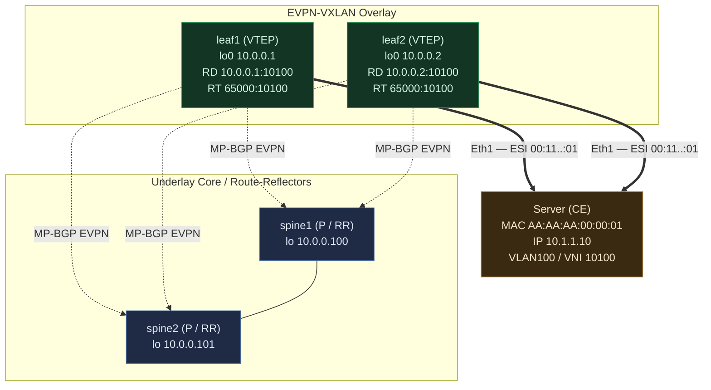

# EVPN All-Active Multihoming — Two Leaves Example

Two leaves dual-attached to one server via an ESI LAG. This is the canonical
active-active case. Config is FRR-style (what SONiC's `bgpd` runs).

## Topology



Edge legend: **thick `==>`** = the ESI LAG (server's single LACP bond, same ESI
on both leaves — the all-active data path); **dashed `-.->`** = MP-BGP EVPN
control-plane sessions to the spine route-reflectors; **plain `---`** =
spine-to-spine underlay.

The server has **one LACP bond** split across leaf1-Eth1 and leaf2-Eth1. Both leaves
forward for it simultaneously = **all-active**. Tenant: VLAN100 ↔ **L2 VNI
10100**; tenant VRF ↔ **L3 VNI 10200**.

## Addressing that matters (and why)

| Purpose | leaf1 | leaf2 | Why |
|---|---|---|---|
| **Loopback0 / Router-ID / VTEP source** | `10.0.0.1/32` | `10.0.0.2/32` | Each leaf's *unique* VTEP tunnel source. Distinct per leaf. |
| **Anycast VTEP loopback** (optional, for AA) | `10.0.0.10/32` | `10.0.0.10/32` | **Shared** — advertised by *both* so remote VTEPs load-share/failover to the pair. |
| **ESI** (on the bond) | `00:11:...:01` | `00:11:...:01` | **Identical** on both leaves — this is what says "same multihomed link." |
| **Anycast gateway IP+MAC** (VLAN100 SVI) | `10.1.1.1` / `00:00:5e:...` | `10.1.1.1` / same MAC | **Shared** — server's default gateway answered by whichever leaf. |
| Underlay p2p to spines | /31s | /31s | eBGP underlay, unique. |

**Discipline:** things that must be *distinct* → loopback0 / VTEP-source / RD.
Things that make the pair act as *one* → ESI, anycast VTEP, anycast gateway, RT.

## BGP config (FRR style — what SONiC's bgpd runs)

**leaf1:**

```
router bgp 65001
 bgp router-id 10.0.0.1
 neighbor 10.0.0.100 remote-as 65100      ! spine1 = RR (or eBGP underlay)
 neighbor 10.0.0.101 remote-as 65100      ! spine2 = RR
 !
 address-family l2vpn evpn
  neighbor 10.0.0.100 activate
  neighbor 10.0.0.101 activate
  advertise-all-vni
 exit-address-family
!
! L2 VNI (bridging)
vni 10100
 rd 10.0.0.1:10100               ! per-leaf unique RD  (leaf2 uses 10.0.0.2:10100)
 route-target import 65000:10100 ! shared RT -> same L2 domain
 route-target export 65000:10100
!
! L3 VNI (tenant VRF routing, symmetric IRB)
vrf Vrf_tenant1
 vni 10200
 rd 10.0.0.1:10200
 route-target import 65000:10200
 route-target export 65000:10200
```

**leaf2 is identical except** `router-id 10.0.0.2`, `rd 10.0.0.2:10100`,
`rd 10.0.0.2:10200`. **RTs are the same on both** (`65000:10100`,
`65000:10200`) — that shared RT is what glues them into one VNI/VRF. **RDs
differ** so their advertisements of the *same* server stay distinct paths
(essential for all-active ECMP).

The **ESI on the bond** (config side, e.g. via SONiC/FRR interface):

```
interface bond0
 evpn mh es-id 00:11:11:11:11:11:11:11:00:01   ! SAME on leaf1 and leaf2
 evpn mh es-df-pref 32767                        ! DF election preference
```

## The EVPN routes that appear

EVPN uses typed NLRI. This all-active setup produces **four/five route types**.

### route types
* EVPN routes all ride MP-BGP, address-family L2VPN EVPN (AFI 25, SAFI 70). Each route type is a different NLRI carrying a different kind of information:

| Type | Name | Carries | Primary job |
|---|---|---|---|
| 1 | Ethernet Auto-Discovery (A-D) | ESI, EthTag, ESI-label, Single-Active flag | Multihoming: aliasing + fast mass-withdraw + split-horizon label |
| 2 | MAC/IP Advertisement | MAC, IP (opt), L2VNI, L3VNI, ESI, router-MAC, MAC-mobility seq | Host reachability (the workhorse) |
| 3 | Inclusive Multicast Ethernet Tag (IMET) | VNI, originating VTEP, PMSI tunnel type | BUM flood list per VNI |
| 4 | Ethernet Segment (ES) | ESI, originating VTEP IP | Multihoming: ES discovery → DF election + split-horizon |
| 5 | IP Prefix | IP prefix, L3VNI, router-MAC, GW IP | Routed reachability (subnets, external, silent hosts) |
| 6 | Selective Multicast Ethernet Tag (SMET) | Multicast group (from IGMP/MLD) | Multicast optimization (prune to interested receivers) |
| 7 | Multicast Join Sync | ESI, multicast group | MH multicast: sync IGMP joins across ES peers |
| 8 | Multicast Leave Sync | ESI, multicast group | MH multicast: sync IGMP leaves across ES peers |

* Grouped by what they actually do
* Reachability — "where is X"
    * Type 2 (MAC/IP) — a specific host: MAC, optionally its IP. Carries L2VNI (bridging) + L3VNI (symmetric IRB routing) + ESI (enables aliasing). The workhorse. (1/3)
    * Type 5 (IP Prefix) — a subnet/prefix, not a host. Summaries, external routes, silent hosts. Routed via L3VNI + router-MAC. Type-2 = hosts, Type-5 = subnets.

* Multihoming — "two leaves = one server"
    * Type 4 (ES) — discovery: leaves sharing an ESI find each other → DF election (who forwards BUM to the server) + split-horizon setup.
    * Type 1 (A-D) — the all-active enabler: aliasing (remote VTEP ECMPs to a MAC across both leaves) + mass-withdraw (one route flips all MACs on the ESI at failover) + carries the ESI-label split-horizon consumes.

* BUM / multicast — "flood control"
    * Type 3 (IMET) — builds the per-VNI BUM flood list (ingress replication or PIM), keyed on VNI membership.
    * Type 6 (SMET) — optimizes the multicast subset: from IGMP snooping, prune so a VTEP only gets groups its receivers actually joined (vs Type-3's flood-all-BUM).
    * Types 7/8 (Join/Leave Sync) — on a shared ESI, keep multicast membership consistent across the ES peer leaves so the DF forwards the right groups even if the IGMP join landed on the non-DF leaf.

* Mnemonic
    * 1 = multihoming, load-balance (A-D → aliasing / mass-withdraw)
    * 2 = a host (MAC/IP)
    * 3 = BUM flood list (who's in the VNI)
    * 4 = multihoming, don't-duplicate (ES → DF election)
    * 5 = a subnet (IP prefix, L3)
    * 6 = multicast pruning (IGMP-derived)
    * 7/8 = multicast join/leave sync across ES peers


### Type-1 — Ethernet Auto-Discovery (the all-active enabler)

* type-1 is to let the fabric know here is a segment and how it behaves (all active, or active-standby)

| | per-ES A-D | per-EVI A-D |
|---|---|---|
| How many leaf3 needs | one (per leaf, but for the decision one is enough) | one from EACH leaf |
| What it gives leaf3 | "this ESI is all-active" (Single-Active=0) + mass-withdraw + (MPLS) ESI-label | a next-hop for the ESI in this VNI |
| Builds the ECMP set? | ❌ no — it's metadata about the segment | ✅ yes — each one adds one next-hop |

#### Type-1 per-ES (per Ethernet Segment)
* Per RFC 7432 the per-ES route uses RD = the segment RD, which FRR sets to <router-id>:0. Everything else is straight from the doc.
* leaf1
```
EVPN Type-1 A-D per-ES
  RD:              10.0.0.1:0                        ← segment RD (router-id:0)
  ESI:             00:11:11:11:11:11:11:11:00:01
  Ethernet Tag ID: 0xFFFFFFFF                        ← MAX-ET = whole segment
  MPLS Label(NLRI):0                                 ← label field 0; real label is in ext-comm
  Next-hop:        10.0.0.1
  Ext-communities:
    Route-Target:  65000:10100                       ← VNI/EVI RT
    ESI Label:     [ Single-Active = 0 (all-active),  ESI-label = 16001 ]
```
* leaf2
```
EVPN Type-1 A-D per-ES
  RD:              10.0.0.2:0                        ← segment RD (router-id:0)
  ESI:             00:11:11:11:11:11:11:11:00:01     ← SAME ESI
  Ethernet Tag ID: 0xFFFFFFFF
  MPLS Label(NLRI):0
  Next-hop:        10.0.0.2                          ← distinct
  Ext-communities:
    Route-Target:  65000:10100                       ← SAME VNI RT
    ESI Label:     [ Single-Active = 0,  ESI-label = 16002 ]
```

* **Same**: ESI, EthTag (MAX-ET), Single-Active=0, ES-import RT
* **Different**: RD (10.0.0.1:0 / 10.0.0.2:0), next-hop, ESI-label (16001/16002).

#### Type-1 per-EVI (per EVPN instance/VNI)
* leaf1
```
EVPN Type-1 A-D per-EVI  (VNI 10100)
  RD:              10.0.0.1:10100        ← doc's leaf1 L2 RD
  ESI:             00:11:11:11:11:11:11:11:00:01
  Ethernet Tag ID: 0
  MPLS Label/VNI:  10100
  Next-hop:        10.0.0.1
  Route-Target:    65000:10100           ← doc's shared L2 RT
```

* leaf2
```
EVPN Type-1 A-D per-EVI  (VNI 10100)
  RD:              10.0.0.2:10100        ← doc's leaf2 L2 RD
  ESI:             00:11:11:11:11:11:11:11:00:01     ← SAME ESI
  Ethernet Tag ID: 0
  MPLS Label/VNI:  10100
  Next-hop:        10.0.0.2                          ← distinct
  Route-Target:    65000:10100                       ← SAME shared RT
```

* **Same**: ESI, EthTag=0, VNI 10100, RT 65000:10100.
* **Different**: RD (10.0.0.1:10100 / 10.0.0.2:10100), next-hop.

#### how leaf3 assembles active-active?

```
Import per-EVI Type-1 (RT 65000:10100 matches leaf3's VNI 10100):
   ESI 00:11:11:11:11:11:11:11:00:01, VNI 10100  →  { 10.0.0.1, 10.0.0.2 }   ← ECMP set (aliasing)

Import per-ES Type-1 (ES-import RT 65000:10100):
   ESI is all-active (Single-Active=0)                                        ← ECMP allowed
   leaf1 split-horizon label 16001, leaf2 16002                              ← (MPLS only)
```

* Then the doc's Type-2 arrives (say from leaf1):
```
RD 10.0.0.1:10100
[2]:[ESI 00:11:11:11:11:11:11:11:00:01]:[0]:[48]:[AA:AA:AA:00:00:01]:[32]:[10.1.1.10]
    next-hop 10.0.0.1,  RT 65000:10100 (+ 65000:10200 L3)
```

* leaf3 reads its ESI → looks up `{10.0.0.1, 10.0.0.2}` → installs ECMP to both leaves for the MAC. That's active-active. On leaf1 failure, its one per-ES Type-1 (10.0.0.1:0) withdraws → leaf3 drops 10.0.0.1 → all MACs on the ESI collapse to {10.0.0.2}.

#### massive withdraw

* **FACT**: Remote VTEPs don't point MACs directly at leaf1 or leaf2 VTEP IP — they point them at the ESI, which resolves (via the per-ES/per-EVI A-D routes) to the set of leaves on that segment:
```
Before failure, on leaf3:
   5000 MACs  ──resolve to──►  ESI 00:11...:01  ──resolves to──►  { 10.0.0.1, 10.0.0.2 }

leaf1 withdraws  per-ES A-D [1]:[00:11...:01]  (RD 10.0.0.1:0)   ← ONE message
   │
   └─► leaf3 removes 10.0.0.1 from the ESI's next-hop set
          ESI 00:11...:01  →  { 10.0.0.2 }        (was {10.0.0.1, 10.0.0.2})
   │
   └─► ALL 5000 MACs that resolve through that ESI instantly re-point to { 10.0.0.2 }
```

* withdraw message:
```
WITHDRAW:  [1]:[ESI 00:11:11:11:11:11:11:11:00:01]:[EthTag 0xFFFFFFFF]
           RD 10.0.0.1:0
```

* withdraw hierachy:
```
1 × per-ES A-D withdraw      → clears leaf1 for the WHOLE ESI, all VNIs, all MACs   ← MASS WITHDRAW (fastest, O(1))
N × per-EVI A-D withdraw     → clears leaf1 for the ESI, per-VNI  (N = #VNIs)        ← medium
M × Type-2 withdraw          → clears leaf1 per-MAC  (M = #MACs)                     ← slowest, O(M), the backstop
```

#### why RD/RT differ between Type-1 per-ES and per-EVI?

| | per-ES | per-EVI (VNI 10100) |
|---|---|---|
| RD | 10.0.0.1:0 / 10.0.0.2:0 | 10.0.0.1:10100 / 10.0.0.2:10100 |
| RT | 65000:10100 (the VNI's RT — same as per-EVI) | 65000:10100 (the VNI's RT) |

* RD differs between the two flavors because they have different scopes; RT is the same on both because both must reach the same audience (the VNI's members).
* The per-EVI route is bound to one VNI, so it carries that VNI's RD (10.0.0.1:10100) and the VNI's RT (65000:10100) — imported into the VNI-10100 context like the MAC routes.
* The per-ES route spans the whole segment (all VNIs), so it can't use a VNI RD — it uses the segment RD <router-id>:0. But its RT is still the VNI RT (65000:10100) — in fact the per-ES A-D route carries the RTs of all EVIs the segment belongs to (here, just VNI 10100), precisely so it reaches all members of those VNIs, including remote VTEPs like leaf3. That's how leaf3 imports the per-ES route (via the VNI RT it already has) and learns Single-Active = all-active + the mass-withdraw handle.
In short: per-EVI is scoped to a VNI (VNI RD + VNI RT); per-ES is scoped to the Ethernet Segment for its RD (segment :0 RD) but still tagged with the VNI RT(s) for distribution. The RD tracks "unique within what scope" (segment vs VNI, so it differs), while the RT tracks "imported by whom" — and since both flavors must be delivered to the VNI's members, the RT is the same (65000:10100). Only the RD differs.

```
Type-1 per-ES A-D:  [1]:[00:11...:01]:[MAX-ET]   RD 10.0.0.1:0   RT 65000:10100 (VNI RT)
        │  RR reflects to everyone
        ├─► leaf2  (has VNI 10100 → import RT 65000:10100 matches)
        │        USE: Single-Active=0 + mass-withdraw handle (also same-segment peer)
        ├─► leaf3  (has VNI 10100 → import RT 65000:10100 matches)
        │        USE: learns Single-Active=0 (ECMP OK) + holds the mass-withdraw handle
        └─► leafX  (no VNI 10100 → RT 65000:10100 does NOT match → ignores it)   ← filtering
```

### Type-2 — MAC/IP advertisement (the host route)

Say the server's frame was learned on leaf1:

```
RD 10.0.0.1:10100
[2]:[ESI 00:11...:01]:[EthTag 0]:[48]:[AA:AA:AA:00:00:01]:[32]:[10.1.1.10]
    L2VNI 10100, L3VNI 10200
    next-hop 10.0.0.1
    ESI = 00:11...:01
    RT 65000:10100 (L2)  + 65000:10200 (L3, symmetric IRB)
    MAC-mobility seq, sticky flags...
```

Key point: the Type-2 carries the **ESI**, not just leaf1's VTEP IP. So a remote
VTEP importing it (RT match) learns:

- MAC `AA:AA:AA:00:00:01` / IP `10.1.1.10` is behind **ESI 00:11...:01**, and
- via Type-1 A-D, that ESI = {leaf1, leaf2} →
- **install ECMP next-hops 10.0.0.1 and 10.0.0.2** for that MAC. Traffic to the
  server load-balances across both leaves. **That's active-active.**

Even though only leaf1 learned the MAC in the data plane, leaf2 forwards for it too
(aliasing), because they share the ESI.

### Type-3 — Inclusive Multicast (BUM flooding)

```
RD 10.0.0.1:10100
[3]:[EthTag 0]:[32]:[10.0.0.1]   from leaf1   (PMSI = ingress replication)
[3]:...:[10.0.0.2]               from leaf2
```

**Purpose:** builds the BUM (broadcast / unknown-unicast / multicast) flood list
per VNI via ingress replication. DF election (from Type-4) ensures only **one** of
leaf1/leaf2 forwards BUM *toward the server* so it isn't duplicated.

### Type-4 — Ethernet Segment route (who shares this ESI)

Both leaves advertise membership of ESI `00:11...:01`:

```
[4]:[00:11:11:11:11:11:11:11:00:01]:[10.0.0.1]   from leaf1  RT=ES-import(auto from ESI)
[4]:[00:11:11:11:11:11:11:11:00:01]:[10.0.0.2]   from leaf2
```

**Purpose:** the two leaves *discover each other* as attached to the same segment →
they run **DF (Designated Forwarder) election** (for BUM traffic) and enable
**split-horizon** so a frame from the server isn't echoed back to it via the peer.

#### Type-4 walkthrough

1. Each advertises:
    * leaf1 has es-id 00:11...:01 configured on its bond, so it originates a Type-4 route [4]:[00:11...:01]:[10.0.0.1] and sends it to the spine (route-reflector) via MP-BGP EVPN.
    * leaf2 likewise advertises [4]:[00:11...:01]:[10.0.0.2].
2. RR reflects:
    * the spine, acting as RR, reflects both Type-4 routes to all EVPN neighbors — including each other. So leaf1 receives leaf2's Type-4, and vice versa.
3. Match by ESI (the key discovery step):
    * each leaf receives a Type-4 and compares the ESI field in the route against its own locally configured ESI:
        * leaf1 receives [4]:[00:11...:01]:[10.0.0.2] → the ESI matches its local 00:11...:01 → "10.0.0.2 is my peer on this segment."
        * leaf2 receives leaf1's route → matches the same way → "10.0.0.1 is my peer."
4. Build the member set:
    * each leaf collects the originators of all Type-4 routes whose ESI matches its local one, yielding the complete member list for this ES: here = {leaf1@10.0.0.1, leaf2@10.0.0.2}. Discovery complete.
5. DF election: each leaf independently runs the same deterministic algorithm over the same member set (default RFC 7432 modulo arithmetic, or the es-df-pref preference method) → all leaves compute the same DF result, with no need to exchange the "election result," because everyone has the same input and the same algorithm → the conclusion is necessarily identical.
    * **only the DF responds to the BUM traffic**
6. Split-horizon: once it knows "10.0.0.2 is also on the same segment," leaf1 can filter BUM frames that arrive flooded over the overlay from that ESI, avoiding echoing them back to the server.


```
server ──broadcast──▶ leaf1 (ingress)
   leaf1 floods into overlay, encap carries origin marker
      (ESI-label, or simply source VTEP = 10.0.0.1)
      ├─▶ leaf3 (remote, not on this segment) → delivers normally to its local server
      └─▶ leaf2 (same-segment member!)
             leaf2 checks: origin = ESI 00:11...:01 (via label)
                           or source VTEP = 10.0.0.1 which shares that ESI (via local bias)
             → matches "my own segment" → [split-horizon drops forwarding toward the bond]
             → server never receives its own broadcast ✔
   Meanwhile, for remote→server BUM, the DF (whichever of leaf1/leaf2 was elected)
   delivers one copy to the server; the non-DF stays silent → no duplication
```
* **NOTE**: leaf1 and leaf2 have the same VNI, so they are in each other's flood list.

### Type-5 — IP Prefix (symmetric IRB / external)

```
RD 10.0.0.1:10200
[5]:[EthTag 0]:[24]:[10.1.1.0]   L3VNI 10200, RT 65000:10200, router-MAC ...
```

**Purpose:** advertises the tenant *prefix* (not host) for routed reachability —
e.g. to a border leaf / external, or for silent hosts. Imported into the tenant
VRF via the L3 RT.

## How a remote VTEP (leaf3) ends up load-balancing

On leaf3, `show bgp l2vpn evpn` shows the Type-2 for the server MAC with **ESI
populated**, and the FIB resolves it to **two** overlay next-hops:

```
MAC AA:AA:AA:00:00:01 (IP 10.1.1.10)  VNI 10100
  ESI 00:11:11:11:11:11:11:11:00:01
  nexthop 10.0.0.1  (leaf1)   \
  nexthop 10.0.0.2  (leaf2)   /  ECMP  -> VXLAN encap, hash per-flow
```

Server→out and out→server both use both leaves. If leaf1 dies: its Type-1 A-D per-ES
withdraw removes the `10.0.0.1` next-hop for *every* MAC on the ESI in one shot →
sub-second failover to leaf2 alone, no per-MAC churn.

## The three rules that make it "active-active," distilled

1. **Same ESI** on both leaves' bond → they know they front the same link
   (Type-4 → DF election + split-horizon; Type-1 → aliasing / mass-withdraw).
2. **Same RT, different RD** → both land in one VNI/VRF, but their advertisements
   stay distinct paths so remote VTEPs can ECMP.
3. **Anycast gateway (shared IP+MAC)** on the SVI → the server's first-hop routing
   is answered by whichever leaf the flow hashes to, no VRRP needed.

## Quick RD/RT recap

- **RD (Route Distinguisher)** — 8-byte value *prepended* to the route to make it
  globally **unique**. Pure disambiguation, no policy. Per-leaf-per-EVI (distinct).
- **RT (Route Target)** — BGP extended-community **attribute** controlling
  **import/export** (who receives the route). Per-VNI (shared) → membership.

## references
* https://arista.my.site.com/AristaCommunity/s/article/Common-EVPN-Route-Types
* https://bgphelp.com/2017/04/03/evpn-type-1-ethernet-auto-discovery-explained/
