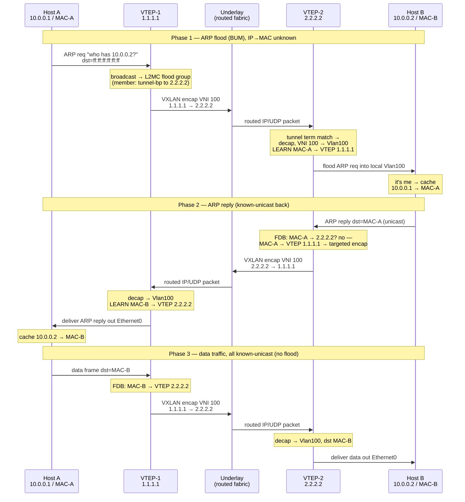

# vxlan with EVPN

## vxlan basics

* What VXLAN actually does
    * VXLAN's core job is to extend an L2 broadcast domain (a VLAN) across an L3 (routed) network — stretch one VLAN so hosts on different physical switches/subnets, connected only by an IP/routed underlay, behave as if they're on the same LAN.

* The full picture:
    * Known-unicast (the common case): host A's frame to host B's MAC gets VXLAN-encapped and sent as a single targeted packet to the VTEP behind B. No flooding. This is most traffic.
    * BUM/flood (broadcast, unknown-unicast, multicast): replicated to all remote VTEPs in the VNI. This is the part you're describing — and it's the exception, needed mainly for ARP, initial learning, etc.

### vxlan vs vlan
* vlan
    * l2 segmentation with 12-bit tag -> 4096 vlans
    * doesn't across L3 boundaries
* vxlan
    * l2-over-l3 overlay: MAC-in-UDP encapsulation (UDP dst port 4789)
    * 24-bt VNI -> 16M+ segments

### underlay vs overlay
* overlay is the virtual network
    * vxlan overlay is Ethernet
* underlay is the physical network
    * vxlan underlay is IP
 
---

|terms|detail|
|-|-|
|VNI(vxlan network identifier)|vxlan ID, the overlay segment|
|VTEP(vxlan tunnel endpoint)|vxlan encapsulation/decapsulation device|
|VTEP IP interface|the VTEP ip address in the underlay network, used to encap/decap Ethernet frames|
|VNI interface|defined in each overlay segment, local handle for the overlay segment; one VTEP can have multiple VNI interfaces|

* vxlan sonic config example:

```
{
    "VXLAN_TUNNEL": {
        "vtep1": {
            "src_ip": "1.2.3.4"
        }
    },
    "VXLAN_TUNNEL_MAP": {
        "vtep1|map_100_Vlan100": {
            "vni": "100",
            "vlan": "Vlan100"
        }
    }
}
```

### vxlan packet format


### vxlan frame forwarding


* the key is to find the mapping between dst MAC -> remote VTEP


## vxlan static ingress replication

* CONFIG_DB

```
{
    "VXLAN_TUNNEL": {
        "vtep1": {
            "src_ip": "1.2.3.4"
        }
    },
    "VXLAN_TUNNEL_MAP": {
        "vtep1|map_100_Vlan100": {
            "vni": "100",
            "vlan": "Vlan100"
        }
    }
}
```


* APPL_DB

```
VXLAN_REMOTE_VNI_TABLE:Vlan100:2.3.4.5   →  { vni: 100 }
```

* BUM (broadcast, unknown-unicast, and L2-multicast) frames get VXLAN-encapped (VNI 100, outer src 1.2.3.4, outer dst 2.3.4.5) and ingress-replicated to 2.3.4.5. With only one remote VTEP listed, there's exactly one flood copy.
* Add more VXLAN_REMOTE_VNI_TABLE:Vlan100:<ip> entries → one encapped copy per remote VTEP (head-end replication).

### example

* Setup
    * VNI 100 ↔ Vlan100, subnet 10.0.0.0/24
    * Switch-1 (VTEP-1): src_ip 1.1.1.1. Host A behind it: IP 10.0.0.1, MAC-A, on port Ethernet0.
    * Switch-2 (VTEP-2): src_ip 2.2.2.2. Host B behind it: IP 10.0.0.2, MAC-B, on port Ethernet0.
    * Underlay: 1.1.1.1 and 2.2.2.2 are IP-reachable (routed fabric, loopbacks advertised).
    * Each VTEP has VXLAN_REMOTE_VNI_TABLE:Vlan100:<other_vtep> → flood member built. (Way A — no EVPN; flooding via that list.)


