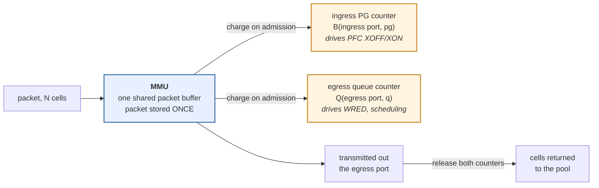
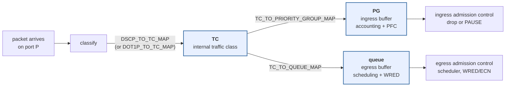

# buffer management

> All config/SAI values quoted below were read from a live SONiC switch
> (Broadcom TD3, `buffer_model = traditional`) unless noted otherwise.

## 1. what the hardware actually does

* The switch has **one** packet buffer, managed by the **MMU**. It is carved into fixed-size
  **cells** (208 B / 256 B / 384 B depending on the ASIC); a packet occupies
  `ceil(len / cell_size)` cells, so small packets waste the remainder of their last cell.
* A packet is stored **once**. It is *not* copied into an "ingress queue" and then an
  "egress queue".
* What is per-queue is **accounting**. On admission the packet's bytes are charged to two
  independent counters, and both are released when the packet is finally transmitted (or
  dropped):
  * an **ingress priority group (PG)**, indexed by `(ingress port, pg index)` —
    `SAI_OBJECT_TYPE_INGRESS_PRIORITY_GROUP`
  * an **egress queue**, indexed by `(egress port, queue index)` —
    `SAI_OBJECT_TYPE_QUEUE`



Two consequences that matter for everything below:

* **A PG is a counter, not a place.** It never "holds" packets; it holds the debt. It
  aggregates *across destinations*: two packets arriving on the same `(port, pg)` but
  leaving via different egress ports share one accounting bucket while having completely
  independent fates.
* **A PG is not a FIFO.** A stuck packet does not head-of-line block the healthy packets in
  the same PG — they sit on a different egress queue and get forwarded normally. But the
  XOFF/XON decision is made on the *aggregate* counter, so forwarding progress for the
  healthy subset does not release the pause.


## 2. classification: DSCP -> TC -> PG / queue



The maps are bound **per port** through `PORT_QOS_MAP`:

| CONFIG\_DB table | bound via `PORT_QOS_MAP` field | SAI port attribute |
| --- | --- | --- |
| `DSCP_TO_TC_MAP` | `dscp_to_tc_map` | `SAI_PORT_ATTR_QOS_DSCP_TO_TC_MAP` |
| `DOT1P_TO_TC_MAP` | `dot1p_to_tc_map` | `SAI_PORT_ATTR_QOS_DOT1P_TO_TC_MAP` |
| `TC_TO_PRIORITY_GROUP_MAP` | `tc_to_pg_map` | `SAI_PORT_ATTR_QOS_TC_TO_PRIORITY_GROUP_MAP` |
| `TC_TO_QUEUE_MAP` | `tc_to_queue_map` | `SAI_PORT_ATTR_QOS_TC_TO_QUEUE_MAP` |
| `MAP_PFC_PRIORITY_TO_QUEUE` | `pfc_to_queue_map` | `SAI_PORT_ATTR_QOS_PFC_PRIORITY_TO_QUEUE_MAP` |
| — | `pfc_enable` | `SAI_PORT_ATTR_PRIORITY_FLOW_CONTROL` (bitmap) |

Because the maps are per port, the *same* DSCP can be classified differently on different
ports of the same switch. That is what dualtor PCBB exploits.

### the five index spaces people confuse

| name | range | where it lives | set by |
| --- | --- | --- | --- |
| **DSCP** | 0-63 | in the packet (IP header) | the sender |
| **TC** | 0-7 (some ASICs more) | internal to the pipeline only | `DSCP_TO_TC_MAP` |
| **PG index** | 0-7 | ingress buffer accounting | `TC_TO_PRIORITY_GROUP_MAP` |
| **queue index** | 0-7 (+ multicast) | egress buffer + scheduler | `TC_TO_QUEUE_MAP` |
| **PFC priority** | 0-7 | on the wire, in the PAUSE frame's class-enable vector | hardware: **equals the PG index** |

The last row is the important one. **PFC priority and PG index are the same number** — the
hardware generates a PAUSE for priority *p* because PG *p* filled. The queue that a
*received* PAUSE stops is a separate lookup through `MAP_PFC_PRIORITY_TO_QUEUE`. That is
why the conventional config maps TC3 -> PG3 -> queue 3 for lossless: keeping the three
numbers equal keeps the whole chain intuitive, but nothing forces it.

## 3. ingress admission control

### 3.1 anatomy of a lossless PG

A lossless PG's allowance is three stacked regions:

```
  +---------------------------+ <- hard limit
  |         headroom          |  xoff bytes: absorbs traffic already in flight
  |                           |             AFTER the PAUSE has been sent
  +---------------------------+ <- XOFF threshold: PAUSE asserted here
  |                           |
  |    shared pool region     |  governed by dynamic_th (alpha x free_pool)
  |                           |  or static_th; contended with every other PG
  |                           |  on the same pool
  +---------------------------+ <- top of the guaranteed region
  |   reserved / guaranteed   |  size bytes: always available, never contended
  +---------------------------+ 0
```

* `size` -> `SAI_BUFFER_PROFILE_ATTR_RESERVED_BUFFER_SIZE`. Private to this PG. `size = 0`
  means the PG draws everything from the shared pool.
* the shared region -> `SAI_BUFFER_PROFILE_ATTR_SHARED_DYNAMIC_TH` or `..._SHARED_STATIC_TH`.
* `xoff` -> `SAI_BUFFER_PROFILE_ATTR_XOFF_TH`. **This is the headroom size, not the trigger
  level.** SAI defines it as "generate XOFF when the available buffer in the PG is less than
  this threshold", i.e. `xoff` bytes are still free at the instant the PAUSE goes out.

A **lossy** PG (typically PG 0) simply has no `xoff` attribute at all. That is exactly what
makes it lossy: no headroom, no PFC, drop on overflow.

### 3.2 what actually happens on arrival

| PG type | at the threshold |
| --- | --- |
| **lossy** | packet is **dropped** (`SAI_INGRESS_PRIORITY_GROUP_STAT_DROPPED_PACKETS`) |
| **lossless** | **PAUSE is asserted** upstream; arrivals already in flight land in the headroom; nothing is dropped unless the headroom is exhausted |

It is drop **or** pause, never both, and only ingress PGs ever generate PFC.

### 3.3 static vs dynamic thresholds

**Static** (`static_th`, `SAI_BUFFER_POOL_THRESHOLD_MODE_STATIC`): a fixed byte ceiling.
Simple, but it either wastes buffer when few PGs are active or oversubscribes when many are.

**Dynamic** (`dynamic_th`, `SAI_BUFFER_POOL_THRESHOLD_MODE_DYNAMIC`): the ceiling is
recomputed continuously as a fraction of what is *currently free* in the pool:

```
alpha      = 2 ^ dynamic_th
threshold  = alpha x free_pool          (free_pool = pool size - total currently used)
```

`dynamic_th` is an exponent, typically -8..+7, so alpha ranges from 1/256 to 128.

Equivalently, at steady state with a single PG consuming the pool `S`:

```
occ = alpha x (S - occ)   =>   occ = S x alpha / (1 + alpha)
```

so `alpha / (1 + alpha)` is the **maximum share of the pool a single PG can reach when it is
the only consumer** — `dynamic_th = 0` (alpha = 1) gives 1/2, `dynamic_th = -2`
(alpha = 1/4) gives 1/5, `dynamic_th = 3` (alpha = 8) gives 8/9.

Both formulations are correct; they answer different questions. The instantaneous rule is
`alpha x free_pool`; the `alpha/(1+alpha)` form is its single-consumer fixed point.

The self-adjusting property is the point: as more PGs become active, `free_pool` shrinks, so
*every* PG's ceiling shrinks together. Heavy PGs get squeezed first and the pool is shared
without any explicit per-PG reservation.

## 4. headroom, XOFF and XON

### 4.1 what headroom is for

Headroom is **not** spare capacity for congestion. It exists to absorb the bytes that are
unavoidably already in flight between the instant this switch decides to pause and the
instant the neighbour actually stops. It must cover, worst case:

1. bytes on the wire in both directions: `2 x cable_length x propagation_delay x line_rate`
2. the MTU-sized frame the peer is mid-transmission when the PAUSE lands
3. PFC frame generation latency here + detection latency at the peer
4. the peer's internal pipeline drain

That is why headroom is a function of **port speed and cable length**, looked up from the
platform's `pg_profile_lookup.ini` using `CABLE_LENGTH` per port:

```
# speed  cable  size   xon    xoff   threshold
100000    40m   1248   1248  101088    0
100000   300m   1248   1248  101088    0
```

**If the headroom is exhausted, packets are dropped and the lossless guarantee is broken.**
By the time that happens the PAUSE was sent long ago. Check `show priority-group drop`.

### 4.2 XOFF / XON semantics

| profile field | SAI attribute | meaning |
| --- | --- | --- |
| `xoff` | `SAI_BUFFER_PROFILE_ATTR_XOFF_TH` | headroom size in bytes |
| `xon` | `SAI_BUFFER_PROFILE_ATTR_XON_TH` | absolute occupancy at/below which XON is generated |
| `xon_offset` | `SAI_BUFFER_PROFILE_ATTR_XON_OFFSET_TH` | hysteresis below the limit |

Resume is governed by:

```
total buffer usage <= max(XON_TH, total_buffer_limit - XON_OFFSET_TH)
```

The hysteresis exists so the port does not oscillate XOFF/XON every few microseconds.

Note that when a profile sets `size = 0`, `xon = 0` and no `xon_offset` (common on some
platforms), there is no meaningful absolute XON at all — the release point is simply the
dynamic threshold itself, and the PAUSE is withdrawn when occupancy falls back under it.

### 4.3 the sequence

```
  egress congests / downstream pauses -> the PG stops draining
        |
  PG occupancy climbs through the shared region
        |
  crosses XOFF  ->  PFC PAUSE emitted upstream, prio bit set, time = N quanta
        |
  in-flight bytes keep arriving  ->  they consume HEADROOM (xoff)
        |
  peer stops that priority (PAUSE must be refreshed before the quanta expire)
        |
  occupancy falls below the resume point  ->  PAUSE with time = 0  ->  peer resumes
```

### 4.4 shared headroom pool

Reserving `xoff` bytes privately for every lossless PG is enormously wasteful — a 32-port
box with 4 lossless PGs per port would reserve 128 x xoff. So the pool itself can own a
**shared headroom pool**:

```
BUFFER_POOL|ingress_lossless_pool
    size = 33169344     total pool
    xoff =  7827456     shared headroom pool  -> SAI_BUFFER_POOL_ATTR_XOFF_SIZE
    mode = dynamic
```

* if the pool's `xoff` is **0**: the profile's `xoff` is a private per-PG headroom reservation.
* if the pool's `xoff` is **> 0**: the profile's `xoff` becomes a per-PG *ceiling* on how much
  it may draw from the shared headroom pool.

The sum of the per-PG ceilings normally **exceeds** the pool — that is the point, it is
statistical multiplexing on the assumption that not every PG enters headroom simultaneously.
If that assumption breaks, the pool runs dry and you drop.

## 5. PFC pause

### 5.1 the frame

IEEE 802.1Qbb frames are **link-local** and never forwarded:

```
dst MAC   01:80:C2:00:00:01     reserved multicast, consumed by the neighbour
EtherType 0x8808                MAC Control
opcode    0x0101                PFC   (0x0001 is legacy 802.3x global PAUSE)
class_enable_vector  8 bits     one bit per priority 0-7
time[0..7]           8 x 16 bit quanta (1 quantum = time to send 512 bits)
```

`time = 0` for a priority is the resume (XON).

### 5.2 generation vs reaction — the asymmetry

| direction | driven by | granularity |
| --- | --- | --- |
| **TX of PAUSE** | **ingress PG** occupancy | `(ingress port, pg)` |
| **RX of PAUSE** | the received frame | stops the **egress queue** on that port, via `pfc_to_queue_map` |

PFC is generated on the ingress side and consumed on the egress side. It never traverses the
switch and has no notion of a flow. **Egress queues never generate PFC.**

### 5.3 "which port sends the PAUSE?" is not a decision

There is no selection logic. A PG is indexed by `(ingress port, priority)`, and the PAUSE is
emitted *on that port* for *that priority*. Whichever PG filled is on the port that gets
paused — it falls out of the accounting.

This is also why PFC causes victim flows: the ASIC has no idea *which* upstream sender or
which flow caused the congestion. It pauses the whole `(port, priority)`, so a flow headed
for a completely uncongested egress port gets paused alongside the guilty one. That is
head-of-line blocking at link granularity.

A useful corollary: because PFC generation is co-indexed with the buffer it protects,
asserting the PAUSE cuts **100%** of that PG's input — only that one link feeds that one PG.

### 5.4 pfc_enable and the watchdog

* `pfc_enable` on `PORT_QOS_MAP` is the bitmap of priorities allowed to generate/honour PFC
  (`SAI_PORT_ATTR_PRIORITY_FLOW_CONTROL`; e.g. `3,4` = `0b11000` = 24). A PG whose priority
  is not in the bitmap is lossy regardless of its buffer profile.
* `pfcwd_sw_enable` arms the **PFC watchdog** on those priorities. PFCWD detects a queue
  paused past a threshold and starts dropping to break the jam — a last-resort mitigation
  that deliberately violates losslessness, not a design.

### 5.5 PFC deadlock

If the buffer dependency graph (`B1 -> B2` = "B1 can only drain if B2 drains") contains a
**cycle**, every buffer on it waits on the next and none can progress. In a lossy network
this self-resolves through drops; under PFC nothing is dropped, so the cycle is a *stable,
self-sustaining state* that survives the offered load going to zero. Only removing an edge
**inside** the cycle helps — draining the source or the sink does not, because a healthy sink
is a one-shot subtraction that floors the counter at the un-drainable residue.

See [pcbb.md](./pcbb.md) for the dualtor case, where the bounce path creates such a cycle
by design and is broken by forcing a priority change at the turn-around.

## 6. egress admission control

The section the original doc left empty.

* Every packet is also charged to an egress queue, with its own buffer profile
  (`SAI_QUEUE_ATTR_BUFFER_PROFILE_ID`) drawn from an **egress** pool.
* Egress queues have the same `size` / `static_th` / `dynamic_th` structure, but **no `xoff`
  and no `xon`** — there is nowhere to send a PAUSE from an egress queue.
* On exceeding the egress threshold the packet is **dropped** (`SAI_QUEUE_STAT_DROPPED_PACKETS`).
  For a lossless queue this normally never happens, because the ingress PG will have paused
  the upstream long before the egress queue can overflow. Egress drops on a lossless queue
  mean something is badly misconfigured.
* Scheduling is per queue, via `SCHEDULER` bound by `QUEUE|<port>|<idx>|scheduler`
  (`SAI_QUEUE_ATTR_SCHEDULER_PROFILE_ID`): `STRICT`, `DWRR` or `WRR`, plus optional
  `pir`/`cir` shaping.

```
SCHEDULER|scheduler.0   type DWRR  weight 14      <- lossy queues
SCHEDULER|scheduler.1   type DWRR  weight 15      <- lossless queues
```

## 7. WRED / ECN

WRED (Weighted Random Early Detection) is an **egress queue** function, bound by
`QUEUE|<port>|<idx>|wred_profile` -> `SAI_QUEUE_ATTR_WRED_PROFILE_ID`.

For each colour (green / yellow / red, assigned by policing/metering; untouched traffic is
green) the profile defines a min threshold, a max threshold and a max drop/mark probability:

```
occupancy < min_threshold                  -> nothing
min_threshold <= occ < max_threshold       -> mark (or drop) with probability rising
                                              linearly from 0 to drop_probability
occupancy >= max_threshold                 -> mark (or drop) everything
```

Real profile from the box:

```
WRED_PROFILE|AZURE_LOSSLESS
    ecn                     = ecn_all        -> SAI_WRED_ATTR_ECN_MARK_MODE = SAI_ECN_MARK_MODE_ALL
    wred_green_enable       = true
    green_min_threshold     = 2000000        ~2 MB
    green_max_threshold     = 10000000       ~10 MB
    green_drop_probability  = 5              5%
    yellow/red_min_threshold = 1048576
    yellow/red_max_threshold = 2097152
    yellow/red_drop_probability = 5
```

The critical subtlety for lossless traffic: with `ecn = ecn_all`, crossing the threshold
causes the packet to be **ECN-marked (CE)**, *not* dropped. Dropping would defeat the whole
point of a lossless queue. The mark travels to the receiver, which echoes it back, and the
sender's congestion control (DCQCN for RoCEv2) reduces its rate. So on a lossless queue:

* **WRED/ECN** is the *early*, graceful signal — reduce the rate before buffers fill.
* **PFC** is the *late*, blunt signal — stop the link entirely.

A well-tuned fabric wants ECN to do almost all the work and PFC to fire rarely, which is why
the green min threshold (2 MB) sits well below where XOFF would trigger.

`ecn` modes: `ecn_none`, `ecn_green`, `ecn_yellow`, `ecn_red`, `ecn_green_yellow`,
`ecn_green_red`, `ecn_yellow_red`, `ecn_all`. Colours that are enabled for WRED but *not*
selected for ECN marking are **dropped** instead of marked.

## 8. watermarks and counters

Occupancy is sampled by the flex counter infrastructure into `COUNTERS_DB`. Two flavours:
**user** watermarks (cleared by the `sonic-clear` / `--clear` commands) and **persistent**
watermarks (cleared only explicitly).

```bash
show priority-group watermark shared        # PG occupancy in the shared region
show priority-group watermark headroom      # how deep into the xoff reserve it went
show priority-group persistent-watermark shared
show priority-group drop                    # non-zero = lossless violation
show queue watermark unicast                # egress queue occupancy
show queue persistent-watermark unicast
show buffer_pool watermark
show pfc counters                           # per-port, per-priority PFC Rx/Tx frames
show pfcwd stats
show queue counters                         # per-queue packets/bytes/drops
counterpoll queue interval 1000             # speed up polling while debugging
```

Raw counter names:

| object | counters |
| --- | --- |
| port | `SAI_PORT_STAT_PFC_<0-7>_RX_PKTS` / `_TX_PKTS`, `..._ON2OFF_RX_PKTS` |
| PG | `SAI_INGRESS_PRIORITY_GROUP_STAT_SHARED_WATERMARK_BYTES`, `..._XOFF_ROOM_WATERMARK_BYTES`, `..._DROPPED_PACKETS` |
| queue | `SAI_QUEUE_STAT_PACKETS`, `SAI_QUEUE_STAT_BYTES`, `SAI_QUEUE_STAT_DROPPED_PACKETS`, `SAI_QUEUE_STAT_SHARED_WATERMARK_BYTES`, `SAI_QUEUE_STAT_ECN_MARKED_PACKETS` |
| pool | `SAI_BUFFER_POOL_STAT_WATERMARK_BYTES` |

How to read them:

* **PFC TX** on a port -> *that port's ingress is backed up*.
* **PFC RX** on a port -> *the downstream neighbour is backed up*.
* To find the origin of a congestion event, follow the PFC-RX trail downstream until you
  reach a switch with high `PFC_x_TX` and no `PFC_x_RX` — its congested egress queue is the
  source.
* A **constant** PG watermark plus **steadily incrementing** PFC TX plus **zero forward
  progress** is the signature of a deadlock rather than ordinary congestion.

## 9. configuration schema

```
BUFFER_POOL|<name>
    size        total pool bytes                 -> SAI_BUFFER_POOL_ATTR_SIZE
    type        ingress | egress                 -> SAI_BUFFER_POOL_ATTR_TYPE
    mode        static | dynamic                 -> SAI_BUFFER_POOL_ATTR_THRESHOLD_MODE
    xoff        shared headroom pool size        -> SAI_BUFFER_POOL_ATTR_XOFF_SIZE
                (ingress lossless pool only)

BUFFER_PROFILE|<name>
    pool        pool name                        -> SAI_BUFFER_PROFILE_ATTR_POOL_ID
    size        reserved/guaranteed bytes        -> SAI_BUFFER_PROFILE_ATTR_RESERVED_BUFFER_SIZE
    dynamic_th  alpha exponent                   -> SAI_BUFFER_PROFILE_ATTR_SHARED_DYNAMIC_TH
    static_th   fixed ceiling                    -> SAI_BUFFER_PROFILE_ATTR_SHARED_STATIC_TH
    xoff        headroom bytes  (lossless only)  -> SAI_BUFFER_PROFILE_ATTR_XOFF_TH
    xon         XON threshold   (lossless only)  -> SAI_BUFFER_PROFILE_ATTR_XON_TH
    xon_offset  XON hysteresis  (lossless only)  -> SAI_BUFFER_PROFILE_ATTR_XON_OFFSET_TH

BUFFER_PG|<port>|<pg-range>          profile      -> SAI_INGRESS_PRIORITY_GROUP_ATTR_BUFFER_PROFILE
BUFFER_QUEUE|<port>|<queue-range>    profile      -> SAI_QUEUE_ATTR_BUFFER_PROFILE_ID
QUEUE|<port>|<idx>                   scheduler    -> SAI_QUEUE_ATTR_SCHEDULER_PROFILE_ID
                                     wred_profile -> SAI_QUEUE_ATTR_WRED_PROFILE_ID
```

Note the key format: `BUFFER_PG` is per **`(port, pg index range)`**, e.g.
`BUFFER_PG|Ethernet0|3-4`. It is not a global "profile per ingress priority" — different
ports on the same switch routinely carry different profiles.

`DEVICE_METADATA|localhost|buffer_model` selects `traditional` (buffer sizes baked into the
per-HWSKU `buffers.json.j2` templates) or `dynamic` (`buffermgrd` recomputes headroom at
runtime from port speed, cable length and MTU).

## 10. a real configuration, end to end

```
BUFFER_POOL
    ingress_lossless_pool   dynamic  size 33169344  xoff 7827456
    egress_lossless_pool    static   size 42349632
    egress_lossy_pool       dynamic  size 26535808

BUFFER_PROFILE
    pg_lossless_100000_300m_profile  pool ingress_lossless_pool
                                     size 1248  xon 1248  xon_offset 2496
                                     xoff 101088  dynamic_th 0
    ingress_lossy_profile            pool ingress_lossless_pool  size 0  static_th 44302336
    egress_lossless_profile          pool egress_lossless_pool   size 0  static_th 42349632
    egress_lossy_profile             pool egress_lossy_pool      size 1664  dynamic_th -1

BUFFER_PG      <uplinks>   0    ingress_lossy_profile
               <uplinks>   2-4  pg_lossless_100000_300m_profile
               <uplinks>   6    pg_lossless_100000_300m_profile
               <downlinks> 3-4  pg_lossless_50000_300m_profile

BUFFER_QUEUE   <downlinks> 0-2  egress_lossy_profile
               <downlinks> 3-4  egress_lossless_profile
               <downlinks> 5-7  egress_lossy_profile

QUEUE          q0,q1,q5,q7  scheduler.0 (DWRR w14), no WRED
               q3,q4        scheduler.1 (DWRR w15), wred AZURE_LOSSLESS
```

Reading the lossless profile: each PG gets 1248 B of private buffer; beyond that it competes
for the shared pool with `alpha = 2^0 = 1`, i.e. it may take up to the whole currently-free
pool (half of it at the single-consumer fixed point); when it crosses that it emits PFC and
has 101088 B of headroom, drawn from the pool's 7827456 B shared headroom pool, to absorb
in-flight traffic; and it resumes at `max(1248, limit - 2496)`.

## 11. common misconceptions

| claim | reality |
| --- | --- |
| "a packet is mapped to an ingress queue and an egress queue" | the ingress object is a **priority group**, not a queue; SAI names them differently for good reason |
| "when the threshold is hit the switch drops the packet **and** sends PFC" | drop (lossy) **or** pause (lossless), never both |
| "egress queues send PFC too" | never; only ingress PGs generate PFC |
| "`xoff` is the level at which XOFF is sent" | `xoff` is the **headroom size**; the trigger is `dynamic_th`/`static_th` |
| "headroom is extra room for congestion" | headroom exists only to absorb **in-flight** bytes during the pause reaction window |
| "`BUFFER_PG` is one profile per ingress priority" | it is per **`(port, pg range)`** |
| "a healthy egress will drain the PG and release the pause" | only for the portion going to that egress; the counter floors at the un-drainable residue |
| "PFC pauses the flow causing congestion" | PFC pauses the whole `(port, priority)`; innocent flows on that link are paused too |


## references
* https://www.usenix.org/system/files/nsdi24-addanki-reverie.pdf
