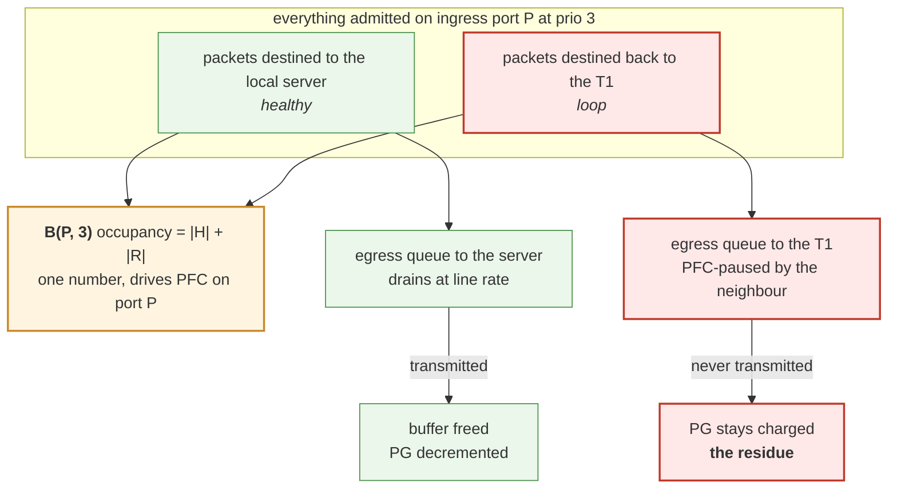
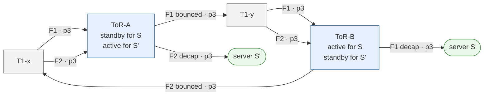
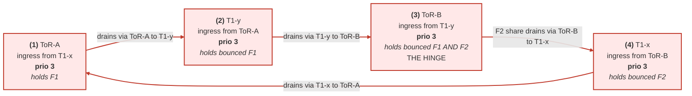
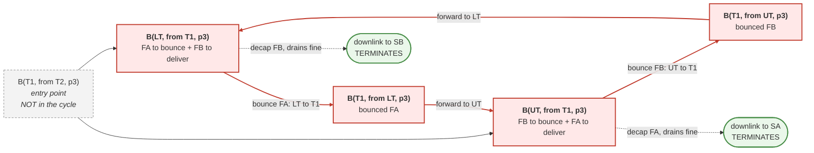
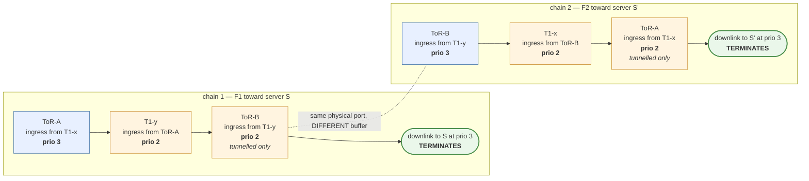
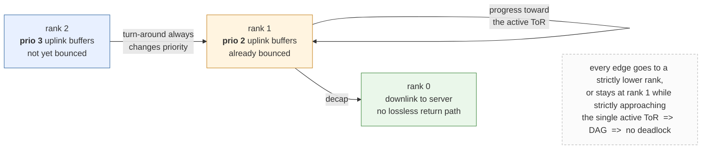
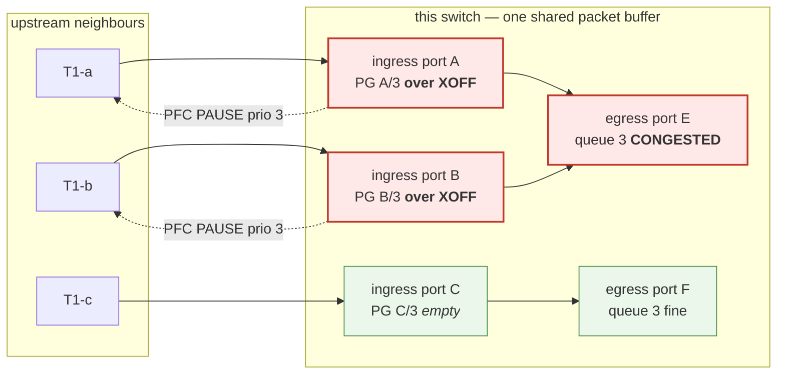

# DualToR tunnel QoS remap (PCBB) — vendor implementation comparison

Notes on how Cisco 8000, Broadcom/Arista and Mellanox implement the `tunnel_qos_remap`
(a.k.a. PCBB, Priority Control for Bounced Back traffic) feature exercised by
`tests/qos/test_tunnel_qos_remap.py`.

All values below were read from live DUTs, one per silicon family, each configured as
`type=ToRRouter`, `subtype=DualToR`, with `SYSTEM_DEFAULTS|tunnel_qos_remap = enabled`:

| vendor / ASIC | HWSKU | branch |
| --- | --- | --- |
| Cisco 8000 | `Cisco-8101C01-C32` | 202605 |
| Broadcom (Arista) | `Arista-7260CX3-D108C8` | 202605 |
| Nvidia/Mellanox | `Mellanox-SN4700-V64` | 202511 |

Throughout, "Cisco", "Broadcom" and "Mellanox" refer to those three HWSKUs. Uplink means
a T1-facing port (PortChannel member); downlink means a server/mux-facing VLAN port.

## 1. Background — why bounced-back traffic needs its own class

### 1.1 Where the bounce comes from

Both ToRs of a dualtor pair advertise the same server subnet to the T1s, so the T1s ECMP
southbound traffic across both. The T1s have no visibility of mux state, so roughly half
of the traffic destined to a given server arrives at the ToR whose mux for that server is
**standby**. The standby ToR cannot put the packet on the mux port; it IPinIP-encapsulates
it toward the peer ToR's loopback and sends it back out an uplink:

```
                +----+                +----+
                | T1 |                | T1 |
                +----+                +----+
                 |  ^                  |  ^
     (1) DSCP 3  |  | (2) bounce       |  | (3) tunnelled
         direct  v  |     outer DSCP 2 v  |     outer DSCP 2
              +---------+          +---------+
              | standby |          | active  |
              |   ToR   |          |   ToR   |
              +---------+          +---------+
                                        | (4) decap, inner DSCP 3
                                        v
                                    +--------+
                                    | server |
                                    +--------+
```

The packet crosses the fabric **three** times before it reaches the server. This is a
*steady-state* condition, not a rare transient — it happens continuously for every server
whose mux is standby on the ToR the T1 happened to hash to. Mux toggles, server NIC
reboots and ToR upgrades make it worse.

### 1.2 The head-of-line blocking failure modes

Suppose the bounce path used the same lossless priority as regular traffic (i.e. the
bounced packet kept DSCP 3 / PG 3 / queue 3). Congestion anywhere on the bounce path then
back-pressures *unrelated* traffic:

**(a) Egress HOL on the standby ToR uplink.**
The uplink egress queue 3 would carry both the bounced traffic and normal northbound
prio-3 traffic (server -> fabric). PFC pause is per-port *and per-priority*, so a pause
triggered by the bounce path stops the whole queue, including traffic that has nothing to
do with any mux.

```
standby ToR uplink egress q3
   [ bounce ][ bounce ][ normal server->fabric ][ normal ]
      ^ paused because the far end is congested
                                  ^ blocked behind it  <-- HOL
```

**(b) Ingress PG HOL on the active ToR uplink.**
The active ToR's uplink receives *two* different kinds of prio-3 traffic: direct T1 ->
server traffic, and tunnelled traffic bounced off the peer. Sharing one PG means a slow
or congested server reached via the tunnel fills PG 3, the ToR asserts PFC prio 3, and
**all** direct prio-3 traffic from that T1 is paused too — including traffic for
completely healthy servers.

**(c) Fate sharing across mux states / congestion spreading.**
Combining (a) and (b), the pause walks back up the tree: active ToR pauses the T1, the T1
pauses the standby ToR, the standby ToR's ingress PG 3 fills, it pauses the T1s, and the
T1s stop sending *any* prio-3 traffic toward it — including traffic for servers whose mux
is **active** on that very ToR and which is perfectly deliverable. One slow server behind
the peer ToR stalls healthy servers on this ToR.

**(d) Cyclic buffer dependency -> PFC deadlock.**
The most severe one. Traffic enters the standby ToR on prio 3 and leaves on prio 3 — a
U-turn inside a single priority — which lets the priority-3 buffer dependency graph close
into a loop. Worked through in detail in section 1.4.

```
   T1 --prio3--> ToR ingress PG3 --+
                                   |  (same priority turns around)
   T1 <--prio3-- ToR egress  q3 <--+
```

**(e) Bandwidth and headroom amplification.**
X Gbps of bounced traffic consumes X in **plus** X out on the standby ToR's uplinks, and
another X in + X out on the T1. Sharing the class with regular traffic means the regular
traffic's share of the lossless budget silently halves. The bounce path also has a longer
PFC reaction RTT (two extra hops), so it needs deeper `xoff` headroom than a normal
downlink PG.

### 1.3 How PCBB fixes it

PCBB adds **two extra lossless classes on uplink ports only** — PG/queue **2** and **6**,
carried on the wire as outer **DSCP 2** and **DSCP 6** — shadowing the two normal lossless
classes:

```
normal lossless prio 3  <->  shadow (bounced) prio 2
normal lossless prio 4  <->  shadow (bounced) prio 6

inner DSCP 3  ->  outer DSCP 2  ->  uplink lossless queue 2 / PG 2
inner DSCP 4  ->  outer DSCP 6  ->  uplink lossless queue 6 / PG 6
```

The two extra classes serve *different roles on the same physical uplink ports*, because a
ToR is simultaneously active for some muxes and standby for others:

| resource | who uses it | role |
| --- | --- | --- |
| uplink **egress queue** 2 / 6 | standby ToR | where the encapsulated bounce is transmitted (fixes (a)) |
| uplink **ingress PG** 2 / 6 | active ToR | where the arriving tunnelled traffic is admitted (fixes (b), (c)) |

And the priority chain becomes strictly ordered instead of cyclic, which removes the
deadlock precondition (d):

```
prio 3  (T1 -> standby ToR)
  -> prio 2  (standby ToR -> T1)          <- U-turn changes priority
  -> prio 2  (T1 -> active ToR)
  -> prio 3  (active ToR -> server, downlink only, no lossless return path)
```

Downlinks deliberately keep only lossless 3/4 and map DSCP 2/6 to lossy TC1, so a server
cannot inject into the shadow classes and the chain terminates at the endpoint.

Headroom (e) is a per-PG buffer reserve (`xoff` in the `BUFFER_PROFILE`) selected per port
from `pg_profile_lookup.ini` by `(speed, CABLE_LENGTH)` — uplinks are tagged with a longer
cable length than downlinks. See section 7 for what the fields actually mean.

### 1.4 The deadlock argument in detail

#### 1.4.0 What a PFC deadlock *is*

> **PFC deadlock** — a permanent, self-sustaining state of a lossless network in which a set
> of ingress buffers forms a **cycle** in the buffer dependency graph: each can only drain
> after the next has drained, so none can ever go first. Forwarding on that priority stops
> completely and stays stopped, with **zero packets dropped**.

Formally: build the graph whose vertices are ingress priority groups
`B(switch, ingress port, priority)`, with an edge `B1 -> B2` meaning *"B1 can only drain if
B2 drains"*. A PFC deadlock is a **directed cycle in that graph, all of whose edges are
simultaneously tight** (every node on it actually asserting PAUSE).

It is the classical deadlock, and all four Coffman conditions hold:

| Coffman condition | how PFC satisfies it | permanent? |
| --- | --- | --- |
| 1. mutual exclusion | buffer cells are exclusively occupied | **always** |
| 2. hold and wait | a PG holds admitted bytes *while waiting* for its downstream | **only under congestion** |
| 3. no preemption | PFC's lossless guarantee **is** "you may not drop" | **always** |
| 4. circular wait | the bounce ring | **structural in dualtor** |

Three of the four are permanent properties of a lossless dualtor. Only **(2)** is
load-dependent — which is why the ring can sit latent and harmless for months.

Distinguishing it from congestion, which uses the identical machinery:

| | congestion / HOL blocking | **PFC deadlock** |
| --- | --- | --- |
| graph shape | DAG — every edge points at a sink | **cycle** |
| throughput on that priority | degraded | **zero** |
| drops | maybe | **none** (that is the problem) |
| clears when the sink drains | yes | **no** |
| clears when the source stops | yes | **no** |
| self-heals | yes | **never** — needs PFCWD, a port flap, or a reload |

Two properties are worth stating explicitly because they are what make it dangerous:

* **Self-sustaining.** The trapped packets are themselves what keep the buffers above
  threshold. The state survives the offered load going to zero.
* **Silent.** Link up, no errors, no drops, near-zero packet counters, PFC TX climbing. It
  reads as *absence of traffic*, not as a failure.

Everything below works out how such a cycle forms in a dualtor, why nothing outside it can
break it, and how the priority hop removes it.

#### 1.4.1 Why a PFC deadlock is permanent

Model the lossless fabric as a **buffer dependency graph**. Vertices are ingress buffers
`B(switch, ingress port, priority)` — i.e. priority groups. There is an edge
`B1 -> B2` when the packets sitting in `B1` must leave through an egress port whose
transmission is gated by a PFC PAUSE generated by `B2`. In words: *`B1` can only drain if
`B2` drains.*

If that graph contains a cycle, every buffer on the cycle is waiting on the next one and
none can make progress. In a lossy network this resolves itself — buffers overflow, packets
are dropped, the cycle breaks. Under PFC **nothing is ever dropped by design**, so the
cycle is a *stable state*. It persists after the original traffic burst is gone, because
the stuck packets themselves are what keep the buffers full. Only operator action (port
shut/flap, PFC watchdog) clears it. That is why deadlock is treated as a
must-never-happen event rather than a performance problem.

In a normal Clos fabric a cycle needs a transient routing loop (link failure plus slow
convergence). **In a dualtor the turn-around is permanent and by design**, so the cycle is
far easier to form.

The obvious follow-up — *"surely it clears once my servers drain, or once the fabric stops
sending?"* — is answered in 1.4.2.

#### 1.4.2 Why draining at the edges cannot help

Two questions come up every time: *"the servers are fine, why doesn't the traffic just drain
out?"* and *"if the fabric stops sending, why doesn't it clear?"* Both have the same answer
— **nothing outside a cycle can break it** — but for two different reasons.

##### (i) The fabric side is a predecessor, not a member

The deadlock lives in a strongly-connected component. The buffer the fabric feeds into has
edges *into* the SCC and none coming back, so it is a predecessor, not a member. Delete it
from the graph entirely and the SCC is untouched. **A cycle can only be broken by removing
an edge inside the cycle.**

Dynamically, stopping the source removes the *fill rate* but not the *contents*, and the
contents are what hold the buffers above their release point. And by the time the loop has
closed, the upstream is itself a victim being paused, so "drain the source" is not even an
available lever.

##### (ii) The healthy sink is a one-shot subtraction

This one is subtler, because every cycle node usually *does* have a healthy outlet.

**A PG is a counter, not a place.** There is one packet buffer in the chip. A packet is
written into it once, and a descriptor is enqueued on whichever egress queue the forwarding
lookup chose. The ingress priority group never holds the packet — it holds the debt:

```
occ(PG) += bytes    on admission at (ingress port P, prio p)
occ(PG) -= bytes    when the packet is finally transmitted and the buffer is freed
```

(On VOQ architectures the ingress accounting *is* the storage, which only makes the
argument more literal.)

**One packet, two counters.** Each packet is charged to an ingress PG and an egress queue,
and both are released together. The PG therefore aggregates *across destinations*: two
packets arriving on the same `(port, priority)` but leaving via different egress ports have
completely independent fates — different queues, different schedulers, different pause
states — but share one accounting bucket. That is the entire coupling.



**"Not a FIFO" cuts both ways.** Were the PG a real FIFO, a stuck head-of-line packet would
block the healthy ones behind it. It is not, so the healthy packets genuinely do get out —
they sit on a different egress queue and nothing blocks them. But XOFF/XON are evaluated on
`occ(PG)`, the aggregate, so the scheduler's ability to forward the healthy subset does not
enter into the flow-control decision at all. Data-plane progress for the healthy traffic,
zero help for the pause state. That mismatch is exactly why a node can be "partly working"
and still deadlocked.

**The input is cut to zero, not merely reduced.** PFC generation is co-indexed with the
buffer it protects: a PG is `(ingress port, priority)`, a PAUSE is emitted *on that port*
for *that priority*, and only that one link feeds that one PG. Asserting the PAUSE therefore
cuts **100%** of the PG's input — not most of it, all of it. After the reaction delay, which
is exactly what the headroom absorbs, the set of packets charged to that PG is a **closed
set**.

**Closed-set arithmetic.** Partition the closed set `S` by destination:

```
S  =  H  (healthy, egress uncongested)   union   R  (loop, egress paused by the cycle)

after the freeze:   no arrivals     ->  occ is monotone non-increasing
                    H drains        ->  occ falls by |H|
                    R cannot move   ->  occ never falls below |R|

                    occ(PG)  ->  |R|    within this pause cycle
```

`|R|` is a **floor**, not a decay — the healthy drain is a one-shot subtraction, because the
moment the PG crossed XOFF it paused its own upstream and admitted nothing further:

```
 occupancy of a cycle node, within ONE pause cycle
   ^
   |        _--_
XOFF ------/----\------------------------------------  PAUSE asserted here
   |      /      \   <- healthy portion H drains (once)
   |     /        \________________________________    <- floor = |R|, loop traffic
   |    /                                               cannot grow (no admissions)
   |   /                                                cannot shrink (egress paused)
   |  /
   +-+---------------------------------------------->  time
```

A perfectly healthy server therefore makes the end state *purer*, not better — the PG ends
up holding nothing but un-drainable loop traffic.

Whether that floor is the end of the story depends on where it sits relative to the release
point. On the early cycles it is **below** it, so the pause does lift and the system keeps
cycling; the sections below work out what makes the floor climb, and when that stops being
true.

##### Terminology used below

| term | standard name | meaning |
| --- | --- | --- |
| **pause lifts** | XON / pause release | `occ` fell back under the release point, so a PFC frame with `time = 0` goes out and the peer resumes |
| **residue `R`** | — | the un-drainable, loop-destined bytes held in a cycle node |
| **ratchet** | monotone accumulation; the locked state is an *absorbing state* | `R` can only stay flat or grow while the ring is closed, never shrink |

##### The bounce fraction `f`, derived

`f` is the share of everything admitted into a cycle node that is loop-destined and
therefore sticks. It is **not** the ECMP split, and it is **not** 1/2 — the deliver side is
fed twice (directly, and again as the peer's bounced traffic returning), the bounce side
only once. At `B(UT, from T1)`, with UT standby for SA and active for SB:

| stream | volume | fate |
| --- | ---: | --- |
| fresh, dst SA | `TA/2` | **bounce** — sticks |
| fresh, dst SB | `TB/2` | deliver |
| tunnelled, dst SB (LT bounced it) | `TB/2` | deliver |

```
f_UT = (TA/2) / (TA/2 + TB) = r / (r + 2),      r = TA/TB
f_LT = 1 / (1 + 2r)

symmetric (r = 1):   f_UT = f_LT = 1/3
```

Asymmetric load does not remove the problem, it relocates it — as one fraction goes to 0 the
other goes to 1, and the **slower** node gates the lock because residues only grow mutually:

| `r = TA/TB` | `f_UT` | `f_LT` | lock cycles (gated by the slower) |
| ---: | ---: | ---: | ---: |
| 1 | 0.33 | 0.33 | **22** |
| 10 | 0.83 | 0.048 | **179** |
| 100 | 0.98 | 0.005 | **1756** |

Balanced bidirectional bounce traffic is the worst case for onset.

##### The ratchet

Each release admits `(T - R)` bytes, of which `f` sticks:

```
R_{n+1}   = R_n + f (T - R_n)
gap_{n+1} = (1 - f) gap_n            gap = T - R,  decays geometrically
```

```
occ
  T  ----/\------/\------/\------/\----   pause asserted at each peak
        /  \    /  \    /  \    /  \
       /    \__/    \__/    \__/    \__
      /     R1      R2      R3      R4    <- troughs = residue after the
     /                                       healthy population drains
    0                                        R1 < R2 < R3 < R4  ->  T
    +----------------------------------> time
```

The peaks stay at the trigger; the **troughs climb**. When a trough rises above the release
point the pause never lifts again. With `f = 1/3` and `T = 16.5 MB` that is ~22 cycles.

Note what this says: **the pause genuinely does lift on the early cycles.** The healthy sink
draining is what *causes* each lift — and every lift admits more loop traffic. A fast server
is the engine of the ratchet, not a defence against it. (A slow one would hold `occ` high,
keep the node paused, admit nothing, and freeze `R` where it is.)

##### The lock-in fixed point

The release point is not fixed either. With `dynamic_th`, `T = 2^alpha x free_pool`, and
`free_pool` is suppressed by the residues themselves. With `n` cycle nodes each holding `R`:

```
locked  iff  R >= 2^alpha (P - nR)
        iff  R >= 2^alpha P / (1 + n 2^alpha)

n = 4, alpha = -2:   R >= P/8       i.e.  4R >= P/2   (half the pool trapped)
n = 4, alpha =  0:   R >= P/5       i.e.  4R >= 4P/5
```

So two monotone processes move toward each other — `R` rises, `T` falls — and the crossing
is irreversible, because `R` cannot drain (needs the ring), cannot be dropped (PFC), and
cannot shrink while paused (no admissions).

##### But a release also cascades — so it is a race

The ratchet is only half the story. A release does not just admit more traffic; it also
**unblocks the next node**, and that can propagate all the way round:

```
UT releases
  -> B(T1,fromLT) drains (its loop traffic reaches UT and is delivered)
  -> T1 stops pausing LT
  -> B(LT,fromT1) drains (LT's residue can finally move)
  -> LT stops pausing T1
  -> B(T1,fromUT) drains
  -> T1 stops pausing UT
  -> UT's own residue can move          <- the ring has opened
```

So the outcome is a race between the **release cascade** and the **refill**:

| | outcome |
| --- | --- |
| cascade propagates faster than refill | ring opens, residues drain, **recovery** |
| refill outpaces the cascade | each node re-crosses XOFF first, residues ratchet, **permanent lock** |

And what decides it is simply whether the offered load is feasible:

```
T1->UT carries  TA/2 + TB      UT->SB limited by the mux port
T1->LT carries  TB/2 + TA      LT->SA limited by the mux port
UT->T1 carries  TA/2           LT->T1 carries TB/2
```

* **all within capacity** — a feasible steady-state flow exists, the cascade wins, no
  deadlock however long you run it
* **some link or mux port sustainedly over capacity** — backlog is unbounded, every node
  re-crosses XOFF immediately, refill wins, the residues converge to the fixed point above

This is the honest version of "draining the servers does not help". It does help — by
deciding who wins the race. What it cannot do is *undo* a ring that has already locked.

##### The gridlock junction

The locked state is best understood as a box junction:

```
                          EXIT NORTH
                        (EMPTY, ready)
                               ^
                               |
        +----------------------|----------------------+
        |                                             |
        |        [ CAR A ] ==========> [ CAR B ]      |
        |            ^                      ||        |
 EXIT   |            ||      JUNCTION       ||        |   EXIT
 WEST <=|===         ||                     vv        |==> EAST
(EMPTY) |            ||                               | (EMPTY)
        |        [ CAR D ] <========== [ CAR C ]      |
        |                                             |
        +----------------------|----------------------+
                               |
                               v
                          EXIT SOUTH
                        (EMPTY, ready)

   A wants B's square. B wants C's. C wants D's. D wants A's.
   All four exit roads are completely clear. Nobody moves. Ever.
```

| junction | network |
| --- | --- |
| car | the bytes trapped in one ingress PG |
| the square it occupies | buffer space |
| "I need the next square first" | "my egress is paused until the next PG drains" |
| cars cannot be towed | PFC forbids dropping — no preemption |
| exit roads | the servers |
| **exit roads are empty** | **both servers draining perfectly** |

Car A sits beside a completely open exit and still cannot move, because the bytes that
could use that exit **already left** — the exit is empty *precisely because* everything that
could leave, did. What remains is addressed through the junction.

> In the locked state **no packet is waiting on a server. Every packet is waiting on another
> packet.** Congestion means the exit road is jammed; deadlock means the roads are clear and
> the cars are blocking each other in the box.

Which is also why a single T0 cannot gridlock: `T2 -> T1 -> T0 -> server` is a straight
road, and a queue always drains from the front. **A ring has no front.**


##### Summary, and how to tell the two apart on a live box

| | source stops? | sink drains? | pool frees? | clears on its own? |
| --- | --- | --- | --- | --- |
| congestion / HOL | yes | yes | yes | yes |
| **deadlock** | no | one-shot, floors at the residue | no | **never** |

| what to look at | congestion | deadlock |
| --- | --- | --- |
| `show priority-group watermark shared` | fluctuating | **pinned at a constant non-zero value** |
| `show queue watermark unicast`, healthy egress | fluctuating | **~0, fully drained** |
| `show queue watermark unicast`, loop egress | fluctuating | **pinned, identical every poll** |
| `show pfc counters` TX for that priority | rises then stops | **rises steadily forever** |
| port counters for that priority | forward progress | **zero packets forwarded** |

PFC TX incrementing steadily with *zero* forward progress and a *constant* PG watermark is
the tell: the counter is not moving because nothing can move, not because nothing is
arriving.

#### 1.4.3 A concrete cycle without PCBB

Mux state is per-server, so at any instant a ToR is active for some servers and standby for
others. Take:

- `S`  — mux **active on ToR-B**, standby on ToR-A
- `S'` — mux **active on ToR-A**, standby on ToR-B
- two T1s, `T1-x` and `T1-y`, both connected to both ToRs

and two southbound flows, all at prio 3. In the data plane they form a physical loop
through the shared T1 layer:



Now the buffer dependency graph. An arrow `X --> Y` reads *"X can only drain if Y drains"*:



Step **(3)** is the hinge: one PG holds packets with two different fates, and one of those
fates points back toward the start of the chain. No link failure, no routing loop, no
misconfiguration is required — just both ToRs bouncing for different servers through a
shared T1 layer, which is the normal steady state.

##### The minimal case: a single T1 is enough

The two-T1 example above is easier to read, but it is not minimal. **One T1 suffices**, and
that form is strictly more likely because it does not depend on ECMP spraying across
particular T1s. Take one T1, the ToR pair `UT`/`LT`, and two servers with *opposite* mux
state:

- `SA` — active on **UT**, standby on LT
- `SB` — active on **LT**, standby on UT

The key point is that `B(T1, ...)` is **not one buffer**. A PG is indexed by
`(ingress port, priority)`, so the T1 has a separate PG for traffic arriving from UT and
for traffic arriving from LT. That is what makes this a real 4-cycle rather than a
degenerate self-loop.

```
FA -> SA :  B(T1,fromT2) --> B(LT,fromT1) --> B(T1,fromLT) --> B(UT,fromT1) --> SA
FB -> SB :  B(T1,fromT2) --> B(UT,fromT1) --> B(T1,fromUT) --> B(LT,fromT1) --> SB

overlay the middles:
            B(LT,fromT1) --> B(T1,fromLT) --> B(UT,fromT1) --> B(T1,fromUT) --> B(LT,fromT1)
```



Minimal ingredients: **2 ToRs, 1 T1, 2 servers with opposite mux state, 1 lossless
priority**. One server is not enough — traffic has to bounce in *both* directions, which
requires the opposite-mux pair.

Note the two grey/green nodes, which answer the two obvious "why doesn't X fix it"
questions using the corollaries from 1.4.1:

- `B(T1, from T2)` is an **entry point**, not a member: edges run into the cycle and none
  come back. Draining or silencing the fabric side does nothing.
- `B(UT,fromT1)` and `B(LT,fromT1)` each *do* have a healthy terminating edge to their local
  server, and those packets really do drain — but the bounce-destined portion of the same PG
  cannot move, and that portion alone holds the counter above XON.

With PCBB the same topology is safe, because the two ToR uplink PGs split by priority and
the post-bounce buffer never bounces again:

```
B(LT,fromT1,p3) --> B(T1,fromLT,p2) --> B(UT,fromT1,p2) --> SA   TERMINATES
B(UT,fromT1,p3) --> B(T1,fromUT,p2) --> B(LT,fromT1,p2) --> SB   TERMINATES
```

#### 1.4.4 Why the priority hop breaks it

PCBB is a **virtual-lane escape**: the packet is forced to change priority at the exact
point where it turns around. That splits the hinge buffer (3) into two independent buffers
on the same physical port — one at prio 3 for not-yet-bounced traffic, one at prio 2 for
already-bounced traffic — and the cycle falls apart into two disjoint chains:



The two chains are now **disjoint and both terminate**. The structural invariants are:

1. A p3 uplink buffer can only depend on a p2 buffer (the turn-around always changes
   priority).
2. A p2 buffer can only depend on another p2 buffer strictly closer to the active ToR.
3. A p2 chain always ends at a **downlink**, and downlinks carry no lossless traffic back
   into the fabric (they only have lossless 3/4, and DSCP 2/6 maps to lossy TC1 there).

Assign a rank `p3 = 2`, `p2 = 1`, `server = 0`. Every edge goes to a strictly lower or
equal rank, and no equal-rank (p2 -> p2) sub-chain can revisit a node because it is a
monotone progression toward the single active ToR. The graph is a DAG, so **no cycle can
exist**.



#### 1.4.5 The invariant that makes it work: bounced at most once

Invariant 2 above only holds if a packet is bounced **at most once**. If the peer ToR were
also standby for that server — a real transient during a mux toggle — it would decap and
then try to re-encapsulate back toward the first ToR, producing a genuine `p2 -> p2` cycle
between the two ToRs that the priority hop would not break.

This is prevented in hardware. Verified on all three platforms, the P2P encap tunnel
carries:

```
SAI_OBJECT_TYPE_TUNNEL
    SAI_TUNNEL_ATTR_PEER_MODE               = SAI_TUNNEL_PEER_MODE_P2P
    SAI_TUNNEL_ATTR_ENCAP_SRC_IP            = <local ToR Loopback0>
    SAI_TUNNEL_ATTR_ENCAP_DST_IP            = <peer ToR Loopback0>
    SAI_TUNNEL_ATTR_LOOPBACK_PACKET_ACTION  = SAI_PACKET_ACTION_DROP    <<<<
```

A packet that arrived through the tunnel and would be re-encapsulated into the same tunnel
is **dropped**, not looped. Dropping one packet during a both-standby transient is vastly
preferable to forming a permanent deadlock.

Mellanox additionally runs `mux_tunnel_egress_acl = enabled` (an ACL that blocks tunnel
traffic from egressing back out a tunnel); it is `disabled` on the Cisco and Broadcom
boxes checked, which rely on the SAI attribute alone.

#### 1.4.6 Head-of-line blocking is not the same as deadlock

Worth being precise, because the two are often conflated:

| | HOL blocking | deadlock |
| --- | --- | --- |
| cause | shared buffer / shared pause domain | **cycle** in the dependency graph |
| clears when | the congested endpoint drains | never, without operator or watchdog action |
| example here | standby ToR ingress PG 3 holds both deliverable and bounce-destined traffic | the 4-node p3 cycle in 1.4.3 |

The residual sharing noted in section 1.5 (standby ToR ingress PG 3 is still shared) causes
HOL blocking but **cannot** cause deadlock: the edges leaving that buffer go to
`{downlink -> server}` and `{T1 ingress p2}`, and neither leads back to a p3 uplink buffer.

#### 1.4.7 Why PFC watchdog is not the answer

PFCWD detects a queue paused beyond a threshold and starts dropping to break the jam. It is
a mitigation of last resort, not a design: it drops the very lossless traffic RDMA cannot
tolerate. And on all three platforms it is **not armed on the shadow priorities** —
`pfc_enable = 2,3,4,6` on uplinks but `pfcwd_sw_enable = 3,4`. The design deliberately
relies on the acyclic priority assignment instead, which means a misconfiguration that
reintroduces a cycle on prio 2/6 would have no safety net.

### 1.5 What PCBB does *not* solve

- **The standby ToR's own ingress PG is still shared.** Incoming prio-3 traffic lands in
  PG 3 whether it will be delivered locally or bounced, on every platform. If the bounce
  egress (q2) backs up hard enough, PG 3 still fills and the ToR still asserts PFC prio 3
  upstream. PCBB moves the separation to the *egress* of the standby ToR and the *ingress*
  of the active ToR, which is where the loop and the cross-tenant blocking actually form.
- **PFC watchdog is not armed on the shadow priorities.** On all three platforms
  `pfc_enable = 2,3,4,6` on uplinks but `pfcwd_sw_enable = 3,4`. A genuinely stuck queue 2
  or 6 will not be auto-mitigated by the watchdog; the design relies on the acyclic
  priority assignment above to prevent deadlock in the first place.
- **The fabric must agree.** The T1s in the path also need DSCP 2/6 classified as lossless,
  otherwise the bounce leg silently degrades to lossy at the first hop. PCBB is a
  fabric-wide configuration, not a ToR-local one.

## 2. How PFC back-pressure actually works

Everything above assumes you already know how a PAUSE is generated and who it is sent to.
This section is the mechanism, because the HOL and deadlock arguments in section 1 depend on
the details.

### 2.1 What a PAUSE frame is

IEEE 802.1Qbb PFC frames are **link-local** and never forwarded:

```
dst MAC   01:80:C2:00:00:01     reserved multicast, consumed by the neighbour
EtherType 0x8808                MAC Control
opcode    0x0101                PFC  (0x0001 is legacy 802.3x global PAUSE)
class_enable_vector  8 bits     one bit per priority 0-7
time[0..7]           8 x 16 bit quanta, one per priority
```

For every priority whose bit is set: *stop sending me that priority for `time[p]` quanta*
(1 quantum = the time to transmit 512 bits at the port's rate). `time = 0` is the resume,
i.e. the XON.

### 2.2 The asymmetry that matters

| direction | driven by | granularity |
| --- | --- | --- |
| **TX of PAUSE** (generation) | **ingress priority group** occupancy | `(ingress port, PG)` |
| **RX of PAUSE** (reaction) | the received frame | stops the **egress queue** on that port, selected by `pfc_to_queue_map` |

PFC is generated from the *ingress* side and consumed on the *egress* side. It never
traverses the switch and it has no notion of a flow.

### 2.3 "Which port sends the PAUSE?" is not a decision

There is no selection logic. A priority group is *indexed by ingress port* — `COUNTERS_PG_NAME_MAP`
has one entry per `<port>:<pg>`. In a shared-memory ASIC a packet is stored **once** but
charged to **two** counters: the ingress PG of the port it arrived on, and the egress queue
it is bound for. Both are released only when the packet is finally transmitted.

So when an egress queue stalls, the packets stuck in it keep their ingress PG charged. The
PG that crosses XOFF is by construction on an ingress port that is feeding the congestion,
and the PAUSE goes back out **that** port. The question answers itself.



Precisely: **the set of ports that emit a PAUSE = every ingress port whose PG for that
priority crossed XOFF, and whose `pfc_enable` bitmap includes that priority.**

Three consequences that the rest of this document relies on:

- **Port C is not paused.** It never fed the congested egress queue, so its PG never filled.
  PFC *does* have selectivity — at ingress-port granularity.
- **But every flow on ports A and B at prio 3 is paused**, including flows headed for the
  perfectly healthy port F. That is the victim-flow / head-of-line blocking problem, and it
  is exactly failure mode (b) and (c) in section 1.2.
- The ASIC has **no idea which upstream is responsible**. It only knows "this PG is full".

### 2.4 The thresholds

- **`dynamic_th` (alpha)** is the XOFF trigger, expressed as a fraction of the *currently
  free* shared pool (`2^alpha`). As the pool fills, every PG's threshold shrinks, so heavy
  PGs are squeezed first and the PGs converge — that is the built-in fairness/adaptivity.
- **`xoff` is not the trigger.** It is the headroom reserve consumed *after* the PAUSE has
  already gone out. See section 7.
- **`pfc_enable`** (`SAI_PORT_ATTR_PRIORITY_FLOW_CONTROL`) decides whether a PG may generate
  PFC at all. Uplinks here are `2,3,4,6`, downlinks `3,4`. A PG whose priority is not in the
  bitmap is lossy — it drops on overflow instead of pausing.

### 2.5 The sequence, and what "headroom full" really means

```
  egress queue congests, stops draining
        |
  ingress PG occupancy climbs through the shared-pool region (dynamic_th)
        |
  crosses XOFF  ->  PFC PAUSE sent upstream, prio bit set, time = N quanta
        |
  bytes already in flight keep arriving  ->  consume HEADROOM (xoff bytes)
        |
  sender stops that priority
        |
  occupancy falls below XON  ->  PAUSE with time = 0  ->  sender resumes
```

**If the headroom is full, the PAUSE was sent long ago and you are about to drop.** The
headroom must cover, worst case:

1. bytes on the wire in both directions (2 x cable propagation delay x line rate)
2. the MTU-sized frame the sender is mid-transmission when the PAUSE lands
3. PFC generation latency here plus detection latency at the peer
4. the peer's internal pipeline drain

If it is exhausted — undersized headroom, a shared headroom pool that ran dry, or a peer
that ignores PFC — packets are dropped and the lossless guarantee is broken. That shows up
as `SAI_INGRESS_PRIORITY_GROUP_STAT_DROPPED_PACKETS` / `show priority-group drop`.

### 2.6 Reading the counters

```bash
show pfc counters                       # per-port, per-priority PFC Rx/Tx frames
show priority-group watermark shared    # how close each PG is to its XOFF limit
show priority-group watermark headroom  # how deep into the reserve it went
show priority-group drop                # non-zero = lossless violation
show queue watermark unicast            # which egress queue is the real root cause
show pfcwd stats

# raw
sonic-db-cli COUNTERS_DB HGETALL "COUNTERS:<port oid>" | grep PFC
#   SAI_PORT_STAT_PFC_<0-7>_RX_PKTS / _TX_PKTS
```

**PFC TX on a port means that port's ingress is backed up. PFC RX means the downstream
neighbour is backed up.** To find the origin of a congestion event, follow the PFC-RX trail
downstream until you reach a switch with high `PFC_x_TX` and no `PFC_x_RX` — that switch's
congested egress queue is the source.

## 3. The two independent template knobs

`/usr/share/sonic/templates/qos_config.j2` exposes two separate switches:

| line | knob | effect on uplink ports |
| --- | --- | --- |
| L442 | `different_dscp_to_tc_map` | `dscp_to_tc_map = AZURE_UPLINK` |
| L455 | `different_tc_to_queue_map` | `tc_to_queue_map = AZURE_UPLINK` |

Each platform's `qos_generic.j2` (per-HWSKU, under
`/usr/share/sonic/device/<platform>/<hwsku>/`) decides which to set inside its
`DualToR` branch. **This single choice is the entire vendor difference.**

## 4. Resulting `PORT_QOS_MAP`

```
                    dscp_to_tc      tc_to_queue     tc_to_pg   pfc_enable

Cisco     downlink  AZURE           AZURE           AZURE      3,4
          uplink    AZURE           AZURE_UPLINK    AZURE      2,3,4,6   <- only tc_to_queue separated

Broadcom  downlink  AZURE           AZURE           AZURE      3,4
          uplink    AZURE_UPLINK    AZURE_UPLINK    AZURE      2,3,4,6   <- both separated

Mellanox  downlink  AZURE           AZURE           AZURE      3,4
          uplink    AZURE_UPLINK    AZURE           AZURE      2,3,4,6   <- only dscp_to_tc separated
```

Why each vendor picks what it picks:

- **Broadcom needs both.** Its `TC_TO_QUEUE_MAP|AZURE` collapses TC2 → q1 and TC6 → q1,
  so even after `AZURE_UPLINK` produces TC2/TC6 the port queue map would throw them into
  q1. A second `AZURE_UPLINK` tc_to_queue (TC2 → q2, TC6 → q6) is required.
- **Mellanox needs only one.** Its `TC_TO_QUEUE_MAP|AZURE` is already identity
  (TC2 → q2, TC6 → q6), so no `AZURE_UPLINK` tc_to_queue map exists at all.
- **Cisco needs only the queue one**, because it never produces TC2/TC6 from a *port*
  DSCP map — the class shift happens inside the tunnel maps instead (see below).

Cisco's `DualToR` branch in `qos_generic.j2` sets only
``; `different_dscp_to_tc_map` is set only in
the `LeafRouter` branch. Consequently **no `DSCP_TO_TC_MAP|AZURE_UPLINK` is generated at
all** on the 8101.

## 5. The QoS maps

```
                            Cisco                     Broadcom / Mellanox
DSCP_TO_TC|AZURE            3->TC3 4->TC4 2,6->TC1     3->TC3 4->TC4 2,6->TC1
DSCP_TO_TC|AZURE_UPLINK     (does not exist)           2->TC2 6->TC6 3->TC3 4->TC4
DSCP_TO_TC|AZURE_TUNNEL     3->TC2 4->TC6      <<<<    identical to AZURE (pass-through)

TC_TO_PG|AZURE              TC2->PG2 TC6->PG6          TC2->PG2 TC6->PG6
TC_TO_PG|AZURE_TUNNEL       TC3->PG2 TC4->PG6          TC3->PG2 TC4->PG6   <<<<
                            (programmed but UNUSED)    (used)

TC_TO_QUEUE|AZURE           TC2->q3 TC6->q4            brcm: TC2->q1 TC6->q1
                                                       mlnx: TC2->q2 TC6->q6 (identity)
TC_TO_QUEUE|AZURE_UPLINK    identity 0-7               brcm: identity 0-7
                                                       mlnx: (does not exist)
TC_TO_QUEUE|AZURE_TUNNEL    TC3->q2 TC4->q6            TC3->q2 TC4->q6      (same)

TC_TO_DSCP|AZURE_TUNNEL     TC3->2 TC4->6              TC3->2 TC4->6        (same)
MAP_PFC_PRIORITY_TO_QUEUE   identity 0-7               identity 0-7         (same)
```

**Cisco puts the class shift in the tunnel's DSCP -> TC step. Broadcom/Mellanox put it in
the tunnel's TC -> PG step.** That is the whole story.

Minor: Broadcom/Mellanox define a 9th TC (TC8) for DSCP 33 (TC8 -> q1); Cisco maps
DSCP 33 -> TC1.

## 6. The tunnel object (identical on all three)

```
TUNNEL|MuxTunnel0
    tunnel_type            = IPINIP
    dscp_mode              = pipe             <- inner DSCP preserved through the tunnel
    ttl_mode               = pipe
    ecn_mode               = copy_from_outer
    encap_ecn_mode         = standard
    src_ip                 = <local ToR Loopback0>
    dst_ip                 = <peer ToR Loopback0>
    encap_tc_to_dscp_map   = AZURE_TUNNEL     -> SAI_TUNNEL_ATTR_ENCAP_QOS_TC_AND_COLOR_TO_DSCP_MAP
    encap_tc_to_queue_map  = AZURE_TUNNEL     -> SAI_TUNNEL_ATTR_ENCAP_QOS_TC_TO_QUEUE_MAP
    decap_dscp_to_tc_map   = AZURE_TUNNEL     -> SAI_TUNNEL_ATTR_DECAP_QOS_DSCP_TO_TC_MAP
    decap_tc_to_pg_map     = AZURE_TUNNEL     -> SAI_TUNNEL_ATTR_DECAP_QOS_TC_TO_PRIORITY_GROUP_MAP
```

Verified in `ASIC_DB` on the Cisco 8101: the P2P `SAI_OBJECT_TYPE_TUNNEL` carries both
`SAI_TUNNEL_ATTR_ENCAP_QOS_TC_AND_COLOR_TO_DSCP_MAP` and
`SAI_TUNNEL_ATTR_ENCAP_QOS_TC_TO_QUEUE_MAP`.

## 7. Buffers (same shape on all three)

```
uplink ports    BUFFER_PG    0 lossy, 2-4 + 6 lossless
                BUFFER_QUEUE 0-1 lossy, 2-4 lossless, 5 lossy, 6 lossless, 7 lossy

downlink ports  BUFFER_PG    0 lossy, 3-4 lossless
                BUFFER_QUEUE 0-2 lossy, 3-4 lossless, 5-7 lossy
```

Uplinks are assigned a longer `CABLE_LENGTH` than downlinks, so they pick a different row
of the platform's `pg_profile_lookup.ini` and therefore a different lossless profile name
(e.g. `pg_lossless_100000_40m_profile` vs `pg_lossless_100000_5m_profile`). Note that on
the Cisco 8101 those two rows happen to carry the **same** `xoff` value at 100 G — its
lookup table is flat across 1 m..300 m and is headed
`# PG lossless profiles - for test purpose only` — so the profiles differ in name only.
On other platforms the values do differ.

### What the lossless profile fields mean

Verified SONiC -> SAI mapping:

| `BUFFER_PROFILE` field | SAI attribute | meaning |
| --- | --- | --- |
| `size` | `SAI_BUFFER_PROFILE_ATTR_RESERVED_BUFFER_SIZE` | guaranteed per-PG buffer (0 here — all from the shared pool) |
| `dynamic_th` | `SAI_BUFFER_PROFILE_ATTR_SHARED_DYNAMIC_TH` | alpha — **the XOFF trigger**: limit = 2^alpha x free shared pool |
| `xoff` | `SAI_BUFFER_PROFILE_ATTR_XOFF_TH` | **headroom in bytes** — the reserve consumed *after* the PAUSE is sent |
| `xon` | `SAI_BUFFER_PROFILE_ATTR_XON_TH` | occupancy at which XON is emitted |

`xoff` is *not* "the level at which XOFF is sent" — SAI defines it as "generate XOFF when
available buffer in the PG is less than this threshold", i.e. `xoff` bytes are still free at
the moment the PAUSE goes out. That free space is exactly what absorbs the traffic already
in flight (bytes on the wire both ways, the MTU frame the sender is mid-transmission, and
PFC generation + peer reaction latency).

Lossy profiles carry **no** `SAI_BUFFER_PROFILE_ATTR_XOFF_TH` at all — that is what makes
them lossy: no headroom, no PFC, just drop.

Headroom is pooled, not privately reserved: `BUFFER_POOL|ingress_lossless_pool` has its own
`xoff` (a shared headroom pool), and the per-profile `xoff` is a per-PG *ceiling* on how
much of it a PG may draw. The sum of all per-PG ceilings normally exceeds the pool, on the
assumption that not every PG enters headroom at once. If that assumption breaks the pool
runs dry and packets are dropped — check `show priority-group drop` and
`show priority-group watermark headroom`.

## 8. Packet walk A — standby ToR, encap / bounce-back

### The packet all three walks follow

Walks A, B and C follow the same packet. This is what leaves the **standby** ToR and
arrives at the **active** ToR's uplink:

```
Ethernet
    dst   <active ToR router MAC>
    src   <T1 MAC>
    type  0x0800

IP  (OUTER)  -- added by the standby ToR
    src   <standby ToR Loopback0>
    dst   <active ToR Loopback0>
    DSCP  2                      <- rewritten by encap_tc_to_dscp
    ECN   copied from inner
    ttl   pipe
    proto 4  (IPIP)

IP  (INNER)  -- the original packet, untouched
    src   1.1.1.1
    dst   192.168.0.2            <- the server
    DSCP  3                      <- PRESERVED
    proto 6  (TCP)

TCP payload
```

The critical enabler is `dscp_mode = pipe` on `MuxTunnel0`: the inner DSCP is **not**
overwritten by the outer. Both DSCPs travel independently — outer 2 for the fabric, inner 3
for the final delivery. **Every vendor difference below comes down to which of the two a
given map keys on.**

### The encap walk — identical on all three

Incoming from T1: `dst = 192.168.0.2, DSCP = 3`, mux for that server is **standby**.

| step | Cisco | Broadcom / Mellanox |
| --- | --- | --- |
| port `dscp_to_tc_map` | `AZURE`: 3 -> **TC3** | `AZURE_UPLINK`: 3 -> **TC3** |
| port `tc_to_pg_map` | `AZURE`: TC3 -> **PG3** | same |
| route lookup | mux standby -> `MuxTunnel0` nexthop | same |
| outer DSCP — `encap_tc_to_dscp_map` | `AZURE_TUNNEL`: TC3 -> **2** | same |
| egress queue — `encap_tc_to_queue_map` | `AZURE_TUNNEL`: TC3 -> **queue 2** | same |
| inner DSCP | untouched (**3**) | same |

Byte-for-byte identical. The `AZURE` vs `AZURE_UPLINK` map difference is invisible here
because the two agree on DSCP 3 and 4 — the tunnel object does all the work.

The remap into the extra lossless queue is done entirely by the tunnel object's encap maps,
which take precedence over the egress port's `tc_to_queue_map` for tunnel-encapsulated
packets.

```
T1 --DSCP 3--> [standby ToR uplink ingress]
      Cisco:     port dscp_to_tc AZURE        -> TC3
      Brcm/Mlnx: port dscp_to_tc AZURE_UPLINK -> TC3     (both agree for DSCP 3/4)
                                   |
                           TC_TO_PG|AZURE -> ingress PG3 (lossless)
                                   |
                   route lookup: mux standby -> MuxTunnel0 IPinIP nexthop
                                   |
        encap_tc_to_dscp  AZURE_TUNNEL  TC3 -> outer DSCP 2
        encap_tc_to_queue AZURE_TUNNEL  TC3 -> egress queue 2    <-- same on all 3
                                   |
                     out uplink LAG, queue 2 (egress_lossless_profile)
```

Same for inner DSCP 4 -> outer DSCP 6 -> queue 6.

Backpressure: a full uplink q2/q6 pushes back on ingress PG3/PG4, and the ToR emits PFC
prio 3/4 toward the T1. In the other direction, the T1's PFC prio 2/6 pauses exactly
q2/q6 because `pfc_to_queue_map` is identity and `pfc_enable` on uplinks is `2,3,4,6`.

Covered by `test_encap_dscp_rewrite` and `test_bounced_back_traffic_in_expected_queue`
(both use the same `(3,2)` / `(4,6)` pairs on every platform).

## 9. Packet walk B — active ToR, decap

This is where the platforms diverge. Both chains land on the **same** result
(ingress PG2, server-facing queue 3) but get there differently.

| step | Broadcom / Mellanox | Cisco |
| --- | --- | --- |
| **1.** port classifies the **OUTER** DSCP 2 | `AZURE_UPLINK`: 2 -> **TC2** | `AZURE`: 2 -> **TC1** |
| **2.** port `tc_to_pg_map` `AZURE` | TC2 -> **PG2**, lossless — *the port map alone already lands it correctly* | TC1 -> **PG0**, lossy — *the port map contributes nothing* |
| **3.** tunnel term: outer dst matches a decap entry | decap | decap |
| **4.** `decap_dscp_to_tc_map` on the **INNER** DSCP 3 | `AZURE_TUNNEL` is **pass-through**: 3 -> **TC3** | `AZURE_TUNNEL` **shifts**: 3 -> **TC2**  <-- |
| **5.** TC -> PG | `decap_tc_to_pg_map` `AZURE_TUNNEL`: TC3 -> **PG2** (agrees with step 2) | port `tc_to_pg_map` `AZURE`: TC2 -> **PG2**; `decap_tc_to_pg_map` is **inert** |
| **6.** downlink `tc_to_queue_map` `AZURE` | TC3 -> **queue 3** | TC2 -> **queue 3** |
| **result** | ingress **PG2**, egress **queue 3** | ingress **PG2**, egress **queue 3** |

Same destination, three differences along the way:

1. **Which DSCP does the work.** Broadcom derives the lossless PG from the **outer** DSCP
   via the port map. Cisco derives it from the **inner** DSCP via the tunnel map.
2. **Which TC the packet carries internally.** Broadcom **TC3**, Cisco **TC2** — same
   packet, different internal class.
3. **Which map is redundant.** Broadcom has two agreeing paths to PG2; Cisco has exactly
   one, and its `decap_tc_to_pg_map` is dead configuration.

> The end state (PG2 / queue 3) is what `test_tunnel_decap_dscp_to_pg_mapping` verifies via
> watermarks. The exact pipeline ordering of PG assignment versus tunnel termination is
> vendor-internal — the table shows which *maps* determine the outcome, not the literal gate
> order.

This is exactly what the fixture encodes in
[tunnel_qos_remap_base.py](tunnel_qos_remap_base.py):

```python
if 'cisco-8000' in asic_type:
    # Cisco-8000 does not use the tunneled tc to pg map
    tc_to_pg_map_name = MAP_NAME          # "AZURE"        <- port map
else:
    tc_to_pg_map_name = TUNNEL_MAP_NAME   # "AZURE_TUNNEL" <- tunnel map
```

`inner_dscp_to_pg_map[3]` per platform:

| platform | chain | result |
| --- | --- | --- |
| Cisco | `DSCP_TO_TC[AZURE_TUNNEL][3]=TC2` -> `TC_TO_PG[AZURE][2]` | PG2 |
| Broadcom | `DSCP_TO_TC[AZURE_TUNNEL][3]=TC3` -> `TC_TO_PG[AZURE_TUNNEL][3]` | PG2 |
| Mellanox | `DSCP_TO_TC[AZURE_UPLINK][3]=TC3` -> `TC_TO_PG[AZURE][3]` | PG3 |

The Nvidia branch uses a third combination and reads
[files/tunnel_qos_map_nvidia.json](files/tunnel_qos_map_nvidia.json); it also skips inner
DSCP 2/6 as "invalid use cases" in `test_tunnel_decap_dscp_to_queue_mapping`.

On Cisco, `decap_tc_to_pg_map = AZURE_TUNNEL` is still written into `ASIC_DB` but is
inert — matching the on-box template comment:
`{# generate_tc_to_pg_map for AZURE_TUNNEL is not used on cisco-8000 #}`.

## 10. Packet walk C — the observable behavioural difference

Take the **same packet** as walks A and B and change only the outer addresses to something
that matches no decap entry — which is literally what `test_separated_qos_map_on_tor`
builds:

```
IP (OUTER)  src 20.2.0.21   dst 20.2.0.22   DSCP 2      <- no decap term matches
IP (INNER)  dst 192.168.0.2                 DSCP 3
```

It is now just an IP packet routed back out an uplink. **No tunnel map is consulted at
all**, so only the port maps decide:

| platform | classification | result |
| --- | --- | --- |
| Broadcom | `AZURE_UPLINK` -> TC2 -> `AZURE_UPLINK` tc_to_queue | queue 2 (extra lossless) |
| Mellanox | `AZURE_UPLINK` -> TC2 -> `AZURE` tc_to_queue (identity) | queue 2 (extra lossless) |
| Cisco | `AZURE` -> TC1 -> `AZURE_UPLINK` tc_to_queue | queue 1 (lossy) |

This is the **only** externally observable difference between the platforms, and it is the
security-relevant one.

Broadcom/Mellanox **trust DSCP 2/6 on uplinks** to mean "bounced-back class" regardless
of whether the packet is actually tunnelled. Cisco makes the extra lossless classes
reachable **only** through the tunnel object.

Cisco's isolation is therefore stricter. Broadcom/Mellanox's is fine in practice because
uplinks face T1s inside the same trust domain, and downlink (server-facing) ports still
map DSCP 2/6 to TC1 -> lossy on every platform, so a server cannot steal the extra
lossless classes by marking DSCP.

### Why `test_separated_qos_map_on_tor` is skipped on Cisco

[test_tunnel_qos_remap.py](test_tunnel_qos_remap.py) sends an IPinIP packet with *fake*
tunnel endpoints (`20.2.0.21` / `20.2.0.22`) so it is **not** decapped, forcing the port
map to do the classification:

```python
UP_LINK_TEST_DATA   = {(3, 2, 2), (4, 6, 6)}   # outer DSCP 2 -> q2, 6 -> q6
DOWN_LINK_TEST_DATA = {(2, 1), (6, 1)}         # DSCP 2/6 -> q1
```

The guard is `separated_dscp_to_tc_map_on_uplink()` in
[../common/fixtures/duthost_utils.py](../common/fixtures/duthost_utils.py), which counts
distinct `dscp_to_tc_map` names in `PORT_QOS_MAP`:

- Broadcom / Mellanox: `{AZURE, AZURE_UPLINK}` -> `True` -> test runs.
- Cisco: `{AZURE}` -> `False` -> test skipped **by design, not a bug**. Its uplink half
  would return q1 instead of q2.

(The downlink half would actually pass on Cisco too; only the uplink half is
inapplicable.)

### Which map does the work, summarised

| job | Broadcom | Cisco |
| --- | --- | --- |
| outer DSCP -> lossless ingress PG | `DSCP_TO_TC\|AZURE_UPLINK` (port) | *nothing* |
| inner DSCP -> correct TC on decap | `DSCP_TO_TC\|AZURE_TUNNEL` (pass-through) | `DSCP_TO_TC\|AZURE_TUNNEL` (**does the shift**) |
| TC -> lossless PG on decap | `TC_TO_PG\|AZURE_TUNNEL` | `TC_TO_PG\|AZURE` (port) |
| TC -> outer DSCP on encap | `TC_TO_DSCP\|AZURE_TUNNEL` | same |
| TC -> lossless queue on encap | `TC_TO_QUEUE\|AZURE_TUNNEL` | same |

**Encap: same mechanism. Decap: Broadcom trusts the outer DSCP via the port map; Cisco
re-derives from the inner DSCP via the tunnel map.**

## 11. Summary of Cisco-specific branches in `test_tunnel_qos_remap.py`

| branch | reason |
| --- | --- |
| `tunnel_qos_maps` reads CONFIG_DB instead of `files/tunnel_qos_map.json` | Cisco's maps differ enough that a static reference file would be wrong |
| `tc_to_pg_map_name = "AZURE"` for cisco-8000 | tunnel TC->PG map is inert on this silicon; PG comes from the port map |
| `inner_dscp_to_outer_dscp_map` built directly from `TC_TO_DSCP_MAP[AZURE_TUNNEL]` + identity fill | works because `DSCP_TO_TC[AZURE]` is identity-ish for DSCP 3/4; Cisco has no TC8 |
| `test_encap_dscp_rewrite` derives `DSCP_COMBINATIONS` from live config | same reason; the hardcoded list is asserted to be a subset |
| `test_pfc_pause_extra_lossless_{standby,active}` skipped | replaced by `test_pfc_watermark_extra_lossless_*` |
| `wmk_stat_queue = inner_dscp` in the watermark tests | watermark is reported under a different queue index than the counter |
| `test_separated_qos_map_on_tor` skipped | no separated uplink DSCP->TC map (section 10) |
| `cell_size = 384`, `packet_size = 1350` in `test_tunnel_decap_dscp_to_pg_mapping` | platform buffer cell size |

## 12. Useful commands

```bash
# QoS maps and port bindings from CONFIG_DB
sonic-cfggen -d --var-json PORT_QOS_MAP
sonic-cfggen -d --var-json DSCP_TO_TC_MAP
sonic-cfggen -d --var-json TC_TO_QUEUE_MAP
sonic-cfggen -d --var-json TC_TO_PRIORITY_GROUP_MAP
sonic-cfggen -d --var-json TC_TO_DSCP_MAP
sonic-cfggen -d --var-json TUNNEL
sonic-cfggen -d --var-json SYSTEM_DEFAULTS

# which uplink/downlink split is in effect
sonic-cfggen -d --var-json PORT_QOS_MAP | \
  jq -r 'to_entries[] | [(.value.dscp_to_tc_map//"-"),(.value.tc_to_queue_map//"-"),
                         (.value.tc_to_pg_map//"-"),(.value.pfc_enable//"-")] | @tsv' |
  sort | uniq -c

# SAI level: which QoS maps exist and what is bound to the tunnel / ports
sonic-db-cli ASIC_DB KEYS 'ASIC_STATE:SAI_OBJECT_TYPE_QOS_MAP*'
sonic-db-cli ASIC_DB KEYS 'ASIC_STATE:SAI_OBJECT_TYPE_TUNNEL:*'
sonic-db-cli ASIC_DB HGETALL 'ASIC_STATE:SAI_OBJECT_TYPE_PORT:<oid>'
#   attrs of interest: SAI_PORT_ATTR_QOS_DSCP_TO_TC_MAP,
#                      SAI_PORT_ATTR_QOS_TC_TO_QUEUE_MAP,
#                      SAI_PORT_ATTR_QOS_TC_TO_PRIORITY_GROUP_MAP,
#                      SAI_PORT_ATTR_PRIORITY_FLOW_CONTROL  (92 = prio 2,3,4,6; 24 = 3,4)

# the template that decides the vendor behaviour
grep -n 'different_dscp_to_tc_map\|different_tc_to_queue_map' \
  /usr/share/sonic/device/*/*/qos_generic.j2 /usr/share/sonic/templates/qos_config.j2
```
