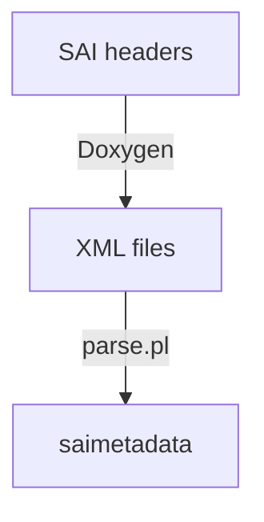

# SAI meta

* SAI metadata generation:



## SAI basics
* SAI objects represent logical/physical switch entities: ports, router interfaces, next hops, ACL tables/rules, etc.
* `sai_object_type_t` enum contains the list of supported SAI object types.
* `sai_object_id_t` represents the SAI object ID.
    * `sai_object_id_t` contains the object type.
```
|switch index(8 bits)|object type(8 bits)|global context(8 bits)|extension flag(1 bit)|object index(39 bits)|
```

* each object type attributes are described in a dedicated `enum`.
* SAI APIs list the `CRUD`(create, remove, update, delete) operations for each SAI object.
* each SAI object type APIs are grouped into one single API structure.
