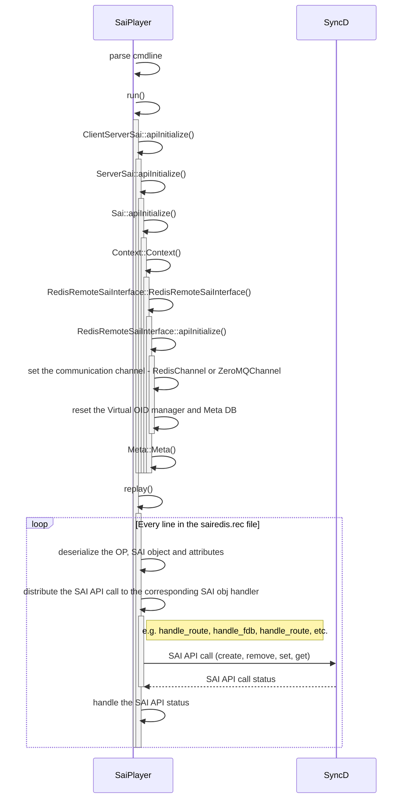

# saiplayer

## how to use saiplayer?
```
/usr/bin/syncd --diag -u -s -Bnull -p /etc/sai.d/sai.profile -b /tmp/break_before_make_objects
```

```
# docker exec swss supervisorctl stop supervisor-proc-exit-listener
# docker exec swss supervisorctl stop orchagent
# docker cp /var/log/swss/sairedis.rec syncd:/
# docker exec -it syncd bash
# supervisorctl stop supervisor-proc-exit-listener
# pkill syncd
# redis-cli flushall; redis-cli -n 4 hmset "LOGGER|syncd" LOGLEVEL INFO LOGOUTPUT SYSLOG
# /usr/bin/syncd --diag -u -s -B null -p /etc/sai.d/sai.profile -b /tmp/break_before_make_objects
# saiplayer  -m -u  -d  sairedis.rec
# echo $?
# 0
```

```
2025 Sep  9 06:59:53.094912 bjw2-can-7260-7 NOTICE syncd#saiplayer: :- replay: line: 2025-09-09.03:30:30.570544|g|SAI_OBJECT_TYPE_VLAN:oid:0x26000000000088|SAI_VLAN_ATTR_MEMBER_LIST=122:oid:0x0,oid:0x0,oid:0x0,oid:0x0,oid:0x0,oid:0x0,oid:0x0,oid:0x0,oid:0x0,oid:0x0,oid:0x0,oid:0x0,oid:0x0,oid:0x0,oid:0x0,oid:0x0,oid:0x0,oid:0x0,oid:0x0,oid:0x0,oid:0x0,oid:0x0,oid:0x0,oid:0x0,oid:0x0,oid:0x0,oid:0x0,oid:0x0,oid:0x0,oid:0x0,oid:0x0,oid:0x0,oid:0x0,oid:0x0,oid:0x0,oid:0x0,oid:0x0,oid:0x0,oid:0x0,oid:0x0,oid:0x0,oid:0x0,oid:0x0,oid:0x0,oid:0x0,oid:0x0,oid:0x0,oid:0x0,oid:0x0,oid:0x0,oid:0x0,oid:0x0,oid:0x0,oid:0x0,oid:0x0,oid:0x0,oid:0x0,oid:0x0,oid:0x0,oid:0x0,oid:0x0,oid:0x0,oid:0x0,oid:0x0,oid:0x0,oid:0x0,oid:0x0,oid:0x0,oid:0x0,oid:0x0,oid:0x0,oid:0x0,oid:0x0,oid:0x0,oid:0x0,oid:0x0,oid:0x0,oid:0x0,oid:0x0,oid:0x0,oid:0x0,oid:0x0,oid:0x0,oid:0x0,oid:0x0,oid:0x0,oid:0x0,oid:0x0,oid:0x0,oid:0x0,oid:0x0,oid:0x0,oid:0x0,oid:0x0,oid:0x0,oid:0x0,oid:0x0,oid:0x0,oid:0x0,oid:0x0,oid:0x0,oid:0x0,oid:0x0,oid:0x0,oid:0x0,oid:0x0,oid:0x0,oid:0x0,oid:0x0,oid:0x0,oid:0x0,oid:0x0,oid:0x0,oid:0x0,oid:0x0,oid:0x0,oid:0x0,oid:0x0,oid:0x0,oid:0x0,oid:0x0,oid:0x0
2025 Sep  9 06:59:53.094912 bjw2-can-7260-7 NOTICE syncd#saiplayer: :- replay: resp (expected): 2025-09-09.03:30:30.571154|G|SAI_STATUS_SUCCESS|SAI_VLAN_ATTR_MEMBER_LIST=122:oid:0x27000000000155,oid:0x2700000000017e,oid:0x270000000001a7,oid:0x270000000001d0,oid:0x270000000001f9,oid:0x27000000000222,oid:0x2700000000024b,oid:0x27000000000274,oid:0x2700000000029d,oid:0x270000000002c6,oid:0x270000000002ef,oid:0x27000000000318,oid:0x27000000000341,oid:0x2700000000036a,oid:0x27000000000393,oid:0x270000000003bc,oid:0x270000000003e5,oid:0x2700000000040e,oid:0x27000000000437,oid:0x27000000000460,oid:0x27000000000489,oid:0x270000000004b2,oid:0x270000000004db,oid:0x27000000000504,oid:0x2700000000052d,oid:0x27000000000556,oid:0x2700000000057f,oid:0x270000000005a8,oid:0x270000000005d1,oid:0x270000000005fa,oid:0x27000000000623,oid:0x2700000000064c,oid:0x27000000000675,oid:0x2700000000069e,oid:0x270000000006c7,oid:0x270000000006f0,oid:0x27000000000719,oid:0x27000000000742,oid:0x2700000000076b,oid:0x27000000000794,oid:0x270000000007bd,oid:0x270000000007e6,oid:0x2700000000080f,oid:0x27000000000838,oid:0x27000000000861,oid:0x2700000000088a,oid:0x270000000008b3,oid:0x270000000008dc,oid:0x27000000000905,oid:0x2700000000092e,oid:0x27000000000957,oid:0x27000000000980,oid:0x270000000009a9,oid:0x270000000009d2,oid:0x270000000009fb,oid:0x27000000000a24,oid:0x27000000000a4d,oid:0x27000000000a76,oid:0x27000000000a9f,oid:0x27000000000ac8,oid:0x27000000000af1,oid:0x27000000000b1a,oid:0x27000000000b43,oid:0x27000000000b6c,oid:0x27000000000b95,oid:0x27000000000bbe,oid:0x27000000000be7,oid:0x27000000000c10,oid:0x27000000000c39,oid:0x27000000000c62,oid:0x27000000000c8b,oid:0x27000000000cb4,oid:0x27000000000cdd,oid:0x27000000000d06,oid:0x27000000000d2f,oid:0x27000000000d58,oid:0x27000000000d81,oid:0x27000000000daa,oid:0x27000000000dd3,oid:0x27000000000dfc,oid:0x27000000000e25,oid:0x27000000000e4e,oid:0x27000000000e77,oid:0x27000000000ea0,oid:0x27000000000ec9,oid:0x27000000000ef2,oid:0x27000000000f1b,oid:0x27000000000f44,oid:0x27000000000f6d,oid:0x27000000000f96,oid:0x27000000000fbf,oid:0x27000000000fe8,oid:0x27000000001011,oid:0x2700000000103a,oid:0x27000000001063,oid:0x2700000000108c,oid:0x270000000010b5,oid:0x270000000010de,oid:0x27000000001107,oid:0x27000000001130,oid:0x27000000001159,oid:0x27000000001182,oid:0x270000000011ab,oid:0x270000000011d4,oid:0x270000000011fd,oid:0x27000000001226,oid:0x2700000000124f,oid:0x27000000001278,oid:0x270000000012a1,oid:0x270000000012ca,oid:0x270000000012f3,oid:0x2700000000131c,oid:0x27000000001345,oid:0x2700000000136e,oid:0x27000000001397,oid:0x270000000013c0,oid:0x270000000013e9,oid:0x27000000001412,oid:0x2700000000143b,oid:0x27000000001464,oid:0x2700000000148d,oid:0x270000000014b6
2025 Sep  9 06:59:53.094912 bjw2-can-7260-7 NOTICE syncd#saiplayer: :- replay: got: SAI_STATUS_SUCCESS
2025 Sep  9 06:59:53.095007 bjw2-can-7260-7 NOTICE syncd#saiplayer: :- replay:  - SAI_VLAN_ATTR_MEMBER_LIST:0:null
```

## saiplayer internals



### key classes
* `SaiInterface`
* `ClientServerSai`: a proxy class that forwards the SAI API call to the implementation class
    * `std::shared_ptr<SaiInterface> m_sai`: points to the SAI client/server implementation
* `Sai`: 

### workflow

#### API init
* `ClientServerSai::apiInitialize` -> `ServerSai::apiInitialize` -> `Sai::apiInitialize`


##### `Sai::apiInitialize`

```cpp
sai_status_t Sai::apiInitialize(
        _In_ uint64_t flags,
        _In_ const sai_service_method_table_t *service_method_table)
{
    MUTEX();
    SWSS_LOG_ENTER();

    memcpy(&m_service_method_table, service_method_table, sizeof(m_service_method_table));

    m_recorder = std::make_shared<Recorder>();

    const char* contextConfig = service_method_table->profile_get_value(0, SAI_REDIS_KEY_CONTEXT_CONFIG);

    auto ccc = ContextConfigContainer::loadFromFile(contextConfig);

    for (auto&cc: ccc->getAllContextConfigs())
    {
        auto context = std::make_shared<Context>(cc, m_recorder, std::bind(&Sai::handle_notification, this, _1, _2));

        m_contextMap[cc->m_guid] = context;
    }

    m_apiInitialized = true;

    return SAI_STATUS_SUCCESS;
}
```
```cpp
Context::Context(
        _In_ std::shared_ptr<ContextConfig> contextConfig,
        _In_ std::shared_ptr<Recorder> recorder,
        _In_ std::function<sai_switch_notifications_t(std::shared_ptr<Notification>, Context*)> notificationCallback):
    m_contextConfig(contextConfig),
    m_recorder(recorder),
    m_notificationCallback(notificationCallback)
{
    SWSS_LOG_ENTER();

    // will create notification thread
    m_redisSai = std::make_shared<RedisRemoteSaiInterface>(
            m_contextConfig,
            std::bind(&Context::handle_notification, this, _1),
            m_recorder);

    m_meta = std::make_shared<saimeta::Meta>(m_redisSai);

    m_redisSai->setMeta(m_meta);
}
```
```cpp
RedisRemoteSaiInterface::RedisRemoteSaiInterface(
        _In_ std::shared_ptr<ContextConfig> contextConfig,
        _In_ std::function<sai_switch_notifications_t(std::shared_ptr<Notification>)> notificationCallback,
        _In_ std::shared_ptr<Recorder> recorder):
    m_contextConfig(contextConfig),
    m_redisCommunicationMode(SAI_REDIS_COMMUNICATION_MODE_REDIS_ASYNC),
    m_recorder(recorder),
    m_notificationCallback(notificationCallback)
{
    SWSS_LOG_ENTER();

    SWSS_LOG_NOTICE("sairedis git revision %s, SAI git revision: %s", SAIREDIS_GIT_REVISION, SAI_GIT_REVISION);

    m_initialized = false;

    apiInitialize(0, nullptr);
}

sai_status_t RedisRemoteSaiInterface::apiInitialize(
        _In_ uint64_t flags,
        _In_ const sai_service_method_table_t *service_method_table)
{
    SWSS_LOG_ENTER();

    m_skipRecordAttrContainer = std::make_shared<SkipRecordAttrContainer>();

    m_asicInitViewMode = false; // default mode is apply mode
    m_useTempView = false;
    m_syncMode = false;
    m_redisCommunicationMode = SAI_REDIS_COMMUNICATION_MODE_REDIS_ASYNC;

    if (m_contextConfig->m_zmqEnable)
    {
        m_communicationChannel = std::make_shared<ZeroMQChannel>(
                m_contextConfig->m_zmqEndpoint,
                m_contextConfig->m_zmqNtfEndpoint,
                std::bind(&RedisRemoteSaiInterface::handleNotification, this, _1, _2, _3));

        SWSS_LOG_NOTICE("zmq enabled, forcing sync mode");

        m_syncMode = true;
    }
    else
    {
        m_communicationChannel = std::make_shared<RedisChannel>(
                m_contextConfig->m_dbAsic,
                std::bind(&RedisRemoteSaiInterface::handleNotification, this, _1, _2, _3));
    }

    m_responseTimeoutMs = m_communicationChannel->getResponseTimeout();

    m_db = std::make_shared<swss::DBConnector>(m_contextConfig->m_dbAsic, 0);

    m_redisVidIndexGenerator = std::make_shared<RedisVidIndexGenerator>(m_db, REDIS_KEY_VIDCOUNTER);

    clear_local_state();                    // reset the virtual OID manager and Meta DB

    m_initialized = true;

    return SAI_STATUS_SUCCESS;
}
```

#### SAI API call
* `Sai::create` -> `Meta::create` -> `RedisRemoteSaiInterface::create`

```cpp
sai_status_t Sai::create(
        _In_ sai_object_type_t objectType,
        _Out_ sai_object_id_t* objectId,
        _In_ sai_object_id_t switchId,
        _In_ uint32_t attr_count,
        _In_ const sai_attribute_t *attr_list)
{
    MUTEX();
    SWSS_LOG_ENTER();
    REDIS_CHECK_API_INITIALIZED();
    REDIS_CHECK_CONTEXT(switchId);

    auto status = context->m_meta->create(
            objectType,
            objectId,
            switchId,
            attr_count,
            attr_list);

    return status;
}
```
```cpp
sai_status_t Meta::create(
        _In_ sai_object_type_t object_type,
        _Out_ sai_object_id_t* object_id,
        _In_ sai_object_id_t switch_id,
        _In_ uint32_t attr_count,
        _In_ const sai_attribute_t *attr_list)
{
    SWSS_LOG_ENTER();

    sai_status_t status = meta_sai_validate_oid(object_type, object_id, switch_id, true);

    CHECK_STATUS_SUCCESS(status)

    sai_object_meta_key_t meta_key = { .objecttype = object_type, .objectkey = { .key = { .object_id  = SAI_NULL_OBJECT_ID } } };

    status = meta_generic_validation_create(meta_key, switch_id, attr_count, attr_list);

    CHECK_STATUS_SUCCESS(status)

    status = m_implementation->create(object_type, object_id, switch_id, attr_count, attr_list);

    META_LOG_STATUS(status, "create");

    if (status == SAI_STATUS_SUCCESS)
    {
        meta_key.objectkey.key.object_id = *object_id;

        meta_generic_validation_post_create(meta_key, switch_id, attr_count, attr_list);
    }

    return status;
}
```

```cpp
sai_status_t RedisRemoteSaiInterface::create(
        _In_ sai_object_type_t objectType,
        _Out_ sai_object_id_t* objectId,
        _In_ sai_object_id_t switchId,
        _In_ uint32_t attr_count,
        _In_ const sai_attribute_t *attr_list)
{
    SWSS_LOG_ENTER();

    *objectId = m_virtualObjectIdManager->allocateNewObjectId(objectType, switchId);

    // NOTE: objectId was allocated by the caller

    auto status = create(
            objectType,
            sai_serialize_object_id(*objectId),
            attr_count,
            attr_list);

    return status;
}
```

```cpp
sai_status_t RedisRemoteSaiInterface::create(
        _In_ sai_object_type_t object_type,
        _In_ const std::string& serializedObjectId,
        _In_ uint32_t attr_count,
        _In_ const sai_attribute_t *attr_list)
{
    SWSS_LOG_ENTER();

    auto entry = SaiAttributeList::serialize_attr_list(
            object_type,
            attr_count,
            attr_list,
            false);

    auto serializedObjectType = sai_serialize_object_type(object_type);

    const std::string key = serializedObjectType + ":" + serializedObjectId;


    m_recorder->recordGenericCreate(key, entry);

    m_communicationChannel->set(key, entry, REDIS_ASIC_STATE_COMMAND_CREATE);

    auto status = waitForResponse(SAI_COMMON_API_CREATE);

    m_recorder->recordGenericCreateResponse(status);

    return status;
}

sai_status_t RedisRemoteSaiInterface::waitForResponse(
        _In_ sai_common_api_t api)
{
    SWSS_LOG_ENTER();

    if (m_syncMode)
    {
        swss::KeyOpFieldsValuesTuple kco;

        auto status = m_communicationChannel->wait(REDIS_ASIC_STATE_COMMAND_GETRESPONSE, kco);

        m_recorder->recordGenericResponse(status);

        return status;
    }

    /*
     * By default sync mode is disabled and all create/set/remove are
     * considered success operations.
     */

    return SAI_STATUS_SUCCESS;
}
```
* SAI Redis communication modes:
    * `SAI_REDIS_COMMUNICATION_MODE_REDIS_ASYNC`: when using Redis DB to communicate with syncd, the SAI API call returns immediately.
    * `SAI_REDIS_COMMUNICATION_MODE_REDIS_SYNC`: when using Redis DB to communicate with syncd, the SAI API call returns immediately.
## references
