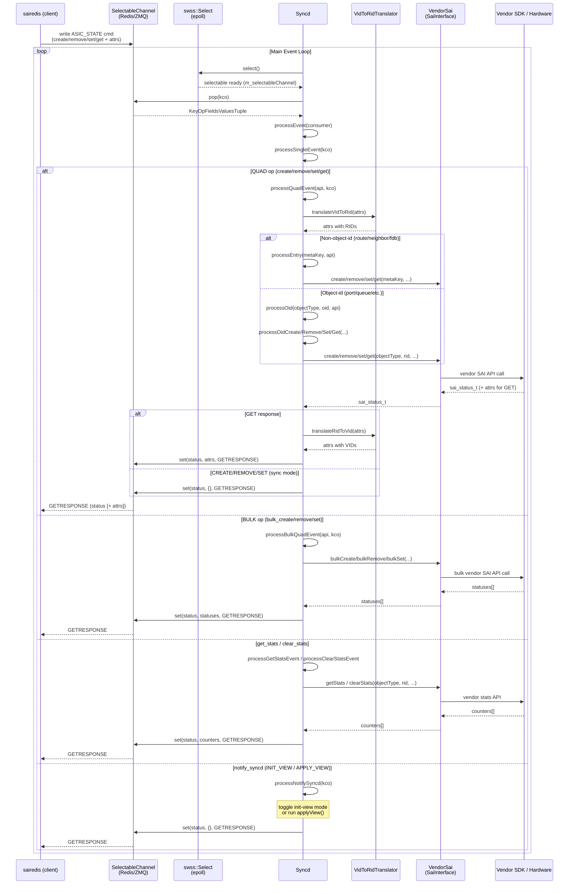

# syncd

```
/usr/bin/syncd --diag -u -s -B null -p /etc/sai.d/sai.profile -b /tmp/break_before_make_objects
```

* `--diag`: diagnostic shell
* `-u`: tempview
* `s`: synchronous mode
* `-B`: batch-polling counters
* `-p`: profile map file
* `-b`: break config

## howdoes syncd handles redis event?
* `Syncd::run()` -> `Syncd::processEvent()` -> `Syncd::processSingleEvent()`:
  * QUAD: `Syncd::processQuadEvent()`
    * entry object: `Syncd::processEntry()`
    * OID object: `Syncd::processOid()`
  * BULK: `Syncd::processBulkQuadEvent()`
  * GET_STATS / CLEAR_STATS: `Syncd::processGetStatsEvent()` / `Syncd::processClearStatsEvent()`
  * NOTIFY_SYNCD: `Syncd::processNotifySyncd()`
* all CRUD operations are dispatched to vendor SAI API



## how does syncd initialize the SAI API?

### VendorSai and SAI API Dispatch

`VendorSai` is syncd's **hardware adapter** — it holds function pointers to the vendor's SAI C library
and dispatches every SAI CRUD call through them. It owns two key members:

| Member | Type | Purpose |
|---|---|---|
| `m_globalApis` | `sai_global_apis_t` | Global/lifecycle APIs: `api_initialize`, `api_query`, `log_set`, etc. |
| `m_apis` | `sai_apis_t` | Per-object-type CRUD APIs: one `sai_port_api_t*`, `sai_route_api_t*`, … per object type |

#### Step 1 — `apiInitialize()`: Loading the Vendor SDK

```cpp
sai_status_t VendorSai::apiInitialize(uint64_t flags,
                                      const sai_service_method_table_t *smt)
{
    // 1. Call vendor's global init (loads vendor .so, sets up callbacks)
    m_globalApis.api_initialize(flags, smt);

    // 2. Query every per-object-type API struct from the vendor SDK
    memset(&m_apis, 0, sizeof(m_apis));
    sai_metadata_apis_query(m_globalApis.api_query, &m_apis);
    //   iterates all SAI_API_* enums, calls api_query(SAI_API_PORT, &m_apis.port_api), etc.
}
```

`m_globalApis` is populated in the **constructor** pointing to static symbols (`sai_api_initialize`,
`sai_api_query`, …) that the linker resolves from the vendor `.so`.

After init, `m_apis` looks like:

```cpp
typedef struct _sai_apis_t {
    sai_switch_api_t   *switch_api;    // SAI_API_SWITCH
    sai_port_api_t     *port_api;      // SAI_API_PORT
    sai_route_api_t    *route_api;     // SAI_API_ROUTE
    sai_neighbor_api_t *neighbor_api;  // SAI_API_NEIGHBOR
    sai_vlan_api_t     *vlan_api;      // SAI_API_VLAN
    // ... one per object type
} sai_apis_t;
```

Each pointer (e.g. `port_api`) points to a **vendor-filled struct of function pointers**:

```cpp
typedef struct _sai_port_api_t {
    sai_create_port_fn          create_port;
    sai_remove_port_fn          remove_port;
    sai_set_port_attribute_fn   set_port_attribute;
    sai_get_port_attribute_fn   get_port_attribute;
    sai_get_port_stats_fn       get_port_stats;
    // ...
} sai_port_api_t;
```

#### Step 2 — Dispatch: `VendorSai::create()` Example

```
Syncd::processOidCreate()
        │
        ▼
VendorSai::create(objectType, &objectId, switchId, attr_count, attr_list)
        │
        │  builds sai_object_meta_key_t mk = { objectType, ... }
        ▼
sai_metadata_generic_create(&m_apis, &mk, switchId, attr_count, attr_list)
        │  (auto-generated by SAI metadata parser)
        │  looks up: info = sai_metadata_get_object_type_info(objectType)
        │  calls:    info->create(&mk, switchId, attr_count, attr_list)
        ▼
m_apis.port_api->create_port(...)   ← vendor function pointer
        │
        ▼
    Vendor SDK / Hardware
```

For **entry-based** objects (route, neighbor, FDB), a macro-generated overload is used instead:

```cpp
// e.g. VendorSai::create(const sai_route_entry_t* entry, ...)
sai_object_meta_key_t mk = { SAI_OBJECT_TYPE_ROUTE_ENTRY,
                              { .key = { .route_entry = *entry } } };
sai_metadata_generic_create(&m_apis, &mk, ...);
// → m_apis.route_api->create_route_entry(entry, attr_count, attr_list)
```

#### Full Picture

```
          VendorSai
          ┌─────────────────────────────────────────┐
          │ m_globalApis                            │
          │  .api_initialize  ─────────────────────►│──► sai_api_initialize()   (vendor .so)
          │  .api_query       ─────────────────────►│──► sai_api_query()        (vendor .so)
          │  .log_set / etc.                        │
          │                                         │
          │ m_apis  (populated by api_query)        │
          │  .port_api ──────────────────────────── │──► { create_port, remove_port, ... }
          │  .route_api ─────────────────────────── │──► { create_route_entry, ... }
          │  .neighbor_api ──────────────────────── │──► { create_neighbor_entry, ... }
          │  .switch_api ────────────────────────── │──► { create_switch, ... }
          │  ...                                    │
          └─────────────────────────────────────────┘
                        │
              sai_metadata_generic_create/remove/set/get()
              (auto-generated dispatcher keyed by object type)
                        │
                        ▼
               Vendor SDK function pointer
                        │
                        ▼
                 Real Hardware / ASIC
```


## what's OID, VID, RID?

### OID — Object ID (the base concept)

A SAI **OID** is a **64-bit opaque integer** that identifies any SAI object (port, route, queue, etc.).
It encodes metadata directly in its bits so the object's type and owner switch can be inferred without a DB lookup.

---

### VID — Virtual ID

The OID format used **inside sairedis / syncd / Redis**. It's a *logical, stable* identifier that doesn't change even if the hardware restarts.

```
Bit layout (64-bit):
┌──────────┬───────────┬────────────────┬────────┬──────────────┐
│ 63 .. 56 │  55 .. 48 │    47 .. 40    │   39   │   38 ..  0   │
│Switch Idx│ Object    │ Global Context │ Ext    │ Object Index │
│ (8 bits) │ Type      │   (8 bits)     │ Flag   │  (39 bits)   │
│          │ (8 bits)  │                │(1 bit) │              │
└──────────┴───────────┴────────────────┴────────┴──────────────┘
```

- Allocated by **`VirtualObjectIdManager`**
- Stored in Redis ASIC_DB (e.g. `ASIC_STATE:SAI_OBJECT_TYPE_PORT:oid:0x1000000000001`)
- What **orchagent / sairedis clients** always see and use

---

### RID — Real ID

The OID format used **by the actual vendor SAI / hardware SDK**. It's whatever the vendor driver returns when it creates an object — opaque to syncd.

```
Bit layout (64-bit, vslib virtual switch):
┌──────────┬────────────────┬───────────┬───────────┬────────┬──────────────┐
│ 63 .. 56 │   55 .. 48     │  47 .. 40 │  39 .. 32 │   31   │   30 ..  0   │
│ Reserved │ Global Context │Switch Idx │ Obj Type  │ Ext    │ Object Index │
│ (8 bits) │   (8 bits)     │ (8 bits)  │ (8 bits)  │ Flag   │  (31 bits)   │
└──────────┴────────────────┴───────────┴───────────┴────────┴──────────────┘
```

- Allocated by **the vendor SAI** (or `RealObjectIdManager` in vslib)
- Never exposed to Redis clients — syncd keeps it private
- Can change across reboots (warm-boot must re-learn them)

---

### How They Relate

```
orchagent / sairedis            syncd                      vendor SDK / HW
─────────────────────   ─────────────────────────────   ──────────────────
  uses VID only    ──►  translates VID → RID      ──►   uses RID only
                   ◄──  translates RID → VID       ◄──
```

Translation tables are stored in Redis as two hash maps:

| Redis Key  | Mapping   |
|------------|-----------|
| `VIDTORID` | VID → RID |
| `RIDTOVID` | RID → VID |

Cached locally in `VirtualOidTranslator` (`m_vid2rid` / `m_rid2vid`).

---

### Why Two IDs?

| Concern | VID | RID |
|---|---|---|
| **Stability** | Never changes (survives reboot) | May change after SDK re-init |
| **Who owns it** | sairedis/syncd | Vendor SDK |
| **Warm-boot** | Persisted in Redis | Must be re-discovered |
| **Multi-switch** | Encodes switch index | Vendor-specific |

> **Summary:** VID is the stable logical name; RID is the hardware's actual handle. Syncd is the translator between the two worlds.

## SaiInterface class hierarchy

`sairedis::SaiInterface` is a pure abstract interface. All SAI implementations inherit from it.

```
sairedis::SaiInterface  (pure abstract, meta/SaiInterface.h)
│
├── saimeta::Meta                    (meta/Meta.h)
│     Validation/metadata layer. Wraps any SaiInterface impl;
│     validates attributes, tracks object state, enforces SAI
│     rules before delegating to the real implementation.
│
├── saimeta::DummySaiInterface       (meta/DummySaiInterface.h)
│     Test stub. Returns configurable dummy responses and can
│     simulate SAI notifications. Used as base for unit test mocks.
│     └── MockableSaiInterface       (unittest/syncd/)
│     └── MockSaiInterface           (unittest/lib/)
│
├── syncd::VendorSai                 (syncd/VendorSai.h)
│     Real hardware adapter. Directly calls the vendor's native
│     SAI C API function pointers to talk to actual switch silicon.
│
├── sairedis::Sai                    (lib/Sai.h)
│     Top-level entry point for applications (orchagent).
│     Manages multiple Context objects (one per switch);
│     routes calls and runs a recording/notification thread.
│
├── sairedis::ClientSai              (lib/ClientSai.h)
│     RPC client. Serializes SAI calls over a Channel (Redis/ZMQ)
│     and waits for responses from a remote ServerSai.
│
├── sairedis::ServerSai              (lib/ServerSai.h)
│     RPC server. Listens on a SelectableChannel for serialized
│     requests, dispatches to a backing SaiInterface, sends replies.
│
├── sairedis::ClientServerSai        (lib/ClientServerSai.h)
│     Thin switchable wrapper around any SaiInterface.
│     Allows the backing implementation to be swapped at runtime.
│
├── saivs::Sai                       (vslib/Sai.h)
│     Virtual switch orchestrator. Wraps VirtualSwitchSaiInterface;
│     manages FDB aging, event queues, and multi-switch simulation.
│
├── saivs::VirtualSwitchSaiInterface (vslib/VirtualSwitchSaiInterface.h)
│     Pure software SAI implementation. Maintains in-memory switch
│     state via SwitchStateBase objects; used for testing and vslib.
│
└── sairedis::Sai                    (proxylib/Sai.h)
      Proxy/forwarding wrapper. Serializes calls as JSON over a
      Channel to forward them to a remote SAI endpoint.
```

### How They Layer Together

```
[orchagent / SONiC daemons]          [saiplayer]          [unit tests]
         │                                │                     │
         ▼                                ▼                     ▼
      lib/Sai                    ClientServerSai         DummySaiInterface
  (sai_api_initialize)          (saiplayer binary)       (MockSaiInterface)
         │
         ├─── production (Redis/ZMQ) ────────────────────────────┐
         ▼                                                        │
      ClientSai                                                   │
    (lib/ClientSai)                                               │
         │  ZMQ/Redis channel                                     │
         ▼                                                        │
      ServerSai                                                   │
    (lib/ServerSai, runs in syncd process)                        │
         │                                                        │
         ▼                                                        ▼
      Meta (validation)                                Meta (validation)
    (meta/Meta, in syncd)                            (meta/Meta, in vslib)
         │                                                        │
         ▼                                                        ▼
      VendorSai                                  VirtualSwitchSaiInterface
    (syncd/VendorSai)                              (vslib/Sai, software)
    [syncd daemon]                               [virtual switch / testing]
         │
         ▼
    Vendor SDK / Hardware
```

| Class | Directory | Instantiated in | Used by |
|---|---|---|---|
| `Meta` | `meta/` | `lib/Context.cpp`, `vslib/Sai.cpp` | All paths — validation wrapper |
| `DummySaiInterface` | `meta/` | unit tests | Test mocks (`MockSaiInterface`, `MockableSaiInterface`) |
| `VendorSai` | `syncd/` | `syncd/syncd_main.cpp` | **syncd** daemon (real HW) |
| `Sai` | `lib/` | via `sai_api_initialize()` | **orchagent** and all SONiC SAI clients |
| `ClientSai` | `lib/` | `lib/ClientServerSai.cpp` | Client side of ZMQ/Redis RPC |
| `ServerSai` | `lib/` | `lib/ClientServerSai.cpp` | Server side of ZMQ/Redis RPC (in **syncd**) |
| `ClientServerSai` | `lib/` | `saiplayer/saiplayer_main.cpp` | **saiplayer** binary (SAI call replay) |
| `Sai` | `vslib/` | `vslib/Sai.cpp` | Virtual switch / software simulation |
| `VirtualSwitchSaiInterface` | `vslib/` | `vslib/Sai.cpp` | **vslib** (in-memory switch state) |
| `Sai` | `proxylib/` | `proxylib/Sai.cpp` | **saiproxy** (intercept/forward SAI calls) |

## how does orchagent talk to syncd?


## how does syncd handles warm-reboot?


## references
