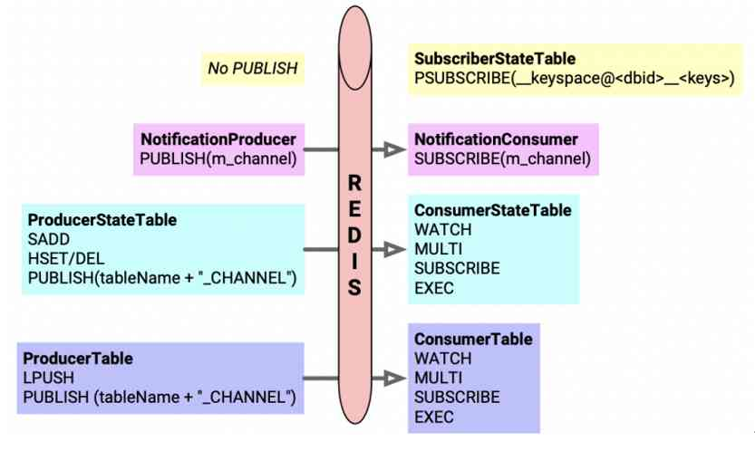

# swss-common notes

## db schema
| db id | db name         | description                                                      |
| ----- | --------------- | ---------------------------------------------------------------- |
| 0     | APP_DB          | DB used for SONiC applications                                   |
| 1     | ASIC_DB         | ASIC states and configurations                                   |
| 2     | COUNTERS_DB     | counters statistics                                              |
| 3     | LOGLEVEL_DB     | log configurations                                               |
| 4     | CONFIG_DB       | system level configurations                                      |
| 5     | FLEX_COUNTER_DB | flex counters                                                    |
| 6     | STATE_DB        | running states, stores dependencies between modules/applications |


## message definitions
```cpp
typedef std::pair<std::string, std::string> FieldValueTuple;
#define fvField std::get<0>
#define fvValue std::get<1>
typedef std::tuple<std::string, std::string, std::vector<FieldValueTuple> > KeyOpFieldsValuesTuple;
#define kfvKey    std::get<0>
#define kfvOp     std::get<1>
#define kfvFieldsValues std::get<2>
```

## redis related


* redisContext: setup connection to a Redis instance
* redisReply: Redis command reply

* RedisInstInfo: contains information of a certain Redis instance
    * unixSocketPath
    * hostname
    * port

* SonicDBInfo: contains information of a certain SONiC DB
    * instName
    * dbId
    * separator

* SonicDBConfig: read/store SONiC DB configuration
    * m_inst_info: mapping from db name to RedisInstInfo obj
    * m_db_info: mapping from db name to SonicDBInfo obj
    * m_db_separator: mapping from db name to separator

```
>>> from swsscommon import swsscommon
>>> swsscommon.SonicDBConfig
<class 'swsscommon.swsscommon.SonicDBConfig'>
">>> swsscommon.SonicDBConfig.getSeparator("APPL_DB")
':'
>>> swsscommon.SonicDBConfig.getDbInst("APPL_DB", "")
'redis'
>>> swsscommon.SonicDBConfig.getDbList()
('STATE_DB', 'APPL_DB', 'GB_FLEX_COUNTER_DB', 'APPL_STATE_DB', 'ASIC_DB', 'CONFIG_DB', 'COUNTERS_DB', 'LOGLEVEL_DB', 'GB_ASIC_DB', 'GB_COUNTERS_DB', 'PFC_WD_DB', 'FLEX_COUNTER_DB', 'RESTAPI_DB', 'SNMP_OVERLAY_DB')
```

* RedisCommand: class to format Redis command string

* RedisReply: issue command to a RedisCommand and stores the redisReply, could act as an auto_ptr for a redisReply object

* DbConnector -> RedisContext: defines common Redis functions
```
>>> db = swsscommon.DBConnector("CONFIG_DB", 0, True)
>>> db.keys("PORT|Ethernet*")
('PORT|Ethernet0', 'PORT|Ethernet40', 'PORT|Ethernet104', 'PORT|Ethernet68', 'PORT|Ethernet96', 'PORT|Ethernet44', 'PORT|Ethernet64', 'PORT|Ethernet112', 'PORT|Ethernet124', 'PORT|Ethernet80', 'PORT|Ethernet116', 'PORT|Ethernet12', 'PORT|Ethernet100', 'PORT|Ethernet4', 'PORT|Ethernet72', 'PORT|Ethernet88', 'PORT|Ethernet56', 'PORT|Ethernet84', 'PORT|Ethernet120', 'PORT|Ethernet108', 'PORT|Ethernet24', 'PORT|Ethernet92', 'PORT|Ethernet48', 'PORT|Ethernet60', 'PORT|Ethernet28', 'PORT|Ethernet36', 'PORT|Ethernet20', 'PORT|Ethernet32', 'PORT|Ethernet52', 'PORT|Ethernet76', 'PORT|Ethernet8', 'PORT|Ethernet16')
```

* RedisPipeline
    * m_db
    * m_expectedTypes: queue of pipelined Redis commands return types
    * m_remaining: pipelined commands counter
    * push(command, expectedType)
        * only `REDIS_REPLY_INTEGER` reply will be cached, others will be executed directly
    * push(command): cache the command into pipeline
    * pop(): use `redisReply` to fetch a reply from the pipelined commands
    * flush(): fetch all results of pipelined commands
    * size(): return m_remaining
```
>>> from swsscommon import swsscommon
>>> db = swsscommon.DBConnector("CONFIG_DB", 0, True)
>>> pipe = swsscommon.RedisPipeline(db)
>>> cmd0 = swsscommon.RedisCommand()
>>> cmd1 = swsscommon.RedisCommand()
>>> cmd0.formatTTL("BGP_NEIGHBOR|10.0.0.63")
>>> cmd1.formatTTL("BGP_NEIGHBOR|10.0.0.53")
>>> pipe.push(cmd0, 3)                      // REDIS_REPLY_INTEGER
>>> pipe.push(cmd1, 3)                      // REDIS_REPLY_INTEGER
>>> reply0 = pipe.pop()
>>> reply1 = pipe.pop()
```

* RedisTransactioner: defines wrapper to allow executions of commands in a single step(Redis transaction)
    * m_db
    * m_expectedResults: deque of reply types
    * m_results: deque of redisReply *
    * multi(): starts a transaction
    * enqueue(command, expectedType)
        * enqueue a command and its expected return type
    * exec(): 
```
>>> db = swsscommon.DBConnector("CONFIG_DB", 0, True)
>>> transaction = swsscommon.RedisTransactioner(db)
>>> cmd0 = swsscommon.RedisCommand()
>>> cmd1 = swsscommon.RedisCommand()
>>> cmd0.formatTTL("BGP_NEIGHBOR|10.0.0.63")
>>> cmd1.formatTTL("BGP_NEIGHBOR|10.0.0.53")
>>> transaction.multi()
>>> transaction.enqueue(cmd0, 3)
>>> transaction.enqueue(cmd1, 3)
>>> transaction._exec()
True
>>> reply0 = transaction.dequeueReply()
```

## select system
* Selectable: virtual base class to represent a selectable object
    * m_last_used_time: last used time
    * m_priority: selectable priority
    * readData
    * hasData
    * hasCachedData
    * initializedWithData

* Select: class to poll selectables
    * m_epoll_fd: epoll fd
    * m_objects: fd to Selectable mapping
    * m_ready: Selectables that are ready for IO read event, sorted
        * Selectables with higher priority || earliest last used time are ranked first
    * poll_descriptors
        * poll Selectables in m_objects and insert those ready for IO into m_ready
        * for every Seletable in m_ready(higher priority || earliest last used time)
            * remove from m_ready
            * update last used time(Selectable::updateLastUsedTime)
            * if Selectable not has data(Selectable::hasData), continue to handle next Selectable
            * if Selectable has cached data(Selectable::hasCachedData), put back into m_ready
            * Selectable::updateAfterRead
    * select(Selectable **, timeout)
    * addSelectable(selectable)
    * removeSelectable(selectable)
    * addSelectables(selectables)

* RedisSelect -> Selectable: redis subscribe client that is selectable

```python
>>> from swsscommon import swsscommon
>>> r = swsscommon.RedisSelect(10)
>>> db = swsscommon.DBConnector("CONFIG_DB", 0, True)
>>> r.subscribe(db, "hellochannel")
>>>
>>> r.readData()
0
>>> r.hasData()
True
```

## table class hierachy

* TableBase: defines table name and table separator
    * TABLE_NAME_SEPARATOR_COLON: `:`
    * TABLE_NAME_SEPARATOR_VBAR: `|`
    * tableNameSeparatorMap: mapping from db id to db separator
    * m_tableName:
    * m_tableSeparator
    * getTableName
    * getKeyName(const std::string &key)
        * m_tableName + m_tableSeparator + key
    * getTableNameSeparator
    * getChannelName
        * m_tableName + "_CHANNEL"

### table operation interface virtual classes

* TableEntryWritable: defines writable tables
    * set(key, values, op, prefix)
    * del(key, op, prefix)

* TableEntryPoppable: defineds consumerable tables(popable), could pops out multiple results
    * pops(keys, ops, values, prefix)
    * pops(vkco, prefix)

* TableEntryEnumerable: defines readable tables
    * get(key, values)
    * getKeys(keys)
    * getContent

* TableName_KeyValueOpQueues
    * m_keyvalueop: tableName + "_KEY_VALUE_OP_QUEUE"
    * getKeyValueOpQueueTableName()

* TableName_KeySet
    * m_key: tableName + "_KEY_SET"
    * m_delkey: tableName + "_DEL_SET"
    * getKeySetName()
    * getDelKeySetName()
    * getStateHashPrefix(): "_"

### table interface classes
* TableConsumable -> TableBase, TableEntryPoppable, RedisSelect

* ConsumerTableBase -> TableConsumable, RedisTransactioner: defines consumerable base class
    * m_buffer: deque of KeyOpFieldsValuesTuple, stores poped-out results
    * pop(kco, prefix)
    * pop(key, op, fvs, prefix)

* Table -> TableBase, TableEntryEnumerable: defines what a db table
    * m_buffered: true to enable pipeline
    * m_pipeowned: true to own m_pipe
    * m_pipes: RedisPipeline object
    * m_shaDump: Lua script SHA to dump a table
        * table_dump.lua

```
>>> db = swsscommon.DBConnector("CONFIG_DB", 0, True)
>>> port_table = swsscommon.Table(db, "PORT")
>>> port_table.getKeys()
('Ethernet0', 'Ethernet40', 'Ethernet104', 'Ethernet68', 'Ethernet96', 'Ethernet44', 'Ethernet64', 'Ethernet112', 'Ethernet124', 'Ethernet80', 'Ethernet116', 'Ethernet12', 'Ethernet100', 'Ethernet4', 'Ethernet72', 'Ethernet88', 'Ethernet56', 'Ethernet84', 'Ethernet120', 'Ethernet108', 'Ethernet24', 'Ethernet92', 'Ethernet48', 'Ethernet60', 'Ethernet28', 'Ethernet36', 'Ethernet20', 'Ethernet32', 'Ethernet52', 'Ethernet76', 'Ethernet8', 'Ethernet16')
```


## SONiC message systems
| type                                         | summary                                                                                                                                                                                                                                                                                                                                                   |
| -------------------------------------------- | --------------------------------------------------------------------------------------------------------------------------------------------------------------------------------------------------------------------------------------------------------------------------------------------------------------------------------------------------------- |
| ProducerTable && ConsumerTable               | ProducerTable uses list to queue (key, values op) and<br /> use pub/sub to notify ConsumerTable key events                                                                                                                                                                                                                                                |
| ProducerStateTable && ConsumerStateTable     | ProducerStateTable uses two sets to store SET and DEL<br /> operation keys, and use pub/sub to notify ConsumerStateTable<br /> so before ConsumerStateTable consumes events, multiple <br /> will be treated as one event for ConsumerStateTable, which will<br /> only be able to resume final table state without any operation<br />sequence guarantee |
| SubscriberStateTable                         | subscribe to a table's keyspace event channel, and get<br /> notification when the table entries get modified(add or del)                                                                                                                                                                                                                                 |
| NotificationProducer && NotificationConsumer | NotificationProducer sends the (key, op, values) as a<br /> jsonized string to the channel which NotificationConsumer<br /> will subscribe to, when NotificationConsumer is ready for<br /> IO, it will read channel messages into its cache for future pops                                                                                              |




### ProducerTable && ConsumerTable

* ProducerTable -> TableBase, TableNameKeyValueOpQueues
    * m_dumpFile
    * m_firstItem
    * m_pipeowned
    * m_pipe
    * m_shaEnque
        * "redis.call('LPUSH', KEYS[1], ARGV[1], ARGV[2], ARGV[3]); redis.call('PUBLISH', KEYS[2], ARGV[4]);";
        * KEYS[1]: tableName + "_KEY_VALUE_OP_QUEUE"
        * KEYS[2]: tableName + "_CHANNEL"
        * ARGV[1]: key
        * ARGV[2]: value
        * ARGV[3]: op
        * ARGV[4]: "G"
    * set(key, values, op, prefix)
        * LPUSH (tableName + "_KEY_VALUE_OP_QUEUE") key (json(values)) ("S" + op)
        * PUBLISH (tableName + "_CHANNEL") "G"
    * del(key, op, prefix)
        * LPUSH (tableName + "_KEY_VALUE_OP_QUEUE") key "{}" ("D" + op)
        * PUBLISH (tableName + "_CHANNEL") "G"

```
>>> db = swsscommon.DBConnector("CONFIG_DB", 0, True)
>>> p = swsscommon.ProducerTable(db, "EMPLOYEE")
>>> values = swsscommon.FieldValuePairs([('name', 'alice'), ('age', '18')])
>>> p.set("ALICE", values)
```
```
$ redis-cli monitor | grep EMPLOYEE
1651572314.750379 [4 127.0.0.1:39780] "EVALSHA" "d171e04fd79e95ca2287f3b067c46ae76a82208b" "2" "EMPLOYEE_KEY_VALUE_OP_QUEUE" "EMPLOYEE_CHANNEL@4" "ALICE" "[\"name\",\"alice\",\"age\",\"18\"]" "SSET" "G"
1651572314.750580 [4 lua] "LPUSH" "EMPLOYEE_KEY_VALUE_OP_QUEUE" "ALICE" "[\"name\",\"alice\",\"age\",\"18\"]" "SSET"
1651572314.751067 [4 lua] "PUBLISH" "EMPLOYEE_CHANNEL@4" "G"
```

* ConsumerTable -> ConsumerTableBase, TableName_KeyValueOpQueues
    * m_shaPop: consumer_table_pops.lua
    * m_modifyRedis: true to modify db
    * pops(vkco, prefix)
        * consumer_table_pops.lua
        * KEYS[1]: tableName + "_KEY_VALUE_OP_QUEUE"
        * KEYS[2]: prefix + tableName
        * ARGV[1]: POP_BATCH_SIZE
        * ARGV[2]: m_modifyRedis ? 1 : 0;
```
>>> db = swsscommon.DBConnector("CONFIG_DB", 0, True)
>>> p = swsscommon.ProducerTable(db, "EMPLOYEE")
>>> values = swsscommon.FieldValuePairs([('name', 'alice'), ('age', '18')])
>>> c = swsscommon.ConsumerTable(db, "EMPLOYEE")
>>> p.set("ALICE", values)
>>> c.pops()
[('ALICE',), ('SET',), ((('name', 'alice'), ('age', '18')),)]
```

### ProducerStateTable && ConsumerStateTable

| Terminology | Sample Redis Object         |
| ----------- | --------------------------- |
| TableHash   | ROUTE_TABLE:25.78.106.0/27  |
| StateHash   | _ROUTE_TABLE:25.78.106.0/27 |

* ProducerStateTable -> TableBase, TableName_KeySet
    * m_buffered
    * m_pipeowned
    * m_tempViewActive
    * m_pipe
    * m_shaSet
    * m_shaDel
    * m_shaBatchedSet
    * m_shaBatchedDel
    * m_shaClear
    * m_shaApplyView
    * m_tempViewState
    * set(key, values, op, prefix)
    * del(key, op, prefix)
 
* ProducerStateTable::m_shaSet
    * add key to keyset(taleName + "_KEY_SET"), which is a set
    * HSET (stateHashPrefix + tableName + tableSeparator + key) fvField(iv) fvValue(iv) for iv in values
    * if key not in keyset previously, publish (tableName + "_CHANNEL") "G"
* ProducerStateTable::m_shaDel
    * add key to keyset(tableName + "_KEY_SET")
    * add key to delkeyset(tableName + "_DEL_SET")
    * DEL (stateHashPrefix + tableName + tableSeparator + key)
    * if key not in keyset previously, publish (tableName + "_CHANNEL) "G"
* ProducerStateTable::m_shaBatchedSet
    * for each key:
        * add key to keyset(tableName + "_KEY_SET")
        * HSET (stateHashPrefix + tableName + tableSeparator + key) fvField(iv) fvValue(iv) for iv in values
    * if any key not in keyset previously, publish (tableName + "_CHANNEL") "G"
* ProducerStateTable::m_shaBatchDel
    * for each key:
        * add key to keyset(tableName + "_KEY_SET")
        * add key to delkeyset(tableName + "_DEL_SET")
        * DEL (stateHashPrefix + tableName + tableSeparator + key)
    * if any key not in keyset previously, publish (tableName + "_CHANNEL) "G"
* ProducerStateTable::m_shaClear
    * del keyset
    * del delkeyset
    * for keys returned by (stateHashPrefix + tableName + "*")
        * del the key(table entry)
```
>>> from swsscommon import swsscommon
>>> db = swsscommon.DBConnector("CONFIG_DB", 0, True)
>>> producer = swsscommon.ProducerStateTable(db, "EMPLOYEE")
>>> values = swsscommon.FieldValuePairs([('name', 'alice'), ('age', '18')])
>>> producer.set("ALICE", values)
>>> values = swsscommon.FieldValuePairs([('salary', '8900')])
>>> producer.set("ALICE", values)
>>> producer._del("ALICE")
>>> producer.clear()
```
```
$ sudo redis-cli monitor | grep EMPLOYEE
1651643806.116813 [4 127.0.0.1:42092] "EVALSHA" "6875900592cdd1621c6191fe038ec3b29775aa13" "4" "EMPLOYEE_CHANNEL@4" "EMPLOYEE_KEY_SET" "_EMPLOYEE|ALICE" "_EMPLOYEE|ALICE" "G" "ALICE" "name" "alice" "age" "18"
1651643806.117046 [4 lua] "SADD" "EMPLOYEE_KEY_SET" "ALICE"
1651643806.117293 [4 lua] "HSET" "_EMPLOYEE|ALICE" "name" "alice"
1651643806.117353 [4 lua] "HSET" "_EMPLOYEE|ALICE" "age" "18"
1651643806.117419 [4 lua] "PUBLISH" "EMPLOYEE_CHANNEL@4" "G"
1651643827.422392 [4 127.0.0.1:42092] "EVALSHA" "6875900592cdd1621c6191fe038ec3b29775aa13" "3" "EMPLOYEE_CHANNEL@4" "EMPLOYEE_KEY_SET" "_EMPLOYEE|ALICE" "G" "ALICE" "salary" "8900"
1651643827.422570 [4 lua] "SADD" "EMPLOYEE_KEY_SET" "ALICE"
1651643827.422636 [4 lua] "HSET" "_EMPLOYEE|ALICE" "salary" "8900"
1651643856.869038 [4 127.0.0.1:42092] "EVALSHA" "88ba6312b8de850b3506966425174d8899aadd93" "4" "EMPLOYEE_CHANNEL@4" "EMPLOYEE_KEY_SET" "_EMPLOYEE|ALICE" "EMPLOYEE_DEL_SET" "G" "ALICE" "''" "''"
1651643856.869496 [4 lua] "SADD" "EMPLOYEE_KEY_SET" "ALICE"
1651643856.869530 [4 lua] "SADD" "EMPLOYEE_DEL_SET" "ALICE"
1651643856.869694 [4 lua] "DEL" "_EMPLOYEE|ALICE"
1651643888.029937 [4 127.0.0.1:42092] "EVALSHA" "a7a229c9946f655aebc07e29d5e4d8ff5055ded8" "3" "EMPLOYEE_KEY_SET" "_EMPLOYEE" "EMPLOYEE_DEL_SET"
1651643888.030139 [4 lua] "DEL" "EMPLOYEE_KEY_SET"
1651643888.030280 [4 lua] "KEYS" "_EMPLOYEE*"
1651643888.030321 [4 lua] "DEL" "EMPLOYEE_DEL_SET"
1651643901.570986 [6 127.0.0.1:35120] "HSET" "PROCESS_STATS|2046154" "CMD" "grep EMPLOYEE"
```

* temp view
```
>>> producer.create_temp_view()
>>> values = swsscommon.FieldValuePairs([('name', 'alice'), ('age', '18')])
>>> producer.set("ALICE", values)
>>> values = swsscommon.FieldValuePairs([('salary', '8900')])
>>> producer.set("ALICE", values)
>>> producer.apply_temp_view()
```
```
$ sudo redis-cli monitor | grep EMPLOYEE
1651645694.019295 [4 127.0.0.1:42092] "EVALSHA" "a7a229c9946f655aebc07e29d5e4d8ff5055ded8" "3" "EMPLOYEE_KEY_SET" "_EMPLOYEE" "EMPLOYEE_DEL_SET"
1651645694.019418 [4 lua] "DEL" "EMPLOYEE_KEY_SET"
1651645694.019469 [4 lua] "KEYS" "_EMPLOYEE*"
1651645694.019500 [4 lua] "DEL" "_EMPLOYEE|ALICE"
1651645694.019534 [4 lua] "DEL" "EMPLOYEE_DEL_SET"
1651645694.030235 [4 127.0.0.1:42092] "EVALSHA" "654245aafba722f7b601e1fc414c3647058c053c" "1" "EMPLOYEE" "''"
1651645694.030258 [4 lua] "KEYS" "EMPLOYEE:*"
1651645694.031142 [4 127.0.0.1:42092] "EVALSHA" "d2494885834676988130076bc645ab8fdee3a1ec" "4" "EMPLOYEE_CHANNEL@4" "EMPLOYEE_KEY_SET" "EMPLOYEE_DEL_SET" "_EMPLOYEE|ALICE" "G" "1" "ALICE" "0" "3" "age" "18" "name" "alice" "salary" "8900"
1651645694.031293 [4 lua] "SADD" "EMPLOYEE_KEY_SET" "ALICE"
1651645694.031458 [4 lua] "HSET" "_EMPLOYEE|ALICE" "age" "18"
1651645694.031487 [4 lua] "HSET" "_EMPLOYEE|ALICE" "name" "alice"
1651645694.031509 [4 lua] "HSET" "_EMPLOYEE|ALICE" "salary" "8900"
1651645694.031532 [4 lua] "PUBLISH" "EMPLOYEE_CHANNEL@4" "G"
```

* ConsumerStateTable -> ConsumerTableBase, TableName_KeySet
    * m_shaPop: consumer_state_table_pops.lua
        * for every key in keyset
            * if key is in delkeyset
                * delete the table hash(tableName + tableSeparator + key)
            * else
                * add the field/value pairs in state hash(stateHashPrefix + tableName + tableSeparator + key) to table hash (tableName + tableSeparator + key)
    * pop(vkco)
        * NOTE: for pop, if the key is deleted via ProducerStateTable::del, its state hash will be deleted
```
>>> db = swsscommon.DBConnector("CONFIG_DB", 0, True)
>>> p = swsscommon.ProducerStateTable(db, "EMPLOYEE")
>>> c = swsscommon.ConsumerStateTable(db, "EMPLOYEE")
>>> values = swsscommon.FieldValuePairs([('name', 'alice'), ('age', '29')])
>>> p.set("ALICE", values)
>>> values = swsscommon.FieldValuePairs([('gender', 'female')])
>>> p.set("ALICE", values)
>>> values = swsscommon.FieldValuePairs([('name', 'bob'), ('age', '19'), ('salary', '18990')])
>>> p.set("BOB", values)
>>> p.delete("BOB")
>>> c.pop()
['ALICE', 'SET', (('name', 'alice'), ('age', '29'), ('gender', 'female'))]
>>> c.pop()
['BOB', 'DEL', ()]
```
```
$ redis-cli -n 4 monitor | grep EMPLOYEE
1651652476.417415 [4 127.0.0.1:51230] "EVALSHA" "6875900592cdd1621c6191fe038ec3b29775aa13" "4" "EMPLOYEE_CHANNEL@4" "EMPLOYEE_KEY_SET" "_EMPLOYEE|ALICE" "_EMPLOYEE|ALICE" "G" "ALICE" "name" "alice" "age" "29"
1651652476.417479 [4 lua] "SADD" "EMPLOYEE_KEY_SET" "ALICE"
1651652476.417611 [4 lua] "HSET" "_EMPLOYEE|ALICE" "name" "alice"
1651652476.417638 [4 lua] "HSET" "_EMPLOYEE|ALICE" "age" "29"
1651652476.417661 [4 lua] "PUBLISH" "EMPLOYEE_CHANNEL@4" "G"
1651652484.917808 [4 127.0.0.1:51230] "EVALSHA" "6875900592cdd1621c6191fe038ec3b29775aa13" "3" "EMPLOYEE_CHANNEL@4" "EMPLOYEE_KEY_SET" "_EMPLOYEE|ALICE" "G" "ALICE" "gender" "female"
1651652484.917869 [4 lua] "SADD" "EMPLOYEE_KEY_SET" "ALICE"
1651652484.917880 [4 lua] "HSET" "_EMPLOYEE|ALICE" "gender" "female"
1651652493.454814 [4 127.0.0.1:51230] "EVALSHA" "6875900592cdd1621c6191fe038ec3b29775aa13" "5" "EMPLOYEE_CHANNEL@4" "EMPLOYEE_KEY_SET" "_EMPLOYEE|BOB" "_EMPLOYEE|BOB" "_EMPLOYEE|BOB" "G" "BOB" "name" "bob" "age" "19" "salary" "18990"
1651652493.454900 [4 lua] "SADD" "EMPLOYEE_KEY_SET" "BOB"
1651652493.455044 [4 lua] "HSET" "_EMPLOYEE|BOB" "name" "bob"
1651652493.455072 [4 lua] "HSET" "_EMPLOYEE|BOB" "age" "19"
1651652493.455093 [4 lua] "HSET" "_EMPLOYEE|BOB" "salary" "18990"
1651652493.455116 [4 lua] "PUBLISH" "EMPLOYEE_CHANNEL@4" "G"
1651652496.424623 [4 127.0.0.1:51230] "EVALSHA" "88ba6312b8de850b3506966425174d8899aadd93" "4" "EMPLOYEE_CHANNEL@4" "EMPLOYEE_KEY_SET" "_EMPLOYEE|BOB" "EMPLOYEE_DEL_SET" "G" "BOB" "''" "''"
1651652496.424744 [4 lua] "SADD" "EMPLOYEE_KEY_SET" "BOB"
1651652496.424754 [4 lua] "SADD" "EMPLOYEE_DEL_SET" "BOB"
1651652496.424912 [4 lua] "DEL" "_EMPLOYEE|BOB"
1651652505.884476 [4 127.0.0.1:51064] "EVALSHA" "88270a7c5c90583e56425aca8af8a4b8c39fe757" "3" "EMPLOYEE_KEY_SET" "EMPLOYEE|" "EMPLOYEE_DEL_SET" "128" "_"
1651652505.884535 [4 lua] "SPOP" "EMPLOYEE_KEY_SET" "128"
1651652505.884691 [4 lua] "SREM" "EMPLOYEE_DEL_SET" "ALICE"
1651652505.884698 [4 lua] "HGETALL" "_EMPLOYEE|ALICE"
1651652505.884711 [4 lua] "HSET" "EMPLOYEE|ALICE" "name" "alice"
1651652505.884737 [4 lua] "HSET" "EMPLOYEE|ALICE" "age" "29"
1651652505.884758 [4 lua] "HSET" "EMPLOYEE|ALICE" "gender" "female"
1651652505.884780 [4 lua] "DEL" "_EMPLOYEE|ALICE"
1651652505.884800 [4 lua] "SREM" "EMPLOYEE_DEL_SET" "BOB"
1651652505.884851 [4 lua] "DEL" "EMPLOYEE|BOB"
1651652505.884854 [4 lua] "HGETALL" "_EMPLOYEE|BOB"
1651652505.884859 [4 lua] "DEL" "_EMPLOYEE|BOB"
```

### SubscriberStateTable
* SubscriberStateTable -> ConsumerTableBase: subscribe to any table entry keyspace event
    * m_keyspace: subscribed pattern: `__keyspace@<dbID>__:<tableName>|*`
    * m_keyspace_event_buffer: cache to store keyspace event from m_keyspace
    * m_table: the table to subscribe
    * readData(): read from subscribed channel `__keyspace@<dbID>__:<tableName>|*`
    * hasData()
    * hasCachedData()
    * pops(vkco):
        * for every keyspace event cached in m_keyspace_event_buffer:
            * if op == "del":
                * (key, "del", empty)
            * elif op == "set"
                * (key, "set", table entry values)

```
>>> s = swsscommon.SubscriberStateTable(db, "PORT")
>>> s.pop()
['Ethernet20', 'SET', (('admin_status', 'up'), ('alias', 'fortyGigE0/20'), ('description', 'Servers4:eth0'), ('index', '5'), ('lanes', '41,42,43,44'), ('mtu', '9100'), ('pfc_asym', 'off'), ('speed', '40000'), ('tpid', '0x8100'))]
>>> s.pop()
['Ethernet28', 'SET', (('admin_status', 'up'), ('alias', 'fortyGigE0/28'), ('description', 'Servers6:eth0'), ('index', '7'), ('lanes', '5,6,7,8'), ('mtu', '9100'), ('pfc_asym', 'off'), ('speed', '40000'), ('tpid', '0x8100'))]
```

### NotificationProducer && NotificationConsumer
NotificationProducer
    * m_db
    * m_channel: channel to publish
    * send(op, data, values)
        * jsonize (op, data, values) and send the json string via m_channel

NotificationConsumer -> Selectable
    * m_db
    * m_subscribe: db connector subscribed to m_channel
    * m_channel: channel to subscribe
    * m_queue: received strings from m_channel
    * readData()
    * hasData()
    * hasCachedData()
    * processReply()
        * retrieve channel message string from the redisReply object
    * pop(op, data, values)
    * pops(vkco)

```
>>> from swsscommon import swsscommon
>>> db = swsscommon.DBConnector("CONFIG_DB", 0, True)
>>> c = swsscommon.NotificationProducer(db, "DEMOCHANNEL")
>>> c.send("SET", "DEMO", swsscommon.FieldValuePairs([('1', '1'), ('2', '2')]))
0
>>> p = swsscommon.NotificationProducer(db, "DEMOCHANNEL")
>>> c = swsscommon.NotificationConsumer(db, "DEMOCHANNEL")
>>> p.send("SET", "DEMO", swsscommon.FieldValuePairs([('1', '1'), ('2', '2')]))
2
>>> c.readData()
0
>>> c.pop()
['SET', 'DEMO', (('1', '1'), ('2', '2'))]
```
```
$ redis-cli monitor | grep DEMO
1651661527.377590 [4 127.0.0.1:49846] "PUBLISH" "DEMOCHANNEL" "[\"SET\",\"DEMO\",\"1\",\"1\",\"2\",\"2\"]"
```

## references
* https://github.com/Azure/SONiC/blob/master/doc/warm-reboot/view_switch.md
* https://redis.io/docs/manual/keyspace-notifications/
* https://chowdera.com/2021/10/20211029112902093b.html